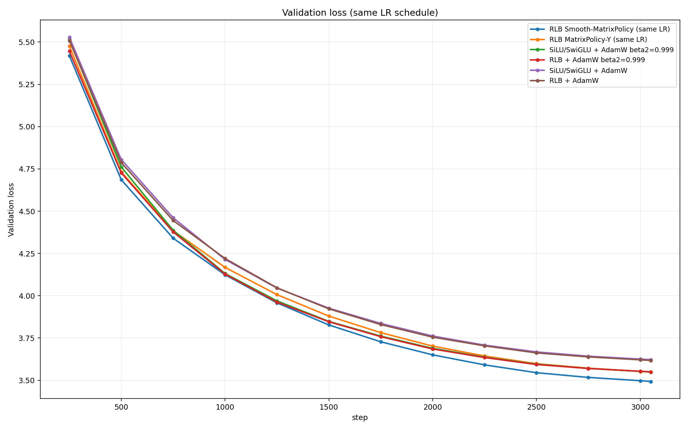
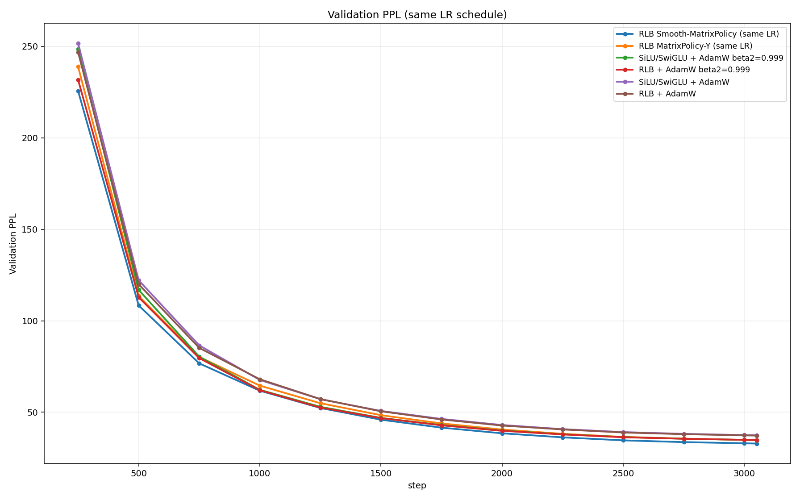
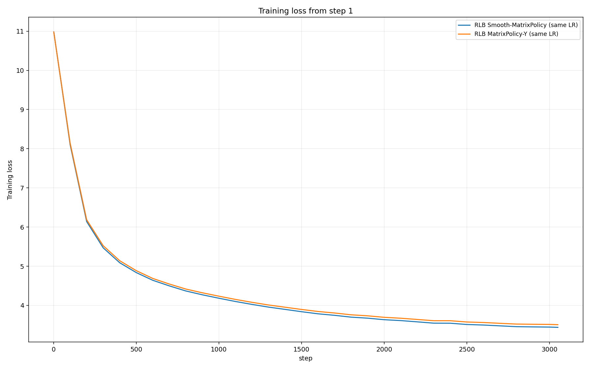

# RationalOPT

RationalOPT is an optimizer-design repo for the no-GLU Rational Local Basis FFN (RLB). The goal is not to win by changing the global learning-rate schedule. The goal is an RLB-specific optimizer that beats both hard controls under the same model, token budget, base LR, warmup, cosine schedule, and evaluation protocol:

```text
SiLU/SwiGLU + AdamW
RLB + AdamW
```

Jacobian, transport, matrix-policy, and other rational optimizers are candidate methods, not baselines. LR ablations are not part of the main claim until the same-LR optimizer has a much larger gap.

## Current Best Result

The current best same-LR optimizer is:

```text
RLB + rational_matrix_policy_onpolicy
```

The default `rational_matrix_policy_onpolicy` is now Smooth-MatrixPolicy. It keeps the benchmark LR schedule fixed at `lr=3e-4`, `min_lr=3e-5`, `warmup=200`, and the same cosine decay as the controls. The optimizer change is inside the update rule:

```text
- RLB W_in/W_out matrices use a layer/side-specific MatrixPolicy.
- MatrixPolicy uses smoother AdamW second moments, beta2=0.999.
- Non-RLB AdamW groups inside the MatrixPolicy branch also use beta2=0.999.
- Exact RLB gauge balance remains active after the step.
- Muon, coefficient-function updates, and rational transport are off by default.
```

Single-seed full 3051-step WikiText-103 result, seed 1337, same LR schedule:

| row | final loss | final PPL | gap vs winner loss | gap vs winner PPL |
| --- | ---: | ---: | ---: | ---: |
| RLB Smooth-MatrixPolicy | 3.493210 | 32.89 | 0.000000 | 0.00 |
| RLB MatrixPolicy-Y | 3.548665 | 34.77 | 0.055455 | 1.88 |
| SiLU/SwiGLU + AdamW beta2=0.999 | 3.549346 | 34.79 | 0.056136 | 1.90 |
| RLB + AdamW beta2=0.999 | 3.550018 | 34.81 | 0.056808 | 1.92 |
| RLB + AdamW | 3.617501 | 37.24 | 0.124291 | 4.35 |
| SiLU/SwiGLU + AdamW | 3.621982 | 37.41 | 0.128772 | 4.52 |

The headline gap versus the original hard controls is now large in PPL and meaningful in loss: about `4.5` PPL and `0.129` loss versus `SiLU/SwiGLU+AdamW`, and about `4.35` PPL and `0.124` loss versus `RLB+AdamW`. The stricter tuned-control gap is smaller but still real: about `1.9` PPL and `0.056` loss versus beta2-tuned AdamW controls. This is still below the desired `0.2-0.3` loss gap, so the research target is not finished.

## Plots

Validation starts at step 250 because that is the first evaluation point. Training loss starts at step 1.







## What Helped

The important discovery was not another LR schedule. It was optimizer-state timescale. The strong RLB matrix policy takes much larger rational-matrix steps than ordinary AdamW, and the default `beta2=0.95` second moment is too reactive for that policy. Moving the MatrixPolicy branch to smooth second moments made the gain durable across the whole run.

What improved results:

| change | effect |
| --- | --- |
| Separate RLB matrices from ordinary AdamW | lets `W_in/W_out` receive a rational-specific policy |
| Strong layer/side MatrixPolicy | creates the main RLB advantage over ordinary RLB+AdamW |
| Smoother second moments, beta2=0.999 | largest new improvement; stabilizes the larger RLB matrix updates |
| Exact RLB gauge balance | preserves function while keeping RLB matrix representatives conditioned |
| Compare to beta2-tuned AdamW controls | proves the win is not only generic AdamW smoothing |

The current default settings are:

```text
adam_lr_scale                  3.00
adam_role_strength             1.20
input_depth_gain              -0.50
output_depth_gain              1.00
adam_min_lr_scale              0.40
adam_max_lr_scale              4.00
rational_matrix_policy_beta2   0.999
backbone_beta2 in this branch   0.999
muon_strength                  0.00
transport_strength             0.00
```

## What Hurt

Several plausible mechanisms were tested and rejected or left as non-default ablations:

| method | result |
| --- | --- |
| Higher MatrixPolicy scale beyond Y | helped short 1250-step screens but hurt full 3051-step loss |
| On-policy group gain/pressure equalization | only about `0.001` at 1250, not durable |
| Stronger exact gauge balancing | slightly better early, worse late |
| Rational amplitude transport | helped early, then became a late penalty; early-off switch was only tiny gain |
| Muon on the non-RLB backbone | badly worse by step 1250 |
| Freezing rational coefficients | badly worse early/mid |
| Function-space coefficient switching | worse than matrix-only policy |

The lesson is that the RLB matrix policy wants a slower optimizer state, not more switching or more coefficient motion. Coefficients and transport can move the represented rational function too aggressively; the durable win comes from matrix role/depth policy plus smooth moments.

## Reproducing The Current Best

Run the best same-LR policy directly. No extra MatrixPolicy args are needed because the defaults now match Smooth-MatrixPolicy:

```bash
env PYTORCH_CUDA_ALLOC_CONF=expandable_segments:True NCCL_P2P_DISABLE=1   RUN_NAME=rlb_smooth_matrix_policy   STEPS=3051 SEEDS=1337   OPTIMIZERS=rational_matrix_policy_onpolicy   ACTIVATIONS=rlb_fused_fixed_strong_ffn   EVAL_INTERVAL=250 EVAL_BATCHES=20 LOG_INTERVAL=100   sbatch --time=02:00:00 --gres=gpu:nvidia_rtx_6000_ada_generation:4   training/run_wikitext103_optimizer_sweep.sbatch
```

Run beta2-tuned hard controls under the same LR schedule:

```bash
env PYTORCH_CUDA_ALLOC_CONF=expandable_segments:True NCCL_P2P_DISABLE=1   RUN_NAME=beta2_0999_adamw_controls   STEPS=3051 SEEDS=1337   OPTIMIZERS=adamw   ACTIVATIONS="silu rlb_fused_fixed_strong_ffn"   EVAL_INTERVAL=250 EVAL_BATCHES=20 LOG_INTERVAL=100   EXTRA_ARGS=--beta2=0.999   sbatch --time=03:00:00 --gres=gpu:nvidia_rtx_6000_ada_generation:4   training/run_wikitext103_optimizer_sweep.sbatch
```

## Next Work

The next optimizer should try to turn the tuned-control gap from `0.056` loss into the requested `0.2-0.3` loss. The best direction is still optimizer-state structure, not LR scheduling:

```text
1. keep Smooth-MatrixPolicy as the base
2. split beta2 by parameter class instead of one smooth value for the branch
3. make RLB matrix beta2 depend on layer/side and live gradient pressure
4. keep coefficient and transport updates off unless they beat matrix-only on the full run
5. verify against both default AdamW controls and beta2-tuned AdamW controls
```

## Layout

```text
activation/         rational activation package and CUDA extension
training/           WikiText-103 training, sweep, and aggregation scripts
optimizer_design/   RLB-specific optimizer components
experiments/        compact result artifacts and local raw run outputs
```
