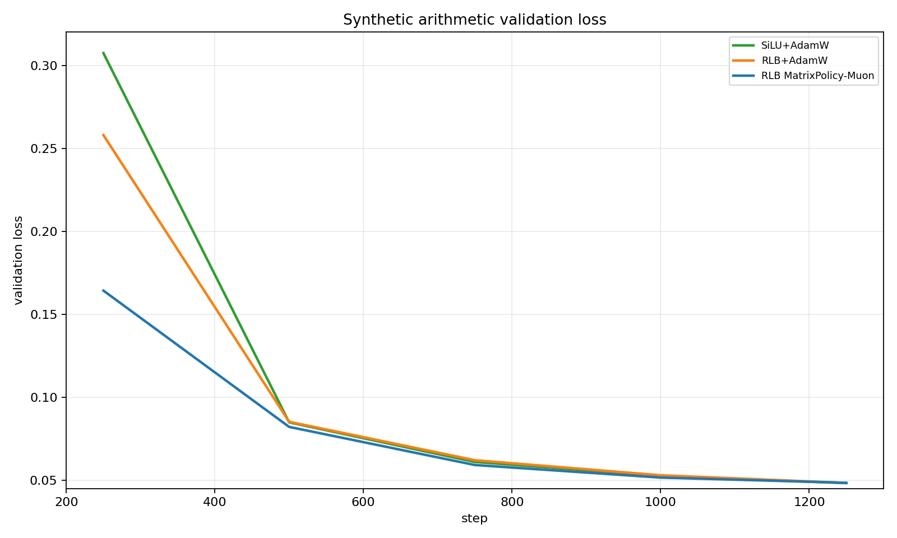
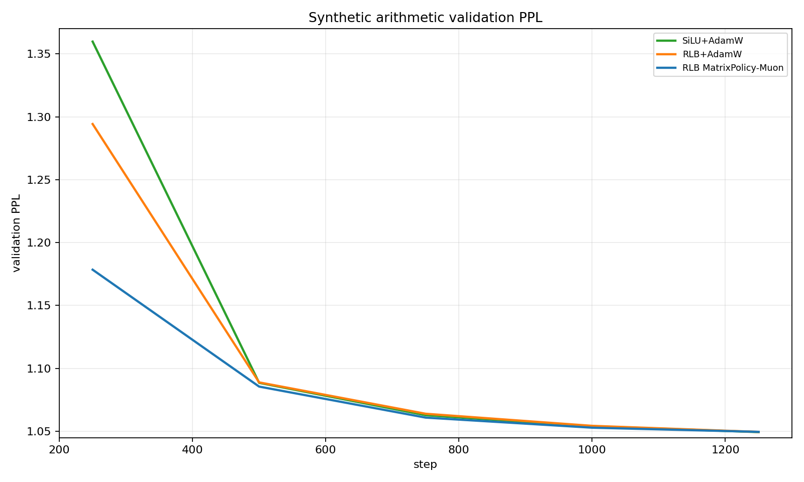
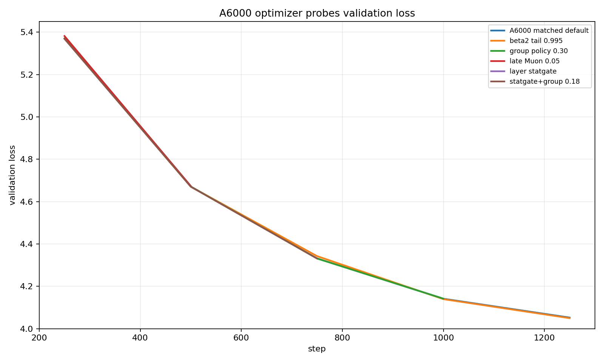

# RationalOPT

RationalOPT is an optimizer-design repo for the no-GLU Rational Local Basis FFN (RLB). The target is an RLB-specific optimizer that beats the real controls under the same global learning-rate schedule. Jacobian and quotient optimizers are ablations, not baselines.

## Baselines

The important comparisons are:

```text
SiLU+AdamW
RLB+AdamW
SiLU+AdamW beta2=0.999
RLB+AdamW beta2=0.999
SiLU+Muon
RLB+Muon
```

The current best still does not clear the requested `0.2-0.3` final loss gap versus the tuned AdamW controls. It does clear more than 2 PPL versus those controls, but this remains an unfinished research target.

## Current Best

| row | final loss | final PPL |
| --- | ---: | ---: |
| RLB MatrixPolicy-Muon | 3.476232 | 32.34 |
| RLB Smooth-MatrixPolicy | 3.493210 | 32.89 |
| SiLU+AdamW beta2=0.999 | 3.549346 | 34.79 |
| RLB+AdamW beta2=0.999 | 3.550018 | 34.81 |
| RLB+AdamW | 3.617501 | 37.24 |
| SiLU+AdamW | 3.621982 | 37.41 |
| SiLU+Muon | 3.644921 | 38.28 |
| RLB+Muon | 3.657877 | 38.78 |

Best full WikiText-103 result: `3.476232` validation loss and `32.34` PPL at step 3051, seed 1337. The tuned AdamW control gap is `0.0731` loss / `2.45` PPL versus `SiLU+AdamW beta2=0.999`.

## Exact Optimizer

```text
optimizer                                           rational_matrix_policy_onpolicy
activation                                          rlb_fused_fixed_strong_ffn
optimizer_lr                                        3e-4
optimizer_min_lr                                    3e-5
warmup_steps                                        200
lr_schedule                                         cosine
rational_matrix_policy_backbone_optimizer           adamw
rational_matrix_policy_backbone_beta2               0.999
rational_matrix_policy_beta2                        0.999
rational_matrix_policy_adam_lr_scale                3.00
rational_matrix_policy_adam_lr_scale_final          null
rational_matrix_policy_adam_decay_start             1.10
rational_matrix_policy_adam_decay_end               1.10
rational_matrix_policy_adam_decay_depth_shift       0.00
rational_matrix_policy_adam_beta2_final             null
rational_matrix_policy_adam_beta2_decay_start       1.10
rational_matrix_policy_adam_beta2_decay_end         1.10
rational_matrix_policy_adam_beta2_decay_depth_shift 0.00
rational_matrix_policy_adam_role_strength           1.20
rational_matrix_policy_adam_stat_strength           0.00
rational_matrix_policy_adam_pressure_balance        0.00
rational_matrix_policy_adam_stat_start              0.00
rational_matrix_policy_adam_stat_end                0.00
rational_matrix_policy_adam_min_lr_scale            0.40
rational_matrix_policy_adam_max_lr_scale            4.00
rational_matrix_policy_input_depth_gain            -0.50
rational_matrix_policy_output_depth_gain            1.00
rational_matrix_policy_muon_strength                0.75
rational_matrix_policy_muon_lr_scale                1.00
rational_matrix_policy_max_muon                     0.75
rational_matrix_policy_min_muon                     0.00
rational_matrix_policy_final_muon                   0.00
rational_matrix_policy_start                        0.02
rational_matrix_policy_end                          0.12
rational_matrix_policy_decay_start                  0.20
rational_matrix_policy_decay_end                    0.36
rational_matrix_policy_muon_decay_depth_shift       0.00
rational_matrix_policy_muon_input_decay_shift       0.00
rational_matrix_policy_muon_output_decay_shift      0.00
rational_matrix_policy_muon_reset_adam_state        false
rational_matrix_policy_pressure_weight              0.30
rational_matrix_policy_activity_weight              0.65
rational_matrix_policy_weight_decay_scale           1.00
rational_matrix_policy_function_coeff               false
rational_matrix_policy_group_gain_strength          0.00
rational_matrix_policy_group_pressure_strength      0.00
rational_matrix_policy_group_activity_damping       0.00
rational_transport_strength                         0.00
rational_transport_matrix_strength                  0.00
rational_transport_quotient_strength                0.00
rational_adaptive_coeff_strength                    0.00
rlb_gauge_strength                                  0.50
rlb_gauge_start                                     0.03
rlb_gauge_end                                       0.35
rlb_gauge_every                                     5
```

This is not a global LR ablation. The global schedule is the same `3e-4 -> 3e-5` warmup/cosine schedule used by the controls. The optimizer changes which update rule is applied to RLB matrices.

## How It Works

RLB computes:

```text
v = x W_in
s_g = sqrt(mean(v_g^2) + eps)
u_g = v_g / s_g
h_g = s_g R_g(u_g)
y = h W_out
```

`W_in` sets rational input domains and derivative exposure. `W_out` composes rational features back into the model stream. MatrixPolicy uses different role/depth update scales for `W_in` and `W_out`, applies a short early Muon phase only to those matrices, then switches back to MatrixPolicy AdamW. The outer wrapper applies exact RLB gauge balance after optimizer steps.

## What We Tried Next

Plain Muon is not a stronger baseline here. `SiLU+Muon` finishes at `3.644921` / `38.28`, and `RLB+Muon` finishes worse at `3.657877` / `38.78`.

A synthetic arithmetic 100M-token task showed faster early learning but no final win:

| row | final loss | final PPL |
| --- | ---: | ---: |
| SiLU+AdamW | 0.048182 | 1.04936 |
| RLB+AdamW | 0.048326 | 1.04951 |
| RLB MatrixPolicy-Muon | 0.048382 | 1.04957 |

The optimizer was better through step 1000 on that task, but the task saturated and the final row slightly favored `SiLU+AdamW`.

Additional A6000 optimizer probes did not widen the gap:

| probe | last step | loss | readout |
| --- | ---: | ---: | --- |
| A6000 matched default | 1250 | 4.052293 | matched fallback screen |
| beta2 tail 0.995 | 1250 | 4.049556 | tiny +0.002738 vs matched default, not close to old best short curve |
| group policy 0.30 | 1000 | 4.141706 | neutral/worse vs matched default at 1000 |
| late Muon 0.05 | 500 | 4.673611 | worse than matched default at 500 |
| layer statgate | 250 | 5.369072 | tied with matched default |
| statgate+group 0.18 | 750 | 4.331103 | tiny +0.000628 vs matched default, noise-level |

The useful lesson is negative: adding late Muon, beta2 tails, group-gradient policy, or on-policy stat gates did not create a material advantage. The durable part remains the original RLB matrix policy plus short early matrix-only Muon and exact gauge balance.

## Plots

Validation starts at the first eval point. Training loss starts at step 1.








## Reproduce

Use A6000 GPUs only. Each launcher requests 4 GPUs; do not run more than two 4-GPU jobs at once.

```bash
env RATIONAL_OPT_TORCH_FALLBACK=1 PYTORCH_CUDA_ALLOC_CONF=expandable_segments:True NCCL_P2P_DISABLE=1 \
  RUN_NAME=rlb_matrix_policy_muon_switch \
  STEPS=3051 SEEDS=1337 \
  OPTIMIZERS=rational_matrix_policy_onpolicy \
  ACTIVATIONS=rlb_fused_fixed_strong_ffn \
  EVAL_INTERVAL=250 EVAL_BATCHES=20 LOG_INTERVAL=100 \
  EXTRA_ARGS="--batch-size 16 --grad-accum 2" \
  sbatch --gres=gpu:nvidia_rtx_a6000:4 training/run_wikitext103_optimizer_sweep.sbatch
```

## Layout

```text
activation/         rational activation package and CUDA extension
training/           WikiText-103 and synthetic training entrypoints
optimizer_design/   RLB-specific optimizer components
experiments/        compact result artifact and local raw runs
```
