# RationalOPT

RationalOPT studies Rational Local Basis (RLB) feed-forward blocks and the `rational_matrix_policy_onpolicy` optimizer for language-model pretraining.

The existing FineWeb/FineWeb-Edu and WikiText results stay in the repo. Future paper evidence must follow the manifest-first plan in `experiments/ICLR_EXACT_RUN_PLAN.md`.

## Existing Results

Existing result packages:

```text
experiments/results/real_lm_multiseed_2026_05_31/
experiments/results/real_lm_screen_2026_05_30/
experiments/results/rlb_matrix_policy_muon_switch_2026_05_28/
experiments/runs/real_lm_multiseed_20260531/
experiments/runs/wikitext103/
```


## FineWeb And FineWeb-Edu Results

Protocol summary:

```text
model: 12-layer GPT-style Transformer, d_model=768, heads=12, 123.6M params
tokenizer: GPT-2
train budget: 100M tokens
validation budget: 4M tokens after a 110M-token stream offset
sequence length: 256
global tokens per step: 32,768
steps: 3,050
seeds: 1337, 2027, 3407
hardware rule: 4 A6000 GPUs per job; at most 8 A6000 GPUs active total
```

### FineWeb, 3 Seeds

| method | n | mean val loss | std | mean PPL | gap vs SiLU+AdamW | gap vs best control |
| --- | ---: | ---: | ---: | ---: | ---: | ---: |
| SiLU+AdamW | 3 | 4.528963 | 0.029611 | 92.69 | 0.000000 | -0.006960 |
| RLB+AdamW | 3 | 4.522311 | 0.029832 | 92.08 | 0.006653 | -0.000308 |
| SiLU+Muon | 3 | 4.566661 | 0.041469 | 96.28 | -0.037698 | -0.044658 |
| RLB+Muon | 3 | 4.571341 | 0.027720 | 96.70 | -0.042377 | -0.049337 |
| RLB+MatrixPolicy (group-stat) | 3 | 4.369701 | 0.026358 | 79.04 | 0.159263 | 0.152302 |

### FineWeb-Edu, 3 Seeds

| method | n | div | mean val loss | std | mean PPL | gap vs SiLU+AdamW | gap vs best control |
| --- | ---: | ---: | ---: | ---: | ---: | ---: | ---: |
| SiLU+AdamW | 3 | 0 | 4.223572 | 0.001635 | 68.28 | 0.000000 | -0.000748 |
| RLB+AdamW | 3 | 1 | 5.618928 | 2.418773 | 1545.54 | -1.395356 | -1.396103 |
| SiLU+Muon | 3 | 0 | 4.258871 | 0.014706 | 70.74 | -0.035300 | -0.036047 |
| RLB+Muon | 3 | 0 | 4.263744 | 0.008026 | 71.08 | -0.040173 | -0.040920 |
| RLB+MatrixPolicy (group-stat) | 3 | 0 | 4.069422 | 0.002281 | 58.52 | 0.154149 | 0.153402 |

Positive gaps mean lower validation loss than the comparison row. Full tables and CSVs are in `experiments/results/real_lm_multiseed_2026_05_31/`.

### FineWeb Curves

Mean validation loss:

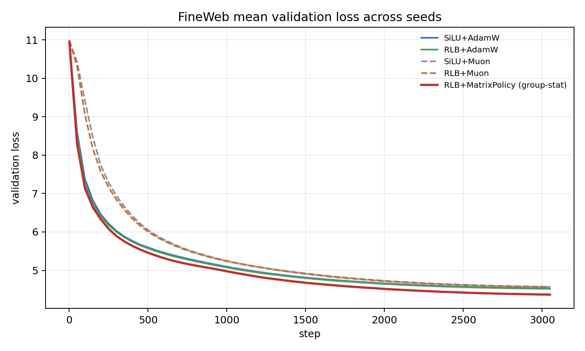

Mean validation loss, zoomed from step 1000:

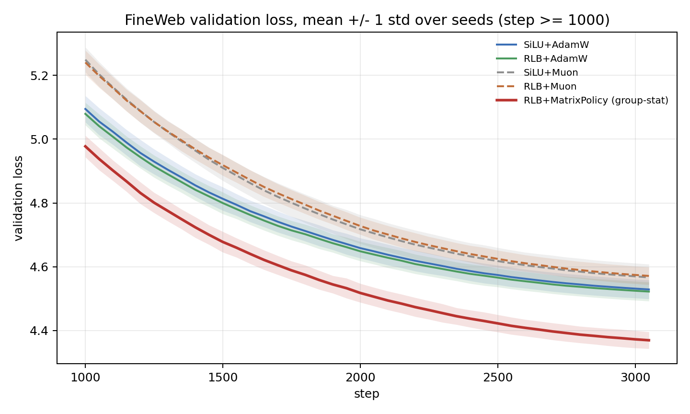

Mean validation PPL:

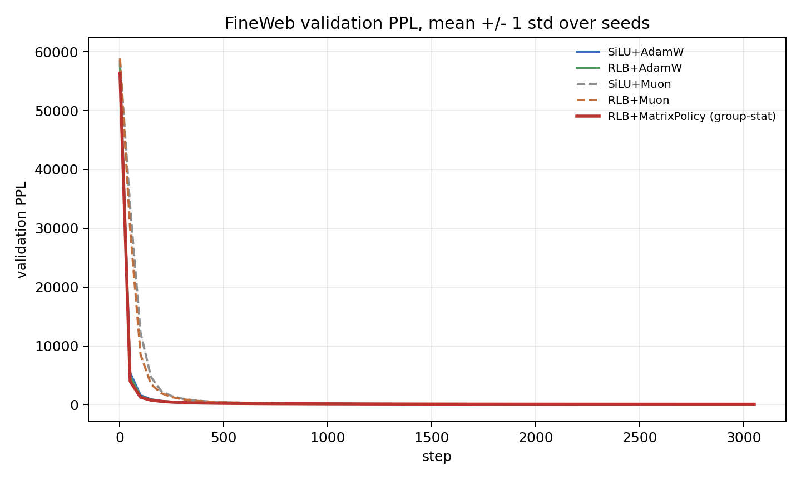

Mean validation PPL, zoomed from step 1000:

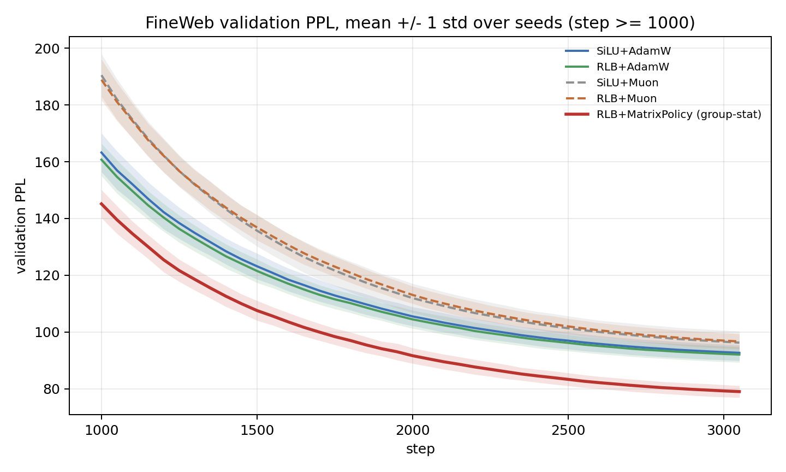

Mean training loss:

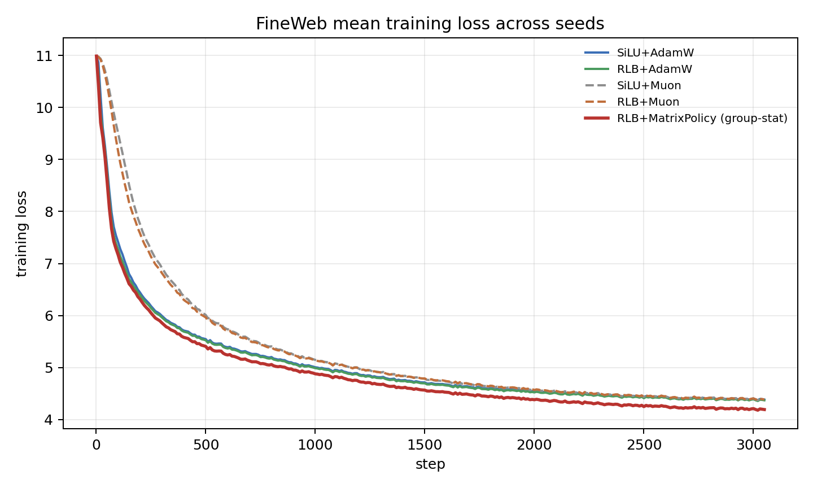

### FineWeb-Edu Curves

Mean validation loss:

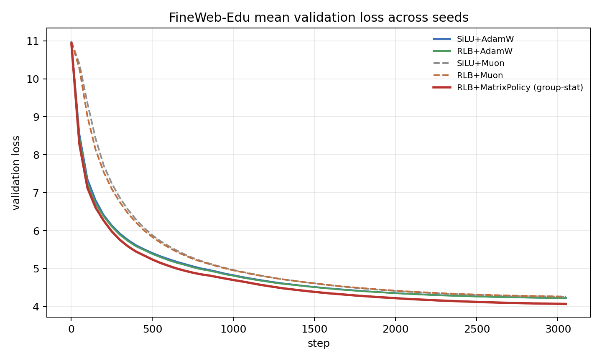

Mean validation loss, zoomed from step 1000:

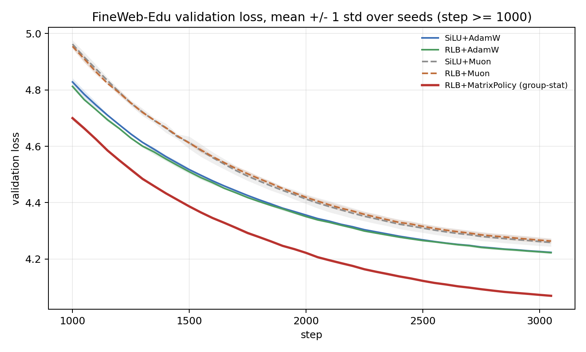

Mean validation PPL:

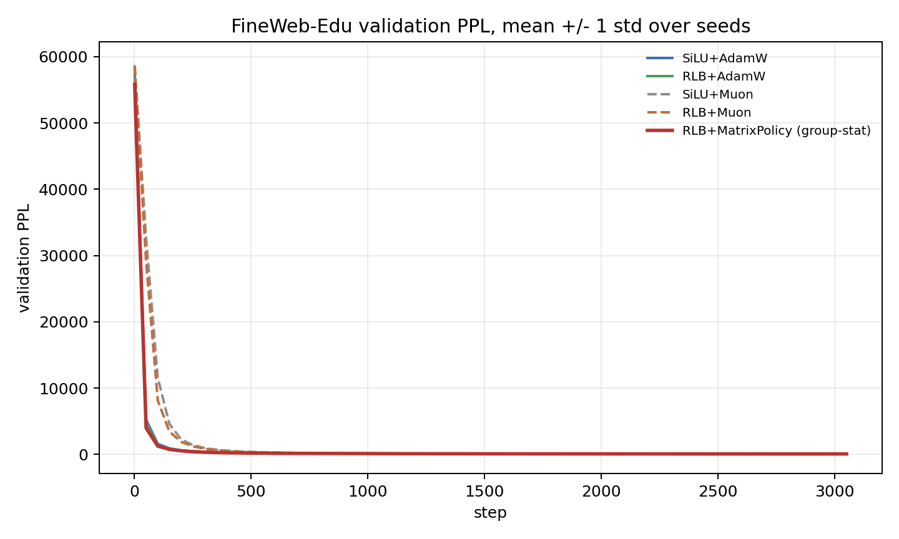

Mean validation PPL, zoomed from step 1000:

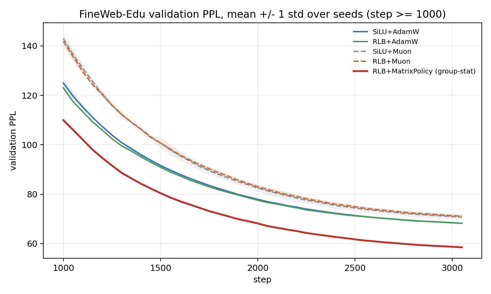

Mean training loss:

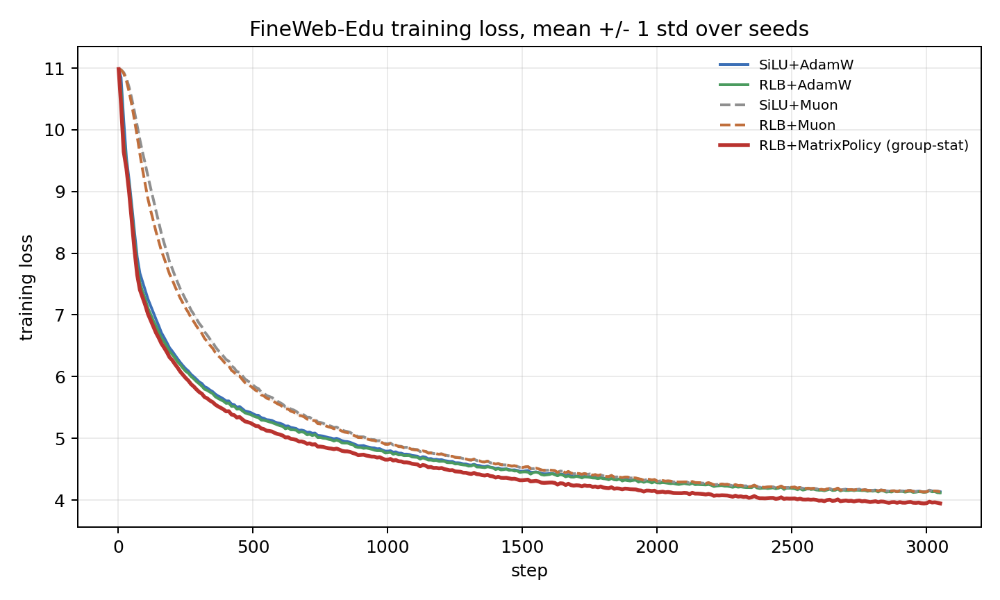

## WikiText Result

| method | final loss | final PPL |
| --- | ---: | ---: |
| RLB MatrixPolicy-Muon | 3.476232 | 32.34 |
| RLB Smooth-MatrixPolicy | 3.493210 | 32.89 |
| SiLU/SwiGLU+AdamW beta2=0.999 | 3.549346 | 34.79 |
| RLB+AdamW beta2=0.999 | 3.550018 | 34.81 |
| RLB+AdamW | 3.617501 | 37.24 |
| SiLU/SwiGLU+AdamW | 3.621982 | 37.41 |
| SiLU/SwiGLU+Muon | 3.644921 | 38.28 |
| RLB+Muon | 3.657877 | 38.78 |

Validation loss:


Validation PPL:


Training loss from step 1:

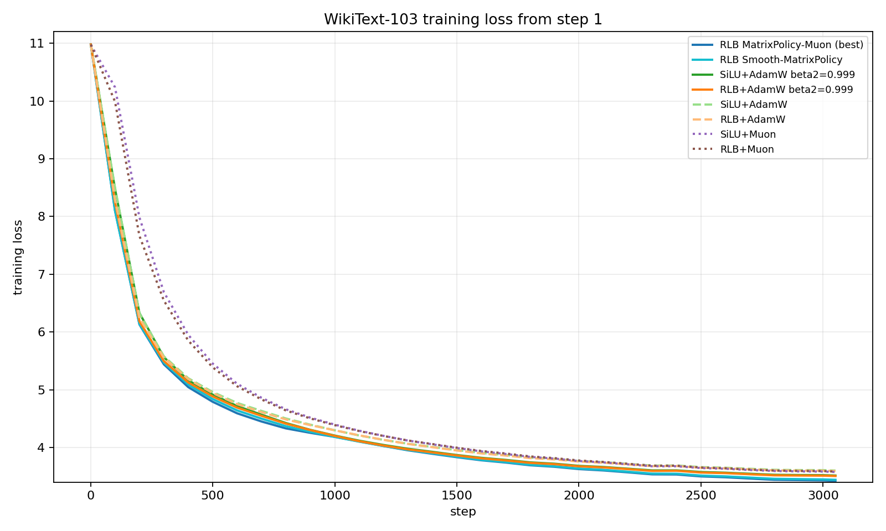

## Main Rule

Every comparison must match outer optimizer configs.

```text
If AdamW uses lr/min_lr/weight_decay = X in a matched cell, MatrixPolicy must also use lr/min_lr/weight_decay = X in that same cell.
```

A matched cell means the same dataset, model, token budget, seed, validation slice, sequence length, global batch, evaluation cadence, and run phase. Partial grids stay out of paper tables. A baseline grid cannot be compared against a non-grid MatrixPolicy row.

## Hard Resource Rules

```text
max 4 A6000 GPUs per job
max 8 A6000 GPUs active total
repo must stay below 200G
eval interval <= 50 for paper/protocol curves
curves and AUC are primary; final validation loss is only one table column
```

## Current Forward Plan

The exact plan is in `experiments/ICLR_EXACT_RUN_PLAN.md`. It is now ordered as:

```text
0. manifest/loader preflight only
1. fixed-config M0 100M main evidence
2. fixed-config M0 300M main evidence
3. M1 scale check
4. 600M long-horizon frontier
5. throughput, memory, and equal-GPU-hour accounting
6. cross-corpus evaluation
7. corpus-shift continued training
8. sensitivity maps only after main evidence
9. method ablations last
```

No sensitivity map or method ablation should start before fixed-config main curves exist.

## Manifest Workflow

Generate and inspect the manifest before any GPU launch:

```bash
python3 experiments/scripts/build_iclr26_main_manifest.py \
  --output experiments/manifests/iclr26_main_manifest.csv \
  --print-summary
```

Launch a bounded manifest chunk:

```bash
CONFIRM_ICLR26_MANIFEST=1 \
MANIFEST=experiments/manifests/iclr26_main_manifest.csv \
ROW_START=0 \
ROW_LIMIT=1 \
sbatch experiments/scripts/run_iclr26_manifest_job.sh
```

The manifest generator verifies that every main cell has the required method rows and that AdamW and MatrixPolicy share the same outer `lr`, `min_lr`, and `weight_decay` config set.

## Method Sketch

RLB replaces the FFN nonlinearity with grouped normalized rational functions:

```text
z = W_in x
z_g = group_g(z)
r_g = sqrt(mean(z_g^2) + eps)
u_g = z_g / r_g
h_g = r_g R_g(u_g)
y = W_out concat_g(h_g)
```

MatrixPolicy partitions backbone weights, rational coefficients, `W_in`, and `W_out`; applies role-aware matrix updates; uses group statistics in the original group-stat recipe; and applies a gauge rebalance. Future claims use matched configs and complete curves.
