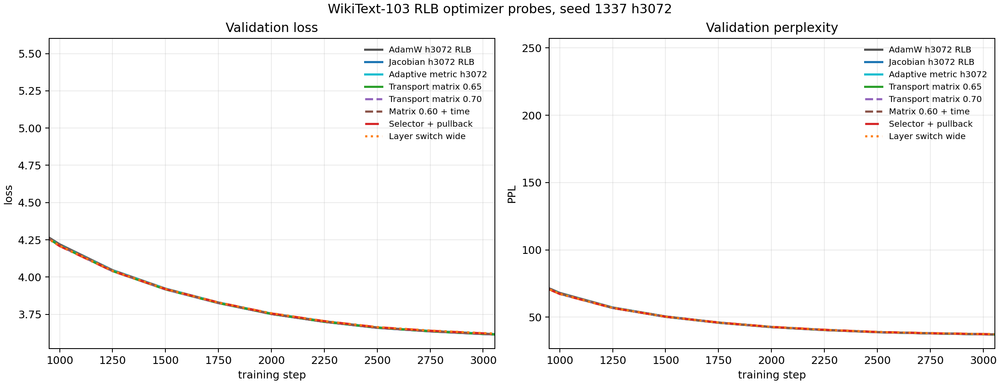
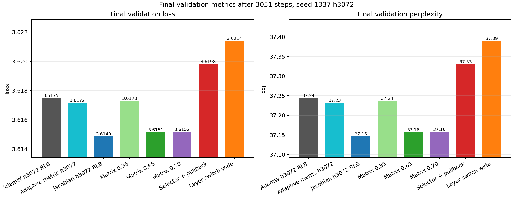
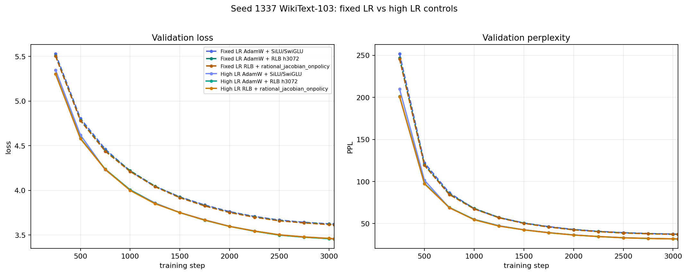
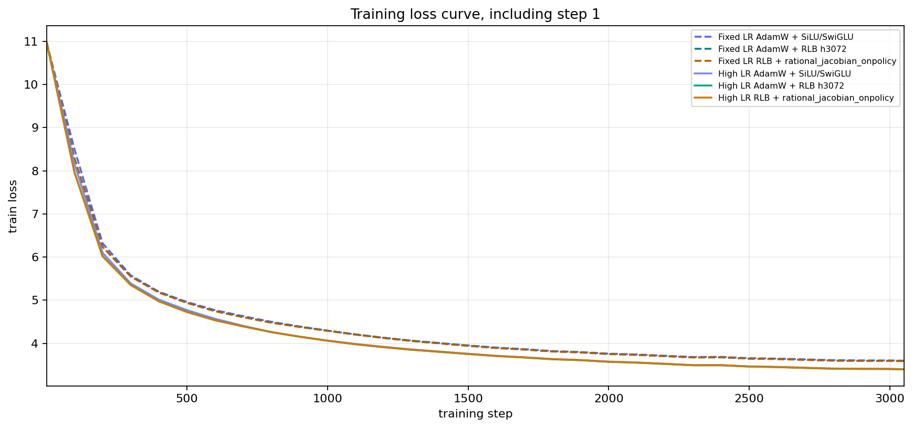
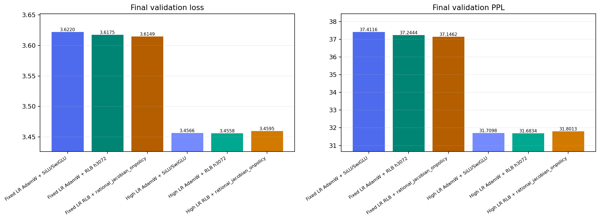

# RationalOPT

Read [READ_FIRST.md](READ_FIRST.md) before running jobs.

This repo studies rational activations and optimizers in a controlled WikiText-103 causal language-modeling benchmark. The current benchmark is a 123M-parameter LLaMA-style decoder-only Transformer. The active question is optimizer-specific: design an optimizer that uses the structure of the no-GLU Rational Local Basis FFN, then compare it fairly against RLB with AdamW/Muon and SiLU/SwiGLU with AdamW/Muon.

## Accepted Comparison

New optimizer experiments use this grid:

```text
SiLU/SwiGLU + AdamW
SiLU/SwiGLU + Muon
RLB + AdamW
RLB + Muon
RLB + factored_adamw                         negative probe
RLB + rational_onpolicy_balance
RLB + rational_quotient_onpolicy
RLB + rational_jacobian_onpolicy
RLB + rational_quotient_jacobian_onpolicy    prototype
RLB + rational_adaptive_metric_onpolicy      prototype
RLB + rational_transport_onpolicy            tested prototype
RLB + rational_jacobian_factored_onpolicy    negative probe
RLB + rational_layerwise_switch_onpolicy     negative probe
RLB + rational_layerwise_factored_switch_onpolicy prototype
```

Rational-specific optimizers are applied only to RLB. The standard optimizer names are `adamw`, `muon`, and the negative-probe ablation `factored_adamw`.

## RLB FFN

RLB is a no-GLU feed-forward layer. It has one expansion projection, grouped rational feature generation, and one output projection:

```text
v = x W_in
s_g = sqrt(mean(v_g^2) + eps)
u_g = v_g / s_g
h_g = s_g R_g(u_g)
y = h W_out
```

There is no gate projection, no up projection, and no SiLU inside the RLB FFN. The current activation variants are:

```text
rlb_fused_fixed_strong_ffn        h = 3072
rlb_fused_fixed_strong_h2880_ffn  h = 2880
```

## Why The Optimizer Is RLB-Specific

RLB has an exact positive group gauge:

```text
W_in,g  <- c W_in,g
W_out,g <- W_out,g / c
```

For positive `c`, the layer function is unchanged. This gives an optimizer a real rational-specific degree of freedom: it can choose the scale representative of each group without changing the model function.

The active optimizer path is:

```text
rational_onpolicy_balance
rational_quotient_onpolicy
rational_jacobian_onpolicy
rational_quotient_jacobian_onpolicy
rational_adaptive_metric_onpolicy
rational_transport_onpolicy
rational_jacobian_factored_onpolicy
rational_layerwise_switch_onpolicy
rational_layerwise_factored_switch_onpolicy
```

`rational_onpolicy_balance` uses live gradient pressure, rational curve activity, and layer depth to apply a function-preserving group-scale correction after each child optimizer step.

`rational_quotient_onpolicy` removes pure gauge motion from the RLB matrix gradients before the child optimizer step, then applies the same on-policy balance transform.

`rational_jacobian_onpolicy` keeps the on-policy balance transform and adds a low-overhead curve-aware preconditioner. It scales each group of `W_in` by the inverse relative rational derivative gain and each group of `W_out` by the inverse relative rational output gain. This directly uses the fact that RLB matrix updates pass through the current learned rational functions.

`rational_quotient_jacobian_onpolicy` is a prototype that combines quotient projection with the Jacobian preconditioner. It is useful as an ablation but did not beat the verified Jacobian row in the seed-1337 probe.

`rational_adaptive_metric_onpolicy` is a prototype that can use live on-policy RLB activation statistics. Its default keeps coefficient Gram conditioning off because that over-conditioned the small rational tensors in probes.

`rational_transport_onpolicy` is a tested prototype. It adds optional rational-only amplitude transport, optional pressure preconditioning, and an on-policy coefficient selector. The selector can switch from aggressive early rational coefficient updates to safer late updates by layer using live coefficient-vs-matrix gradient activity. The validated default is conservative: baseline coefficient dynamics plus matrix preconditioning, because aggressive coefficient schedules caused a late loss penalty.

## Current Full Result

Completed full sweep:

```text
run name: rlb_optimizer_empirical_ngram_full
job ids:  763059 + 813929 + 821187
seeds:    1337, 2024, 31415
budget:   100M training tokens per row
```

Aggregate losses from `experiments/results/rlb_optimizer_empirical_ngram_full/aggregate.csv`:

```text
AdamW + SiLU/SwiGLU                         3.610129  PPL 36.973  sec/step 0.188997
AdamW + RLB h3072                           3.606629  PPL 36.845  sec/step 0.205268
RLB h3072 + rational_onpolicy_balance       3.606226  PPL 36.831  sec/step 0.209027
RLB h3072 + rational_quotient_onpolicy      3.606664  PPL 36.847  sec/step 0.205176
RLB h3072 + rational_jacobian_onpolicy      3.605394  PPL 36.800  sec/step 0.204885
```

The best measured row is `rational_jacobian_onpolicy + rlb_fused_fixed_strong_ffn`, with mean loss gap `-0.004736` versus AdamW + SiLU/SwiGLU and mean gap `-0.001236` versus AdamW on the same RLB activation.

## 2026-05-27 Optimizer Probes

Additional RLB-specific optimizers were implemented and probed on seed 1337 before deciding whether to launch a full multi-seed sweep:

```text
rational_adaptive_metric_onpolicy h3072             3.615887  PPL 37.184
rational_adaptive_metric_onpolicy h2880             3.615114  PPL 37.156
rational_quotient_jacobian_onpolicy h3072           3.615571  PPL 37.173
rational_transport_onpolicy h3072 matrix=0.65       3.615149  PPL 37.157
rational_transport_onpolicy h3072 matrix=0.70       3.615180  PPL 37.158
```

The seed-1337 external baseline is `AdamW + SiLU/SwiGLU` at `3.621982` loss and `37.412` PPL. The activation-controlled baseline is `AdamW + RLB h3072` at `3.617501` loss and `37.244` PPL. Jacobian is not the baseline; it is the current best rational-specific optimizer row. On seed 1337 it reaches `3.614862`, which is `-0.007120` loss versus SiLU+AdamW and `-0.002639` versus RLB+AdamW. The full three-seed recommendation remains unchanged because the new transport probes did not increase that headline gap.

### Transport Probe Analysis

The compact analysis artifacts are in `experiments/results/transport_optimizer_analysis_2026_05_27/`:

```text
loss_ppl_curves.png          optimizer comparison validation loss/PPL curves; x-axis starts at step 1
final_loss_ppl_bars.png      final validation loss and PPL bars
transport_probe_summary.csv  retained probe metrics with SiLU/RLB baseline deltas
```





Seed-1337 comparison. Negative gaps are better than the named baseline:

| row | final loss | final PPL | gap vs SiLU+AdamW | gap vs RLB+AdamW |
| --- | ---: | ---: | ---: | ---: |
| AdamW + SiLU/SwiGLU | 3.621982 | 37.412 | +0.000000 | +0.004480 |
| AdamW + RLB h3072 | 3.617501 | 37.244 | -0.004480 | +0.000000 |
| RLB h3072 + `rational_jacobian_onpolicy` | 3.614862 | 37.146 | -0.007120 | -0.002639 |
| RLB h3072 + transport matrix `0.65`, baseline coeffs | 3.615149 | 37.157 | -0.006833 | -0.002352 |
| RLB h3072 + transport matrix `0.70`, baseline coeffs | 3.615180 | 37.158 | -0.006802 | -0.002321 |
| RLB h3072 + transport matrix-only early probe | 3.615939 | 37.186 | -0.006042 | -0.001562 |
| RLB h3072 + transport matrix `0.60` plus time ramp | 3.616660 | 37.213 | -0.005322 | -0.000841 |
| RLB h3072 + `rational_adaptive_metric_onpolicy` | 3.617174 | 37.232 | -0.004807 | -0.000327 |
| RLB h3072 + selector plus coefficient pullback | 3.619819 | 37.331 | -0.002162 | +0.002318 |
| RLB h3072 + depth-corrected layer switch | 3.621418 | 37.391 | -0.000564 | +0.003917 |
| RLB h3072 + aggressive xfast coefficient schedule | 3.625419 | 37.540 | +0.003438 | +0.007918 |

The important decomposition is: non-GLU RLB itself beats SiLU+AdamW by `-0.004480` on this seed, and the current best rational optimizer adds another `-0.002639` beyond RLB+AdamW. That is useful, but it is not yet the much larger gap we want against the real baseline, `AdamW + SiLU/SwiGLU`.

The main positive transport result is narrow: RLB-aware matrix geometry is consistently useful. The best transport rows kept the rational coefficients on the conservative baseline path and only changed how the matrices see the learned rational curves. A time ramp was worse, which suggests the useful part is stable curve-aware scaling, not late extra pressure.

The main negative result is stronger: aggressive coefficient motion is the wrong place to spend risk in this benchmark. The coefficient selector, layer-specific switches, reset-on-switch, freezes, and late pullback were all trying to avoid the late-penalty pattern, but they still landed behind the matrix-only transport rows and often gave back most of the SiLU+AdamW gap. The likely reason is that rational coefficients are small function parameters, not ordinary dense weights. Early large moves can change the learned scalar nonlinearity enough that later cooldown only stops further damage; it does not restore the better function-space basin.

The next optimizer design should therefore target a larger gap to SiLU+AdamW directly. Matrix preconditioning and gauge balancing should be the default path; coefficient moves should become reversible, function-space-bounded proposals accepted only when a local on-policy test says they help. Layer-specific behavior is still worth using, but it should choose among validated conservative actions rather than switching into aggressive coefficient modes because a schedule says the phase changed.


## 2026-05-27 High-LR Follow-Up

The aggressive optimizer pass added four implementation paths before the high-LR controls were run:

```text
factored_adamw
rational_jacobian_factored_onpolicy
rational_layerwise_switch_onpolicy
rational_layerwise_factored_switch_onpolicy
```

The compact artifacts are in `experiments/results/high_lr_optimizer_followup_2026_05_27/`:

```text
loss_ppl_curves.png          validation loss/PPL curves; x-axis starts at step 1
train_loss_curves.png        training loss curves including the real step-1 point
final_loss_ppl_bars.png      final validation loss and PPL bars
summary.csv                  fixed-LR and high-LR main comparison rows
negative_probe_summary.csv   cancelled/negative ASAM, factored, and layerwise probes
analysis.md                  compact written interpretation
```







Seed-1337 comparison. Negative gaps are better than the named baseline:

| row | final loss | final PPL | gap vs original SiLU+AdamW | gap vs high-LR SiLU+AdamW | gap vs high-LR RLB+AdamW |
| --- | ---: | ---: | ---: | ---: | ---: |
| Fixed LR AdamW + SiLU/SwiGLU | 3.621982 | 37.412 | +0.000000 | +0.165357 | +0.166190 |
| Fixed LR AdamW + RLB h3072 | 3.617501 | 37.244 | -0.004480 | +0.160876 | +0.161709 |
| Fixed LR RLB + `rational_jacobian_onpolicy` | 3.614862 | 37.146 | -0.007120 | +0.158237 | +0.159070 |
| High LR AdamW + SiLU/SwiGLU | 3.456625 | 31.710 | -0.165357 | +0.000000 | +0.000833 |
| High LR AdamW + RLB h3072 | 3.455792 | 31.683 | -0.166190 | -0.000833 | +0.000000 |
| High LR RLB + `rational_jacobian_onpolicy` | 3.459508 | 31.801 | -0.162473 | +0.002883 | +0.003716 |

The high-LR schedule creates the large headline gap versus the old fixed-LR `SiLU+AdamW` row: `-0.166190` loss and `-5.728` PPL for high-LR `RLB+AdamW`. But this is a schedule result, not a rational-optimizer result. Under the same high-LR schedule, `RLB+AdamW` is the best seed-1337 row, high-LR `SiLU+AdamW` is only `0.000833` loss behind it, and high-LR `RLB+rational_jacobian_onpolicy` is worse by `0.003716` loss.

The optimizer lesson is stricter than the earlier transport pass. The robust signal is still conservative matrix/gauge geometry, but the large practical improvement came from correcting the learning-rate budget. ASAM, factored AdamW second moments, and aggressive layerwise coefficient switching all made things worse or were cancelled early because their curves were clearly behind. The next serious design should start from the tuned high-LR `RLB+AdamW` control and only accept rational-specific changes that beat that control, not just the old fixed-LR SiLU baseline.

## Layout

```text
activation/         rational activation package and CUDA extension
training/           WikiText-103 training, sweep, and aggregation scripts
optimizer_design/   RLB-specific optimizer components
experiments/        cache, active runs, logs, and aggregate outputs
```

## Commands

Run the active full comparison set:

```bash
env PYTORCH_CUDA_ALLOC_CONF=expandable_segments:True NCCL_P2P_DISABLE=1 \
  RUN_NAME=rlb_optimizer_empirical_ngram_full \
  STEPS=0 \
  SEEDS="1337 2024 31415" \
  OPTIMIZERS="adamw muon rational_onpolicy_balance rational_quotient_onpolicy rational_jacobian_onpolicy rational_quotient_jacobian_onpolicy rational_adaptive_metric_onpolicy" \
  ACTIVATIONS="silu rlb_fused_fixed_strong_ffn rlb_fused_fixed_strong_h2880_ffn" \
  EVAL_INTERVAL=250 EVAL_BATCHES=20 LOG_INTERVAL=100 \
  sbatch --time=08:00:00 --gres=gpu:nvidia_rtx_6000_ada_generation:4 training/run_wikitext103_optimizer_sweep.sbatch
```

Aggregate completed jobs:

```bash
.venv-cu128/bin/python training/aggregate_wikitext103_multiseed.py \
  --run-dir experiments/runs/wikitext103/rlb_optimizer_empirical_ngram_full \
  --out-dir experiments/results/rlb_optimizer_empirical_ngram_full \
  --baseline silu \
  --baseline-optimizer adamw \
  --classic-optimizer adamw \
  --job-id 763059+813929+821187 \
  --log-path experiments/runs/logs/ract-wt103-opt-821187.out
```
