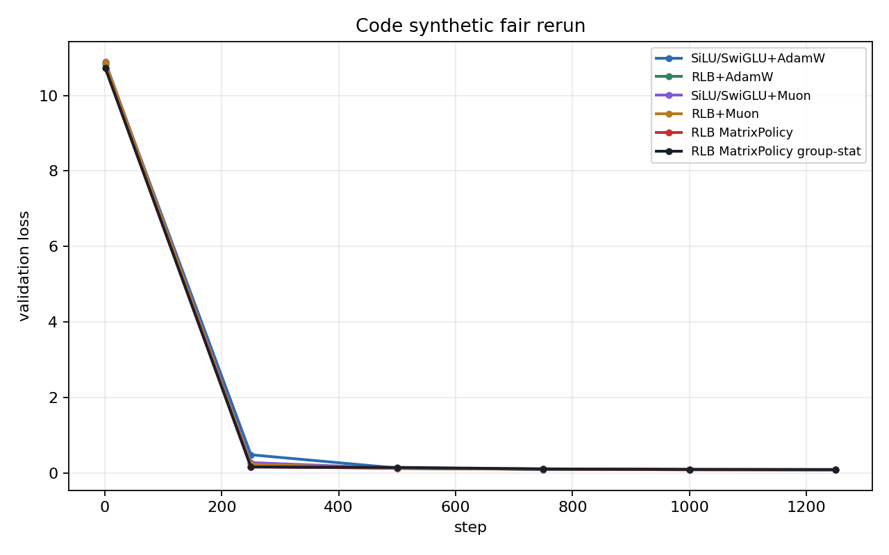
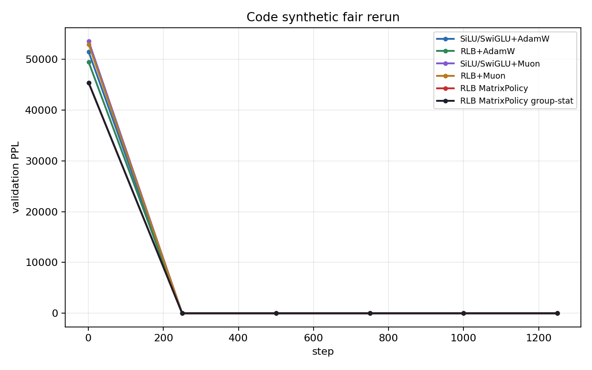
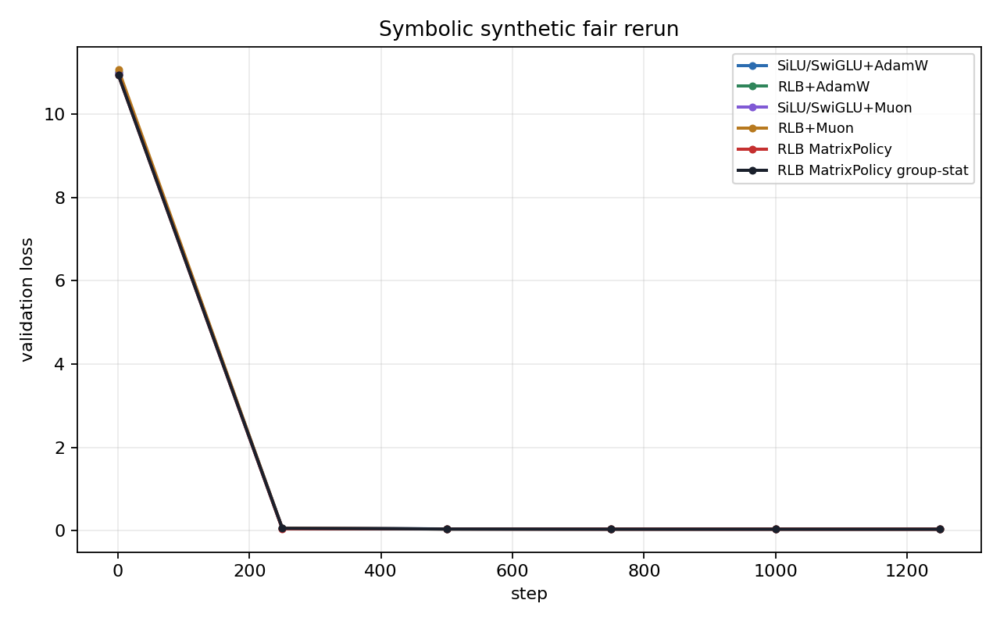
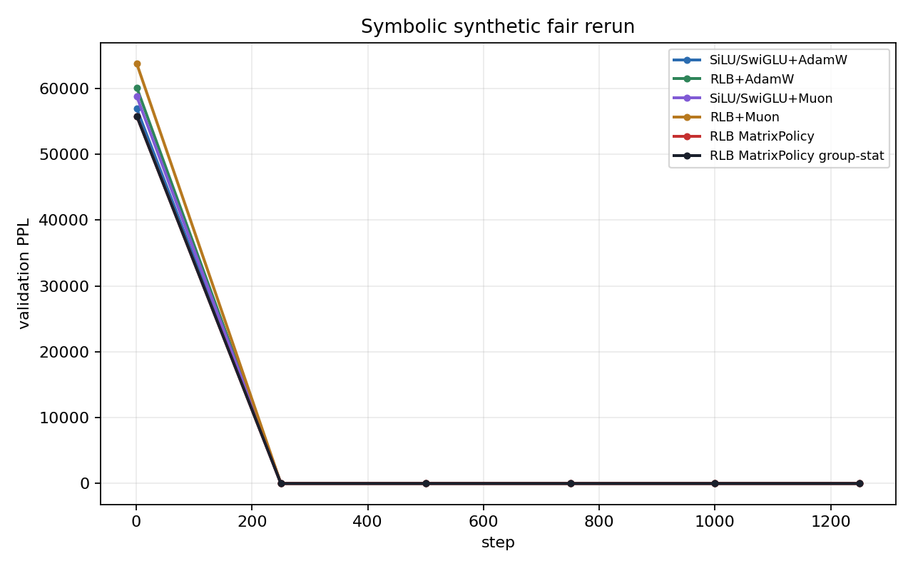
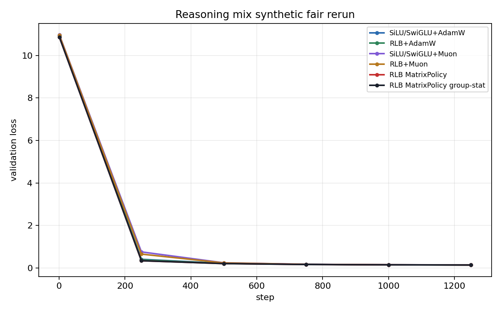
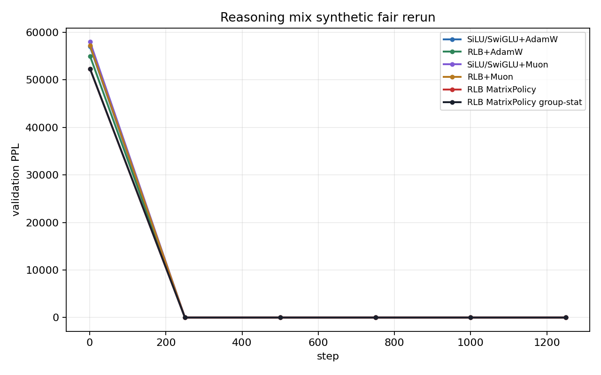

# RationalOPT

RationalOPT is a small-scale language-modeling study of rational feed-forward layers and optimizers that exploit their structure. The central question is:

```text
Can a no-GLU rational FFN train better than SiLU/SwiGLU when the optimizer uses rational-specific geometry, under the same model size, tokens, seed, base LR schedule, and evaluation cadence?
```

The project is not trying to win by changing the global learning-rate schedule. A result counts only when the rational model and rational optimizer beat strong generic controls under the same base training protocol.

## Research Object

The model replacement is a Rational Local Basis FFN (RLB). For input `x`, hidden width split into groups `g = 1..G`, and group width `m`:

```text
z = W_in x
z_g = group_g(z)
r_g = sqrt(mean(z_g^2) + eps)
u_g = z_g / r_g
h_g = r_g R_g(u_g)
y = W_out concat_g(h_g)
```

`R_g` is a learned rational function with local odd/bump basis terms. There is no GLU gate and no hidden SiLU branch inside the RLB FFN.

The useful symmetry is a positive group gauge. Let `D(a)` be block diagonal with block `a_g I_m`, `a_g > 0`. Then

```text
W_in'  = D(a) W_in
W_out' = W_out D(a)^(-1)
```

preserves the represented RLB block function. This gives an optimizer-specific problem: generic optimizers can behave differently on equivalent parameterizations, while an RLB optimizer can try to update useful function directions and control gauge drift.

## Optimizer

The current optimizer family is `rational_matrix_policy_onpolicy`. In plain terms, MatrixPolicy is the optimizer for the RLB matrices `W_in` and `W_out`; it is not the optimizer for every parameter in the Transformer. The rest of the model stays on ordinary optimizers so the comparison remains focused on whether RLB-specific matrix geometry helps.

For each RLB layer, write:

```text
A_l = W_in,l   input selector into rational groups
B_l = W_out,l  output recombiner back to the residual stream
```

MatrixPolicy is a deterministic local rule for these matrices. It chooses the update for each matrix from its role, its layer depth, the current training phase, and optional live RLB group statistics. The full run partitions parameters into:

```text
theta_backbone: ordinary Transformer parameters
theta_coeff:    rational numerator, denominator, centers, local basis coefficients
A_l:            RLB W_in matrix in layer l
B_l:            RLB W_out matrix in layer l
```

The best verified variant uses:

```text
theta_backbone -> AdamW
theta_coeff    -> AdamW/function-space coefficient optimizer when enabled
A_l, B_l       -> RationalMatrixPolicyOptimizer
RLB groups     -> on-policy function-preserving gauge rebalance
```

For each RLB matrix group, MatrixPolicy computes a role/depth scale. With normalized layer depth `d_l = l/(L-1)`:

```text
rho_in(l)  = clip(1 - 0.50 (d_l - 0.5), 0.55, 1.40)
rho_out(l) = clip(1 + 1.00 (d_l - 0.5), 0.55, 1.40)
```

AdamW on RLB matrices receives a role-scaled multiplier, while a short early Muon component is blended only into the RLB matrices:

```text
Delta A_l = Delta_AdamW(A_l; eta_t s_A(l,in,t) [1 - mu(l,in,t)])
          + Delta_Muon (A_l; eta_t s_M mu(l,in,t))

Delta B_l = Delta_AdamW(B_l; eta_t s_A(l,out,t) [1 - mu(l,out,t)])
          + Delta_Muon (B_l; eta_t s_M mu(l,out,t))
```

The Muon fraction `mu(l, role, t)` turns on smoothly near the beginning of training, decays after the early phase, and is modulated by role, depth, and live RLB pressure statistics. The base LR `eta_t` is shared with all controls.

Group-stat variants additionally precondition matrix gradients per rational group. For group activity/pressure scale `q_g`, the optimizer uses a centered inverse scale

```text
c_g = (geomean(q) / q_g)^alpha
c_g <- c_g / geomean(c)
c_g <- clip(c_g, c_min, c_max)
```

and multiplies the corresponding `W_in` rows or `W_out` columns by `c_g` before the AdamW/Muon step. The outer on-policy wrapper then applies the exact gauge transform above, so gauge correction changes parameterization but preserves the represented function.

The full mathematical definition is in [optimizer_design/README.md](optimizer_design/README.md).

## Experimental Contract

A serious comparison must include:

```text
SiLU/SwiGLU + AdamW
RLB + AdamW
SiLU/SwiGLU + Muon
RLB + Muon
RLB + MatrixPolicy variants
```

A rational optimizer result is credible only if these are held fixed across rows:

```text
model size, token budget, seed, batch shape, sequence length,
base LR schedule, weight decay, eval cadence, dataset, dataset config
```

Jacobian, quotient, transport, coefficient-only, and scheduler variants are ablations, not the baseline target.

## Evidence So Far

The best verified WikiText-103 row is a modest but real same-LR win:

| method | final loss | final PPL |
| --- | ---: | ---: |
| RLB MatrixPolicy-Muon | 3.476232 | 32.34 |
| RLB Smooth-MatrixPolicy | 3.493210 | 32.89 |
| SiLU/SwiGLU+AdamW beta2=0.999 | 3.549346 | 34.79 |
| RLB+AdamW beta2=0.999 | 3.550018 | 34.81 |
| RLB+AdamW | 3.617501 | 37.24 |
| SiLU/SwiGLU+AdamW | 3.621982 | 37.41 |
| SiLU/SwiGLU+Muon | 3.644921 | 38.28 |
| RLB+Muon | 3.657877 | 38.78 |

The current gap over the strongest `SiLU/SwiGLU+AdamW` row is `0.0731` loss and `2.45` PPL. This supports the optimizer direction but does not yet meet the intended `0.2-0.3` loss-gap target.

## Figures

WikiText-103 validation loss:


WikiText-103 validation PPL:


WikiText-103 training loss from step 1:


Sparse synthetic validation curves are included only as provisional curve evidence. They suggest faster rational drops but are too sparse and too saturated for a final claim.













## Current Falsification Tests

The next evidence must answer mechanism-level questions:

| test | pass condition |
| --- | --- |
| Dense synthetic curves | RLB advantage appears in step-1 training and validation curves, not just sparse final checkpoints. |
| Positive gauge stress | MatrixPolicy degrades less than generic `RLB+AdamW` and `RLB+Muon` under equivalent-function gauge reparameterization. |
| Hard non-saturated tasks | Early rational advantage remains visible when controls do not reach loss `<0.1`. |
| Real LM transfer | The optimizer advantage survives a second small-scale LM task. |

If MatrixPolicy is not more gauge-stable than generic RLB optimizers, the current optimizer is not exploiting the clearest RLB symmetry and should be redesigned before adding more benchmarks.

## Repository Map

```text
activation/         RLB activation implementation
optimizer_design/   rational-specific optimizer implementations
training/           LM harness, synthetic generators, optimizer wiring
experiments/        launchers, summarizers, committed figures
```

Raw run directories under `experiments/runs/` are local artifacts. Research figures and compact summaries live under `experiments/results/`.
