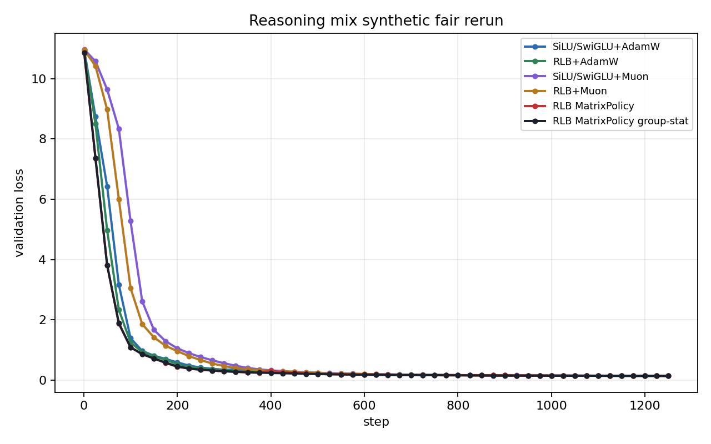
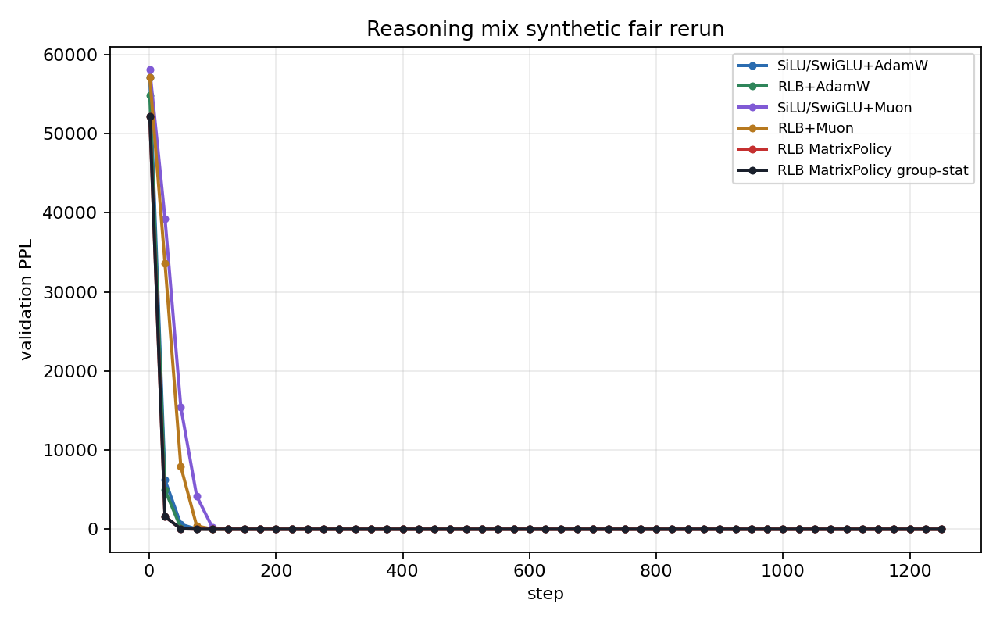
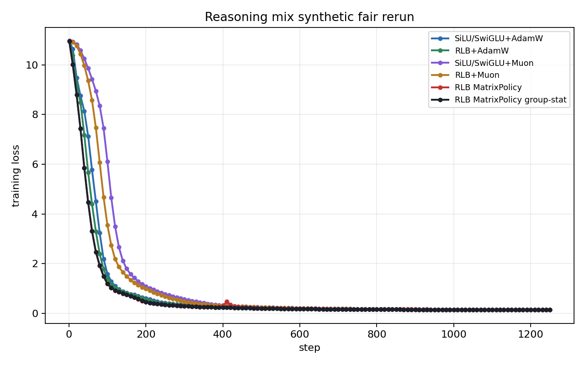

# RationalOPT

RationalOPT is a small-scale language-modeling study of rational feed-forward layers and optimizers that exploit their structure. The central question is:

```text
Can a no-GLU rational FFN train better than SiLU/SwiGLU when the optimizer uses rational-specific geometry, under the same model size, tokens, seed, base LR schedule, and evaluation cadence?
```

The project is not trying to win by changing the global learning-rate schedule. A result counts only when the rational model and rational optimizer beat strong generic controls under the same base training protocol.

## Research Object

The model replacement is a Rational Local Basis FFN (RLB). For input `x`, hidden width split into groups `g = 1..G`, and group width `m`:

```text
z = W_in x
z_g = group_g(z)
r_g = sqrt(mean(z_g^2) + eps)
u_g = z_g / r_g
h_g = r_g R_g(u_g)
y = W_out concat_g(h_g)
```

`R_g` is a learned rational function with local odd/bump basis terms. There is no GLU gate and no hidden SiLU branch inside the RLB FFN.

The useful symmetry is a positive group gauge. Let `D(a)` be block diagonal with block `a_g I_m`, `a_g > 0`. Then

```text
W_in'  = D(a) W_in
W_out' = W_out D(a)^(-1)
```

preserves the represented RLB block function. Generic optimizers can behave differently on equivalent parameterizations; an RLB optimizer can try to update useful function directions while controlling gauge drift.

## MatrixPolicy Optimizer

The current optimizer family is `rational_matrix_policy_onpolicy`. MatrixPolicy is the optimizer for the RLB matrices `W_in` and `W_out`; it is not a whole-Transformer optimizer. The rest of the model stays on ordinary optimizers so the comparison isolates RLB-specific matrix geometry.

For each RLB layer, write:

```text
A_l = W_in,l   input selector into rational groups
B_l = W_out,l  output recombiner back to the residual stream
```

The verified MatrixPolicy run partitions parameters as:

```text
theta_backbone -> AdamW
theta_coeff    -> AdamW/function-space coefficient optimizer when enabled
A_l, B_l       -> RationalMatrixPolicyOptimizer
RLB groups     -> on-policy function-preserving gauge rebalance
```

For each RLB matrix group, MatrixPolicy computes a role/depth scale. With normalized layer depth `d_l = l/(L-1)`:

```text
rho_in(l)  = clip(1 - 0.50 (d_l - 0.5), 0.55, 1.40)
rho_out(l) = clip(1 + 1.00 (d_l - 0.5), 0.55, 1.40)
```

AdamW on RLB matrices receives this role-scaled multiplier, while a short early Muon component is blended only into the RLB matrices:

```text
Delta A_l = Delta_AdamW(A_l; eta_t s_A(l,in,t) [1 - mu(l,in,t)])
          + Delta_Muon (A_l; eta_t s_M mu(l,in,t))

Delta B_l = Delta_AdamW(B_l; eta_t s_A(l,out,t) [1 - mu(l,out,t)])
          + Delta_Muon (B_l; eta_t s_M mu(l,out,t))
```

The base LR `eta_t` is shared with all controls. Group-stat variants additionally precondition matrix gradients per rational group, then the outer wrapper applies the exact gauge transform. The full mathematical definition is in [optimizer_design/README.md](optimizer_design/README.md).

## Evidence Boundary

The best verified WikiText-103 row is a modest same-LR win:

| method | final loss | final PPL |
| --- | ---: | ---: |
| RLB MatrixPolicy-Muon | 3.476232 | 32.34 |
| RLB Smooth-MatrixPolicy | 3.493210 | 32.89 |
| SiLU/SwiGLU+AdamW beta2=0.999 | 3.549346 | 34.79 |
| RLB+AdamW beta2=0.999 | 3.550018 | 34.81 |
| RLB+AdamW | 3.617501 | 37.24 |
| SiLU/SwiGLU+AdamW | 3.621982 | 37.41 |
| SiLU/SwiGLU+Muon | 3.644921 | 38.28 |
| RLB+Muon | 3.657877 | 38.78 |

The current real-LM gap over the strongest `SiLU/SwiGLU+AdamW` row is `0.0731` loss and `2.45` PPL. This supports the optimizer direction but does not meet the intended `0.2-0.3` loss-gap target.

Dense synthetic runs now give the more important short-run signal: MatrixPolicy improves the curve, especially before the task saturates. The table reports mean validation loss AUC through step 200; lower is better.

| task | best MatrixPolicy curve row | MatrixPolicy AUC200 | RLB+AdamW AUC200 | SiLU+AdamW AUC200 | first MatrixPolicy val <= 0.2 | final interpretation |
| --- | --- | ---: | ---: | ---: | ---: | --- |
| Code | group-stat | 2.1462 | 2.4336 | 2.7252 | 200 | early win, final saturated and SiLU+AdamW ends slightly lower |
| Symbolic | group-stat | 1.6594 | 2.0576 | 2.4332 | 150 | strong early win, final differences are floor-level |
| Reasoning mix | MatrixPolicy | 2.7143 | 3.1170 | 3.4677 | 550 | early win; group-stat also gives best final loss, 0.1424 |

The positive-gauge stress run is a mechanism test, not a final benchmark. At gauge log scale `2.0`, MatrixPolicy remains the fastest early curve on both tasks, but the stressed parameterization often trains faster than gauge `0.0` for all optimizers. This means the current gauge run shows optimizer sensitivity to gauge, not a clean proof of gauge invariance.

| task | gauge | best early row | best AUC200 | RLB+AdamW AUC200 | RLB+Muon AUC200 | final note |
| --- | ---: | --- | ---: | ---: | ---: | --- |
| Code | 0.0 | MatrixPolicy | 2.1541 | 2.4297 | 4.2148 | AdamW/Muon catch up late |
| Code | 2.0 | MatrixPolicy group-stat | 1.9561 | 2.2702 | 3.4906 | Muon has best final loss |
| Reasoning mix | 0.0 | MatrixPolicy | 2.7346 | 3.1179 | 4.8260 | group-stat has best final loss |
| Reasoning mix | 2.0 | MatrixPolicy | 2.5668 | 2.9404 | 4.1080 | group-stat has best final loss |

Current claim: MatrixPolicy is a rational-specific early/mid training accelerator. The group-stat variant can preserve that speed into final loss on reasoning_mix, but the synthetic tasks are too saturated to support a large final-gap claim. The next paper-level target is to convert this curve lead into a robust final gap on harder non-saturated tasks and real LM transfer.

## Figures

WikiText-103 validation loss:


WikiText-103 validation PPL:


WikiText-103 training loss from step 1:


Dense synthetic reasoning_mix validation loss:



Dense synthetic reasoning_mix validation PPL:



Dense synthetic reasoning_mix training loss:



Gauge-stressed reasoning_mix validation loss:


Gauge-stressed reasoning_mix validation PPL:


Full dense and gauge result packages are in [experiments/results/synthetic_dense_curves_2026_05_29](experiments/results/synthetic_dense_curves_2026_05_29) and [experiments/results/rlb_gauge_stress_2026_05_29](experiments/results/rlb_gauge_stress_2026_05_29).

## Interpretation

What is working:

- RLB itself drops faster than SiLU/SwiGLU on the synthetic tasks, especially before the loss floor.
- MatrixPolicy improves that early drop beyond generic `RLB+AdamW` and far beyond `RLB+Muon` on the same base LR.
- The role/depth matrix policy seems useful: `W_in` and `W_out` should not be optimized as interchangeable matrices.
- Group-stat scaling is mild but useful on reasoning_mix, where it preserves the curve lead into the best final row.

What is not yet solved:

- On Code and Symbolic, the tasks saturate so final loss is not a strong discriminator.
- MatrixPolicy can spend its early advantage before the end of training; late retention is the main weakness.
- Gauge log scale `2.0` was not a pure degradation stress. More gauge seeds/scales and direct gauge-drift diagnostics are required.
- The desired `0.2-0.3` real-LM loss gap has not been reached.

## Experimental Contract

A serious comparison must include:

```text
SiLU/SwiGLU + AdamW
RLB + AdamW
SiLU/SwiGLU + Muon
RLB + Muon
RLB + MatrixPolicy variants
```

A rational optimizer result is credible only if these are held fixed across rows:

```text
model size, token budget, seed, batch shape, sequence length,
base LR schedule, weight decay, eval cadence, dataset, dataset config
```

Jacobian, quotient, transport, coefficient-only, and scheduler variants are ablations, not the baseline target.

## Next Tests

| test | pass condition |
| --- | --- |
| Hard non-saturated tasks | MatrixPolicy curve lead becomes a final loss gap before the task hits a floor. |
| Gauge sweep | MatrixPolicy has lower sensitivity across gauge seeds/scales, not just one gauge draw. |
| Function-space audit | Better loss/AUC comes with less gauge drift or better function-change-per-update. |
| Real LM transfer | The optimizer advantage survives another small-scale LM task beyond WikiText-103. |
| Seeds | Best claims hold across at least two seeds. |

## Repository Map

```text
activation/         RLB activation implementation
optimizer_design/   rational-specific optimizer implementations
training/           LM harness, synthetic generators, optimizer wiring
experiments/        launchers, summarizers, committed figures
```

Raw run directories under `experiments/runs/` are local artifacts. Research figures and compact summaries live under `experiments/results/`.
