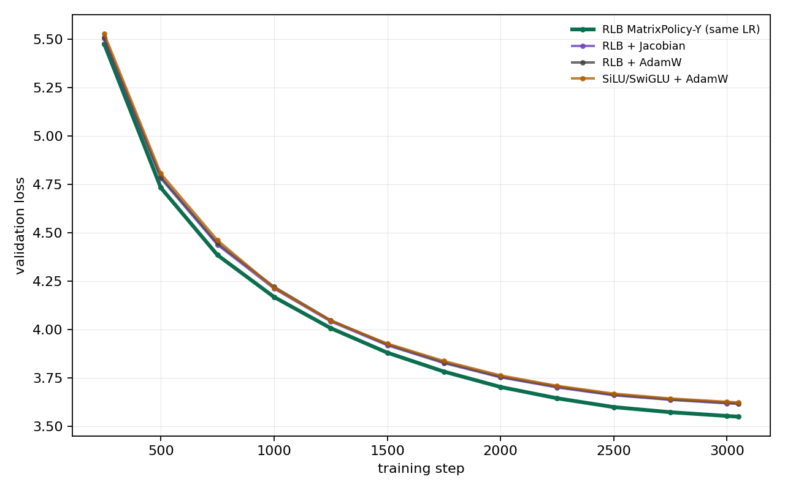
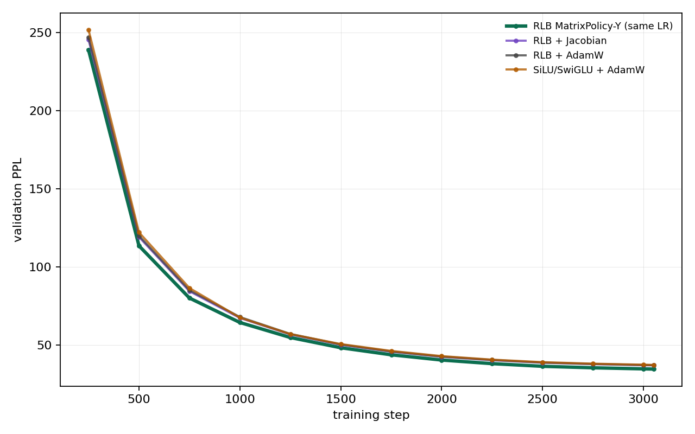
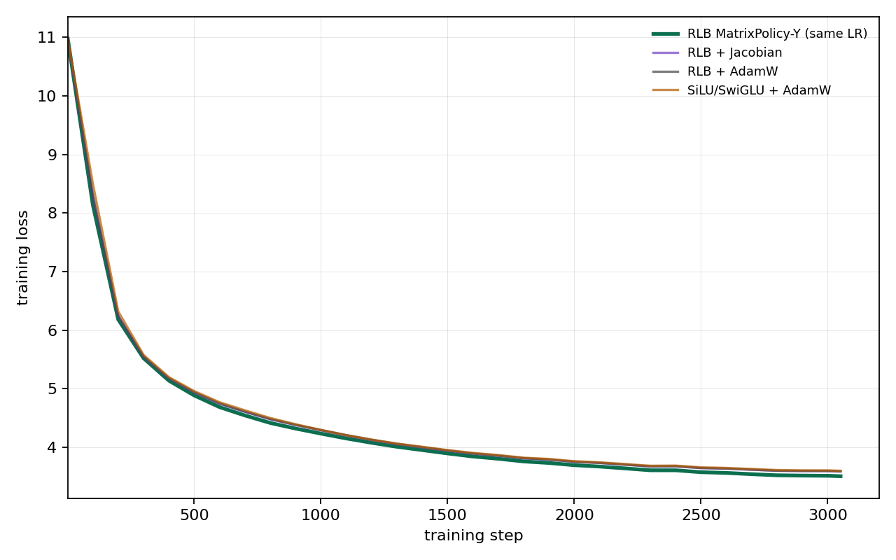
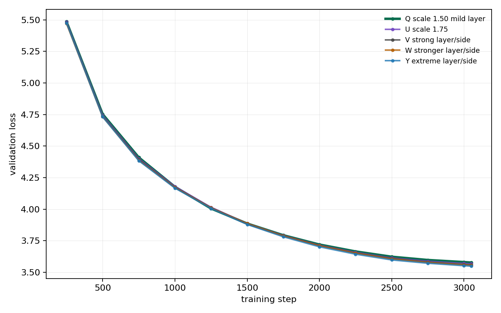

# RationalOPT

RationalOPT is an optimizer-design repo for the no-GLU Rational Local Basis FFN (RLB). The goal is not to win by changing the global learning-rate schedule. The goal is an RLB-specific optimizer that beats both hard controls under the same model, token budget, base LR, warmup, cosine schedule, and evaluation protocol:

```text
SiLU/SwiGLU + AdamW
RLB + AdamW
```

Jacobian, transport, matrix-policy, and other rational optimizers are candidate methods, not baselines. LR ablations are not part of the main claim until the same-LR optimizer has a much larger gap.

## Current Best Result

The current best same-LR optimizer is:

```text
RLB + rational_matrix_policy_onpolicy
```

This is the Probe Y policy, now the default for `rational_matrix_policy_onpolicy`. It keeps the benchmark schedule fixed at `lr=3e-4`, `min_lr=3e-5`; the change is inside the optimizer. RLB `W_in` and `W_out` matrices are updated by a dedicated layer/side policy while the rest of the model remains on AdamW. The policy strongly favors shallow input-side adaptation and deep output-side adaptation, which matches the RLB computation path:

```text
v = x W_in
u_g = v_g / rms(v_g)
h_g = rms(v_g) R_g(u_g)
y = h W_out
```

Single-seed full 3051-step WikiText-103 result, seed 1337, same LR/schedule:

| row | final loss | final PPL | gap vs winner loss | gap vs winner PPL |
| --- | ---: | ---: | ---: | ---: |
| RLB MatrixPolicy-Y | 3.548665 | 34.77 | 0.000000 | 0.00 |
| RLB + Jacobian | 3.614862 | 37.15 | 0.066197 | 2.38 |
| RLB + AdamW | 3.617501 | 37.24 | 0.068836 | 2.48 |
| SiLU/SwiGLU + AdamW | 3.621982 | 37.41 | 0.073316 | 2.64 |

At the 1250-step same-schedule diagnostic horizon, the same policy reached `4.126142 / 61.94`, versus `4.245049 / 69.76` for `RLB+AdamW` and `4.254405 / 70.41` for `SiLU/SwiGLU+AdamW`.

The PPL gap is now in the requested 2-3+ range on the full run, but the loss gap is still only about `0.07`, not the desired `0.2-0.3`. Therefore the optimizer is a real improvement, but not yet the final research target.

## Plots

Training loss starts at step 1. Validation loss/PPL starts at step 250 because that is the first evaluation point in the benchmark.







Optimizer ablation among same-LR matrix-policy variants:



## What Helped

The strongest signal was not coefficient motion or a generic scheduler. It was larger, RLB-specific AdamW-style updates on the two RLB FFN matrices.

What improved results:

| change | effect |
| --- | --- |
| Separate RLB matrices from the rest of AdamW | lets only `W_in/W_out` receive rational-specific policy |
| Increase RLB matrix step scale under the same global LR | gave the main loss/PPL gap |
| Make policy layer/side-specific | better than a uniform matrix scale |
| Favor shallow `W_in` and deep `W_out` | matched RLB derivative path into `W_in` and feature path into `W_out` |
| Keep the policy sustained instead of switching it off | late performance improved versus switch-down variants |

The final policy uses:

```text
adam_lr_scale          3.00
adam_role_strength     1.20
input_depth_gain      -0.50
output_depth_gain      1.00
adam_min_lr_scale      0.40
adam_max_lr_scale      4.00
muon_strength          0.00
transport_matrix       0.00
```

## What Hurt

Several plausible rational-specific ideas were tested and rejected for this benchmark:

| method | result |
| --- | --- |
| Muon on RLB matrices | early motion did not translate into durable validation gain |
| Manual MatrixAdamW variant | worse late curve than MatrixPolicy and removed from active code |
| Function-space coefficient switch | damaged mid/late validation despite rational-specific design |
| Functional trust coefficient optimizer | too conservative/unstable relative to matrix policy |
| Transport matrix preconditioning | did not beat strong matrix-policy scaling |
| Early on-policy pressure/activity selectors | often hurt the middle of the curve |
| Factored matrix second moments | clearly negative in this setup |

The lesson is narrow but useful: for this RLB model and dataset, the trainable rational coefficients are not the first place to spend optimizer complexity. The durable win comes from exploiting how RLB matrices see different functional roles by layer and side.

## Reproducing The Current Best

Run the best same-LR policy directly:

```bash
env PYTORCH_CUDA_ALLOC_CONF=expandable_segments:True NCCL_P2P_DISABLE=1   RUN_NAME=rlb_matrix_policy_same_lr   STEPS=3051 SEEDS=1337   OPTIMIZERS=rational_matrix_policy_onpolicy   ACTIVATIONS=rlb_fused_fixed_strong_ffn   EVAL_INTERVAL=250 EVAL_BATCHES=20 LOG_INTERVAL=100   sbatch --time=02:00:00 --gres=gpu:nvidia_rtx_6000_ada_generation:4   training/run_wikitext103_optimizer_sweep.sbatch
```

Run hard controls under the same schedule:

```bash
env PYTORCH_CUDA_ALLOC_CONF=expandable_segments:True NCCL_P2P_DISABLE=1   RUN_NAME=rlb_same_lr_controls   STEPS=3051 SEEDS=1337   OPTIMIZERS="adamw rational_jacobian_onpolicy"   ACTIVATIONS="silu rlb_fused_fixed_strong_ffn"   EVAL_INTERVAL=250 EVAL_BATCHES=20 LOG_INTERVAL=100   sbatch --time=02:00:00 --gres=gpu:nvidia_rtx_6000_ada_generation:4   training/run_wikitext103_optimizer_sweep.sbatch
```

## Next Work

The next optimizer should keep the same global LR and try to close the loss-gap problem. The most promising direction is still matrix-policy control, but with a more principled on-policy controller:

```text
1. keep the strong layer/side matrix policy as the base
2. add live pressure balancing only if it improves the middle curve
3. use coefficient updates only when predicted function-space gain beats matrix-only gain
4. add trust based on actual RLB u-distribution and denominator margin
5. do not run LR ablations until same-LR loss gap is much larger
```

## Layout

```text
activation/         rational activation package and CUDA extension
training/           WikiText-103 training, sweep, and aggregation scripts
optimizer_design/   RLB-specific optimizer components
experiments/        local run outputs and compact result artifacts
```
