# ICLR Run Status

Updated: 2026-07-17 EDT
Manifest: `experiments/manifests/iclr26_main_manifest.csv`

## Experiment Code Map

The ICLR runs in this status file are generated by the manifest workflow below:

| Role | File |
| --- | --- |
| Manifest generator | `experiments/scripts/build_iclr26_main_manifest.py` |
| Manifest used by queued jobs | `experiments/manifests/iclr26_main_manifest.csv` |
| Exact command log | `experiments/ICLR_RUN_COMMANDS.md` |
| Slurm manifest launcher | `experiments/scripts/run_iclr26_manifest_job.sh` |
| Per-row training wrapper called by the launcher | `training/run_lm_optimizer_sweep.sbatch` |
| Training harness and JSONL writer | `training/transformer_lm_compare.py` |
| MatrixPolicy implementation | `optimizer_design/matrix_policy_optimizer.py` |
| MatrixPolicy private wrapper mechanics | `optimizer_design/transport_onpolicy_optimizer.py` |
| Broad optimizer baselines | `optimizer_design/baseline_optimizers.py` |
| RLB activation implementation | `activation/rational_opt/rational.py`, `activation/csrc/` |
| E1 curve/table generator | `experiments/scripts/plot_iclr26_e1_curves.py` |
| E1 token-to-target summarizer | `experiments/scripts/summarize_iclr26_e1_token_savings.py` |
| E2 completed-cell summarizer | `experiments/scripts/summarize_iclr26_e2_dataset.py` |
| E2 curve/table generator | `experiments/scripts/plot_iclr26_e2_curves.py` |
| Completed-cell runtime summarizer | `experiments/scripts/summarize_iclr26_runtimes.py` |

Raw row outputs are JSONL files under `experiments/runs/iclr26_main/<phase>/<dataset>/<row_id>/<activation>.jsonl`. Slurm stdout logs are under `experiments/runs/logs/`.

Rejected MatrixPolicy proposal artifacts were pruned from the active repo surface and raw run tree on 2026-06-23. The single retained negative-result state is `optimizer_design/proposals/matrixpolicy_variant_failures.md`; this status file keeps the completed implementation-speed records plus the current RLB MatrixPolicy and non-MatrixPolicy RLB-control paper-facing summaries.

## MatrixPolicy Live-Statistic Correction Status
Main completed: 2026-07-14. E8 completed: 2026-07-15. Decision: use the validated correction campaign as the paper-facing MatrixPolicy source for completed E1/E2 summaries and E8 sensitivity analysis.

The correction preserves the grouped P5/Q4 `rlb_fused_global_rational` activation and original `rational_matrix_policy_onpolicy` recipe. It globally reduces the optimizer-consumed response/derivative sufficient statistics across ranks and prevents validation forwards from refreshing the training cache. The earlier global-rational MatrixPolicy rows are superseded; the non-MatrixPolicy global-rational controls remain valid because they do not consume these live gains.

| Field | Value |
| --- | --- |
| Campaign | `experiments/corrections/matrixpolicy_live_stats_20260712/` |
| Paper-facing manifests | `matrixpolicy_live_stats_20260712_main.csv`; `matrixpolicy_live_stats_20260712_e8.csv` |
| Validation records | `validation/main.json`; `validation/e8.json` |
| Scope | E1 + E2: five datasets x three seeds per phase; E8: five datasets x 16 LR/WD cells |
| Completed rows | main `30/30`; E8 `80/80` passed validation |
| Slurm restarts | main: `0/30`; E8: 40 rows at zero and 40 rows at one |
| Activation | `rlb_fused_global_rational`; trainable rational parameters are `numerator` and `denominator` |
| Optimizer | original `rational_matrix_policy_onpolicy` |
| E8/E9 | E8 complete and paper-facing; E9 recovery queued and excluded pending validation |

E1 final validation-loss anchor with the corrected MatrixPolicy overlay:

| Dataset | MatrixPolicy final val loss | next best current method | gap |
| --- | ---: | ---: | ---: |
| DCLM | 4.252404 +/- 0.005837 | rlb_lion 4.294575 +/- 0.008320 | 0.042171 |
| FineWeb-Edu | 4.085588 +/- 0.009984 | rlb_lion 4.136091 +/- 0.008299 | 0.050503 |
| FineWeb | 4.317483 +/- 0.013287 | rlb_lion 4.362572 +/- 0.011154 | 0.045089 |
| Dolma-sample | 4.323237 +/- 0.003625 | rlb_lion 4.362160 +/- 0.006582 | 0.038923 |
| C4 | 4.286474 +/- 0.020047 | rlb_lion 4.327134 +/- 0.015977 | 0.040660 |

E2 final validation-loss anchor with the corrected MatrixPolicy overlay:

| Dataset | MatrixPolicy final val loss | next best aggregate method | gap |
| --- | ---: | ---: | ---: |
| DCLM | 3.951745 +/- 0.029409 | rlb_lion 3.988719 +/- 0.029477 | 0.036973 |
| FineWeb-Edu | 3.702151 +/- 0.020357 | rlb_muon 3.737328 +/- 0.018698 | 0.035177 |
| FineWeb | 3.962942 +/- 0.008025 | rlb_lion 3.996049 +/- 0.010524 | 0.033107 |
| Dolma-sample | 3.805292 +/- 0.007943 | rlb_lion 3.841206 +/- 0.008478 | 0.035914 |
| C4 | 3.878322 +/- 0.015039 | rlb_lion 3.913219 +/- 0.013928 | 0.034897 |

Interpretation: the 30 corrected rows replace MatrixPolicy in every E1/E2 generated summary, table, and curve. The completed non-MatrixPolicy RLB sweep remains the source for matched RLB controls.

E8 pairs the 80 validated corrected MatrixPolicy rows with the 160 unaffected
SiLU controls from `experiments/manifests/iclr26_e8_primary_manifest.csv`.
Across all 80 cells per comparator, MatrixPolicy has lower validation loss at
all 61 observed checkpoints. The minimum complete-trajectory margins are
`0.037904` against SiLU+AdamW and `0.042953` against SiLU+Muon. At the
main targets, pooled median first-hit token savings are `15.7%` and `19.9%`,
respectively. Validator job `858361` records `80/80` passes and no row
errors.

## MatrixPolicy Timing Node Guard and Repair Queue
Queued: 2026-06-25 15:54 EDT. Policy correction: MatrixPolicy timing repair is node-based, not a fixed seconds-per-step exclusion rule. The launcher denylist rejects `sablab-gpu-12` before archiving/writing timing JSONL for timing-critical rows. The training harness still supports an optional `--timing-guard-max-seconds-per-step`, but launcher default is now `0.0` and the active repair queue disables that cutoff.

The bad RLB E2 MatrixPolicy rows were legacy JSONLs without Slurm metadata fields. `sacct --duplicates` maps them to completed jobs on `sablab-gpu-12`, and that audited mapping is recorded in `experiments/manifests/iclr26_timing_node_overrides.csv`. The runtime and E2 summarizers use that override only when the JSONL has no `slurm_node`; repaired JSONLs with fresh node metadata bypass the override. Summarizers now hard-fail on JSONL corruption/restart mixing or denylisted nodes, and require rerun/repair rather than excluding rows from aggregates.

Rows completed for in-place repair with `FORCE_RERUN_COMPLETE_JSONL=1`, `TIMING_NODE_DENYLIST=sablab-gpu-12`, `TIMING_GUARD_MAX_SECONDS_PER_STEP=0`, and `TIMING_GUARD_MAX_REQUEUES=6`:

| Manifest row | Dataset | Seed | Rejected legacy job/node | Repair job | Dependency |
| ---: | --- | ---: | --- | ---: | --- |
| 21 | FineWeb | 1337 | `835139` / `sablab-gpu-12` | `986793` | afterany:`982028`:`982029` |
| 26 | Dolma-sample | 3407 | `835126` / `sablab-gpu-12` | `986794` | afterany:`982028`:`982029` |
| 28 | C4 | 2027 | `835127` / `sablab-gpu-12` | `986795` | afterany:`986793`:`986794` |

Downstream RLB optimizer-control heads `982030` and `982031` were held while replacing the earlier strict-cutoff repair jobs, then updated to `afterany:986795` and released. The repair jobs `986793`, `986794`, and `986795` completed on accepted nodes, and the downstream RLB control sweep has now also completed.

## RLB Optimizer-Control Sweep Status
Completed: 2026-06-29. Purpose: rerun every non-MatrixPolicy RLB optimizer control with the corrected `rlb_fused_global_rational` activation so the completed MatrixPolicy overlay is compared against matched RLB controls.

| Field | Value |
| --- | --- |
| Manifest | `experiments/manifests/iclr26_global_rational_optimizer_controls_manifest.csv` |
| Scope | `210` rows = 7 non-MatrixPolicy RLB optimizers x 5 datasets x 3 seeds x 2 phases |
| Phases | `E1_global_rational_optimizers_100m`, `E2_global_rational_optimizers_300m` |
| Activation | `rlb_fused_global_rational`; trainable rational parameters are `numerator` and `denominator` |
| Optimizers | `rlb_adamw`, `rlb_muon`, `rlb_lion`, `rlb_soap`, `rlb_ademamix`, `rlb_came`, `rlb_schedulefree` |
| Jobs | `982026`-`982237` scheduler range, excluding non-sweep gaps `982086` and `982192`; queue is now empty |
| Submission shape | one manifest row per Slurm job, two parity dependency chains, `--constraint=nvlink`, at most two active 4-A6000 jobs |
| Terminal jobs | even chain `982236`, odd chain `982237`; both finished |
| Launcher guard | NVLink timing guard includes both RLB optimizer-control phases |
| Artifact audit | `180` full completions, `30` RLB+ADeMaMix early stops from non-finite loss, `0` missing/partial/bad JSONLs |

Verification: completed JSONLs under `experiments/runs/iclr26_main/E1_global_rational_optimizers_100m/` and `experiments/runs/iclr26_main/E2_global_rational_optimizers_300m/` use `rlb_fused_global_rational`, report trainable rational parameters only in `numerator` and `denominator`, and are now the paper-facing source for non-MatrixPolicy RLB controls.

Interpretation: these controls are complete and included in the paper-facing tables. Non-MatrixPolicy RLB controls now match MatrixPolicy on the RLB activation; RLB+ADeMaMix is retained as a negative/divergent row rather than excluded.

## MatrixPolicy Safe Muon-Off Speed P0 Pilot
Queued: 2026-06-22 20:54:36 EDT. Completed: 2026-06-22 22:32:09 EDT. Decision: pass as an implementation-speed validation and prune the temporary P0 manifest.

Commit `02b85d9` keeps the original `rational_matrix_policy_onpolicy` method, but skips `torch.optim.Muon.step()` after every MatrixPolicy Muon group has permanently decayed to zero (`final_muon=min_muon=0` and all group decay ends have passed). It does not skip the early zero-LR warmup region, so Muon momentum state before the active window is unchanged. This is not a new optimizer method; it is the speed-fixed implementation of the original MatrixPolicy.

| Field | Value |
| --- | --- |
| Manifest | removed after completed P0; raw JSONL retained under `experiments/runs/iclr26_main/P0_matrixpolicy_safe_speed_500step/` |
| Phase | `P0_matrixpolicy_safe_speed_500step` |
| Dataset/seed | DCLM seed `1337` |
| Budget | `500` steps, `16,384,000` train tokens per row |
| Jobs | SiLU+AdamW `727991`, RLB+AdamW `727990`, RLB+MatrixPolicy `727992`; all completed `0:0`, `Restarts=0` |

Result:

| Metric | SiLU+AdamW | RLB+AdamW | RLB+MatrixPolicy speed-fixed |
| --- | ---: | ---: | ---: |
| Final val loss | 5.526357 | 5.507063 | 5.390449 |
| Validation-loss AUC | 6.526789 | 6.465431 | 6.366827 |
| Total seconds | 201.893 | 225.824 | 235.540 |
| Mean seconds/step | 0.382180 | 0.417371 | 0.437841 |
| Tokens/s | 85,739.7 | 78,510.5 | 74,840.0 |
| Mean optimizer-step s | 0.016275 | 0.015735 | 0.074118 |
| Late optimizer-step s, step >= 200 | 0.015229 | 0.015152 | 0.064019 |
| Slurm node | `damle-compute-01` | `barcheck-compute-01` | `lancer-compute-01` |

Interpretation: the implementation speed fix preserves the expected MatrixPolicy loss/AUC band and materially reduces logged MatrixPolicy optimizer-step overhead. Against the earlier same-node pre-speed P0 control on `lancer-compute-01` (`5.390707` final loss, `242.934s` total, `0.452856` s/step, `0.089893` mean optimizer-step s), the speed-fixed row is effectively quality-neutral and improves total time by about `3.0%`, mean s/step by about `3.3%`, and mean optimizer-step time by about `17.5%`. It is still slower than SiLU+AdamW at P0, but is now close to RLB+AdamW full-step time while retaining the MatrixPolicy quality advantage. This justifies the full split E1 rerun below.

## E1 MatrixPolicy Safe-Speed Full Rerun
Queued: 2026-06-23 14:23:33 EDT. Completed: 2026-06-23 18:16:55 EDT. Decision: pass as the paper-facing implementation-speed validation of original MatrixPolicy under commit `02b85d9`.

This is not a new optimizer method. It is original `rlb_matrixpolicy_original` / `rational_matrix_policy_onpolicy` with the method-preserving safe Muon-off implementation fix: after every MatrixPolicy Muon group has permanently decayed to zero, the code skips the otherwise zero-LR Muon step.

| Field | Value |
| --- | --- |
| Manifest | `experiments/manifests/iclr26_matrixpolicy_safe_speed_e1_manifest.csv` |
| Phase | `E1_matrixpolicy_safe_speed_100m` |
| Dataset/seed coverage | 5 datasets x 3 seeds, all `rlb_matrixpolicy_original` |
| Budget | `3050` steps, about `100M` train tokens per row |
| Submission shape | one row per Slurm job, two parity dependency chains, at most two active jobs |
| Jobs | `767136`-`767150`; all completed `0:0` |
| Restart note | job `767137` had `Restarts=1`; the preempted partial JSONL was archived as `.incomplete_767137_1_20260623150154` and excluded from aggregates |

Quality aggregate, compared with the original completed E1 MatrixPolicy table:

| Dataset | Safe-speed final mean +/- std | Original MatrixPolicy final mean +/- std | Delta |
| --- | ---: | ---: | ---: |
| DCLM | 4.256989 +/- 0.004197 | 4.256224 +/- 0.004972 | +0.000765 |
| FineWeb-Edu | 4.088287 +/- 0.009169 | 4.088240 +/- 0.009434 | +0.000047 |
| FineWeb | 4.319472 +/- 0.012370 | 4.318581 +/- 0.010914 | +0.000891 |
| Dolma-sample | 4.323933 +/- 0.005168 | 4.323851 +/- 0.004565 | +0.000082 |
| C4 | 4.286446 +/- 0.019324 | 4.285119 +/- 0.020677 | +0.001327 |

Runtime and optimizer-step telemetry use JSONL `summary.total_seconds` and exclude queue/dependency wait, token-cache construction, extension compilation, launcher overhead, and the archived preempted attempt.

| Scope | Runs | Mean runtime | Std | Range | Mean s/step | Mean tokens/s | Late optimizer-step s, step >= 1200 |
| --- | ---: | ---: | ---: | ---: | ---: | ---: | ---: |
| E1 safe-speed MatrixPolicy | 15 | 27.3 min | 6.0 min | 22.1-37.2 min | 0.5102 | 67,078.3 | 0.061662 |

Interpretation: quality is neutral within the original E1 seed/dataset noise on all five datasets. This safe-speed row was the implementation-speed validation source before the corrected RLB replacement completed. Together with the completed FineWeb-Edu seed-2027 repair overlay, it established that the generated E1 runtime table can use clean JSONL `summary.total_seconds` rows without inferred row times from restart-contaminated Slurm attempts.

Per-row results:

| Dataset | Seed | Job | Restarts | Final val | Harness runtime | Slurm elapsed | Mean s/step | Tokens/s | Late opt step s | Node |
| --- | ---: | ---: | ---: | ---: | ---: | ---: | ---: | ---: | ---: | --- |
| DCLM | 1337 | `767136` | 0 | 4.252673 | 36.0 min | 00:36:36 | 0.6807 | 48,140.5 | 0.054690 | `ma-compute-01` |
| DCLM | 2027 | `767137` | 1 | 4.261056 | 37.2 min | 00:39:56 | 0.7036 | 46,572.8 | 0.060412 | `fang-compute-02` |
| DCLM | 3407 | `767138` | 0 | 4.257238 | 35.9 min | 00:36:35 | 0.6802 | 48,171.8 | 0.054221 | `ma-compute-01` |
| FineWeb-Edu | 1337 | `767139` | 0 | 4.090931 | 36.7 min | 00:37:28 | 0.6954 | 47,122.0 | 0.059448 | `fang-compute-02` |
| FineWeb-Edu | 2027 | `767140` | 0 | 4.078087 | 22.2 min | 00:22:58 | 0.4100 | 79,929.2 | 0.056384 | `abdelfattah-compute-03` |
| FineWeb-Edu | 3407 | `767141` | 0 | 4.095844 | 22.1 min | 00:22:47 | 0.4094 | 80,030.6 | 0.055419 | `abdelfattah-compute-03` |
| FineWeb | 1337 | `767142` | 0 | 4.305259 | 26.0 min | 00:26:52 | 0.4836 | 67,762.5 | 0.071853 | `badfellow` |
| FineWeb | 2027 | `767143` | 0 | 4.325352 | 22.2 min | 00:22:47 | 0.4100 | 79,922.8 | 0.056349 | `abdelfattah-compute-03` |
| FineWeb | 3407 | `767144` | 0 | 4.327806 | 26.4 min | 00:27:05 | 0.4903 | 66,829.9 | 0.073551 | `badfellow` |
| Dolma-sample | 1337 | `767145` | 0 | 4.320532 | 22.2 min | 00:22:48 | 0.4101 | 79,909.0 | 0.055597 | `abdelfattah-compute-03` |
| Dolma-sample | 2027 | `767146` | 0 | 4.329880 | 26.0 min | 00:27:16 | 0.4829 | 67,855.6 | 0.070334 | `badfellow` |
| Dolma-sample | 3407 | `767147` | 0 | 4.321388 | 22.2 min | 00:23:05 | 0.4106 | 79,796.8 | 0.056856 | `abdelfattah-compute-03` |
| C4 | 1337 | `767148` | 0 | 4.264466 | 26.2 min | 00:27:07 | 0.4886 | 67,064.8 | 0.072973 | `badfellow` |
| C4 | 2027 | `767149` | 0 | 4.300764 | 22.2 min | 00:22:51 | 0.4102 | 79,884.0 | 0.055058 | `abdelfattah-compute-03` |
| C4 | 3407 | `767150` | 0 | 4.294108 | 26.3 min | 00:27:11 | 0.4878 | 67,181.7 | 0.071785 | `badfellow` |

## E2 MatrixPolicy Safe-Speed Timing Rerun
Queued: 2026-06-23 20:06:40 EDT. Completed: 2026-06-24 05:52:29 EDT. Initial status: jobs `810092` and `810093` running; jobs `810094`-`810106` dependency-pending. Corrected on 2026-06-23 21:36 EDT: job `810093` was cancelled as timing-contaminated after running about 4x slower on non-NVLink `monakhova-compute-01` with `Restarts=0`. The clean E2 aggregate uses the original even chain ending at `810106` plus the NVLink-constrained replacement odd chain `812522`-`812528`; all clean jobs completed with exit `0:0` and `Restarts=0`. The pending even-chain jobs `810096`, `810098`, `810100`, `810102`, `810104`, and `810106` were updated with `Features=nvlink` on 2026-06-23 21:41 EDT and verified before they started.

This is not a new method. It reruns only original `rlb_matrixpolicy_original` E2 MatrixPolicy rows under the accepted safe Muon-off implementation so the E2 runtime table can use the same speed-fixed code path as E1.

| Field | Value |
| --- | --- |
| Manifest | `experiments/manifests/iclr26_matrixpolicy_safe_speed_e2_manifest.csv` |
| Phase | `E2_matrixpolicy_safe_speed_300m` |
| Dataset/seed coverage | 5 datasets x 3 seeds, all `rlb_matrixpolicy_original` |
| Budget | `9150` steps, about `300M` train tokens per row |
| Submission shape | one row per Slurm job, two parity dependency chains, at most two active jobs |
| Running at queue check | initial: `810092` row 0 on `lancer-compute-01`; rejected: `810093` row 1 on `monakhova-compute-01` |
| Clean replacement | `812522` row 1 started on `abdelfattah-compute-03` with `--constraint=nvlink`; its startup archived the slow partial JSONL as `.incomplete_812522_0_20260623213620` |
| Even-chain constraint fix | pending jobs `810096`, `810098`, `810100`, `810102`, `810104`, and `810106` now have `Features=nvlink` |
| Launcher guard | timing-critical safe-speed/repair phases now exit before JSONL archive/write if the node lacks `nvlink`, unless `ALLOW_NON_NVLINK_TIMING=1` is explicitly set |
| Jobs | `810092`, `810094`, `810096`, `810098`, `810100`, `810102`, `810104`, `810106`, and `812522`-`812528`; all completed `0:0`, `Restarts=0` |

Completed clean jobs:

| Row | Job | Dependency |
| ---: | ---: | --- |
| 0 | `810092` | none |
| 1 | `812522` | none; replaces cancelled `810093` |
| 2 | `810094` | afterok:`810092` |
| 3 | `812523` | afterok:`812522`; replaces cancelled `810095` |
| 4 | `810096` | afterok:`810094` |
| 5 | `812524` | afterok:`812523`; replaces cancelled `810097` |
| 6 | `810098` | afterok:`810096` |
| 7 | `812525` | afterok:`812524`; replaces cancelled `810099` |
| 8 | `810100` | afterok:`810098` |
| 9 | `812526` | afterok:`812525`; replaces cancelled `810101` |
| 10 | `810102` | afterok:`810100` |
| 11 | `812527` | afterok:`812526`; replaces cancelled `810103` |
| 12 | `810104` | afterok:`810102` |
| 13 | `812528` | afterok:`812527`; replaces cancelled `810105` |
| 14 | `810106` | afterok:`810104` |

Final clean rows finished without Slurm restarts. These rows validated the speed-fixed implementation path for E2. The current generated runtime summary now overlays the corrected RLB MatrixPolicy JSONL rows instead of these earlier safe-speed timing rows.

## E1 FineWeb-Edu Runtime Repair Rerun

Queued: 2026-06-23 20:43:47 EDT. Completed: 2026-06-24 07:39:58 EDT. Original jobs `811802`-`811809` were dependency-pending behind old E2 terminals `810105` and `810106`. Corrected on 2026-06-23 21:37 EDT: old terminal `810105` was cancelled with the timing-contaminated odd chain, so repair jobs `811802`-`811809` were cancelled and replaced by NVLink-constrained jobs `812529`-`812536` behind clean E2 terminals `810106` and `812528`. All replacement repair jobs completed with exit `0:0` and `Restarts=0`.

Purpose: cleanly rerun original E1 FineWeb-Edu seed `2027` rows `81-88`. Slurm job `158117` had six preemptions, and the existing original artifacts cannot reconstruct trusted per-row runtimes for those rows. Rows `75-80` remain retained from the original main manifest; row `89` is replaced by the current MatrixPolicy replacement overlay.

| Field | Value |
| --- | --- |
| Manifest | `experiments/manifests/iclr26_e1_fineweb_edu_seed2027_runtime_repair_manifest.csv` |
| Phase | `E1_fineweb_edu_seed2027_runtime_repair_100m` |
| Coverage | original rows `81-88`, FineWeb-Edu seed `2027`, methods `silu_soap`, `rlb_soap`, `silu_ademamix`, `rlb_ademamix`, `silu_came`, `rlb_came`, `silu_schedulefree`, `rlb_schedulefree` |
| Budget | `3050` steps, about `100M` train tokens per row |
| Submission shape | one row per Slurm job, two parity dependency chains, at most two active jobs after E2 safe-speed terminals |
| Initial dependency | `afterok:810106:812528` |
| Jobs | `812529`-`812536`; all completed `0:0`, `Restarts=0` |

Completed clean jobs:

| Repair manifest offset | Original row | Job | Dependency |
| ---: | ---: | ---: | --- |
| 0 | 81 | `812529` | afterok:`810106`:`812528` |
| 1 | 82 | `812530` | afterok:`810106`:`812528` |
| 2 | 83 | `812531` | afterok:`812529` |
| 3 | 84 | `812532` | afterok:`812530` |
| 4 | 85 | `812533` | afterok:`812531` |
| 5 | 86 | `812534` | afterok:`812532` |
| 6 | 87 | `812535` | afterok:`812533` |
| 7 | 88 | `812536` | afterok:`812534` |

All eight repair jobs completed cleanly. `experiments/scripts/summarize_iclr26_runtimes.py` overlays these rows into the E1 runtime table and restores 15 runs for SOAP, ADeMaMix, CAME, and ScheduleFree.

## Completed Runtime Summary

Generated: 2026-06-25.

This package summarizes clean per optimizer/activation-combo runtime from completed JSONL `summary` records. The runtime field is `summary.total_seconds`, i.e. training-harness wall time for a manifest row. It excludes Slurm queue wait, dependency wait, token-cache construction, extension compilation, launcher overhead, and pre-restart partial attempts.

Included in tracked runtime aggregates:

- E1 M0/100M clean rows: `225` rows. E1 FineWeb-Edu seed `2027` job `158117` had `Restarts=6`; rows `75-80` are retained because their completed JSONL timings match adjacent seeds. Original rows `81-88` are skipped because the existing artifacts cannot reconstruct trusted per-row runtime after multiple preempted allocations and partial JSONLs. Completed clean repair overlay rows for E1 FineWeb-Edu seed `2027` rows `81-88`: `8/8`. Row `89` is replaced by the completed MatrixPolicy replacement rerun when available.
- E2 M0/300M DCLM completed cell: `45` rows, one dataset x three seeds x 15 methods.
- E2 M0/300M FineWeb-Edu completed cell: `45` rows, one dataset x three seeds x 15 methods.
- E2 M0/300M FineWeb completed cell: `45` rows, one dataset x three seeds x 15 methods.
- E2 M0/300M Dolma-sample completed cell: `45` rows, one dataset x three seeds x 15 methods.
- E2 M0/300M C4 completed cell: `45` rows, one dataset x three seeds x 15 methods.

Excluded from tracked runtime aggregates:

- Original E1 FineWeb-Edu seed `2027` rows `81-88`: `8` rows skipped from the main manifest runtime source. They are overlaid from the completed clean repair manifest `manifests/iclr26_e1_fineweb_edu_seed2027_runtime_repair_manifest.csv`.
- Rows `465+` are outside E2.

No raw Slurm-elapsed E1 aggregate is tracked in this package. Runtime aggregates use completed JSONL `summary.total_seconds` only for clean row attempts; original restart-contaminated rows `81-88` are not assigned inferred row times.

Clean rows summarized: `450`.

## Runtime Accounting

Generated: 2026-07-14.

This package summarizes clean per optimizer/activation-combo runtime from JSONL `summary` records. The runtime field is `summary.total_seconds`, i.e. training-harness wall time for a manifest row. It excludes Slurm queue wait, dependency wait, token-cache construction, extension compilation, launcher overhead, and pre-restart partial attempts. MatrixPolicy replacement rows must pass JSONL integrity checks and the denylisted-node guard; an optional per-step timing ceiling can be enabled manually, but is off by default. Failures abort generation and require rerun/repair rather than exclusion. Early-stop rows are retained and counted explicitly rather than excluded.

The MatrixPolicy rows in this regeneration use the validated live-statistic-corrected `rlb_fused_global_rational` campaign. All 30 corrected main rows completed with `slurm_restart_count=0`. Node assignments were not matched across methods or corrected rows, so wall-clock values are observed allocation-specific measurements rather than hardware-normalized optimizer timings.

Included in tracked runtime aggregates:

- E1 M0/100M clean rows: `225` rows. E1 FineWeb-Edu seed `2027` job `158117` had `Restarts=6`; rows `75-80` are retained because their completed JSONL timings match adjacent seeds. Original rows `81-88` are skipped because the existing artifacts cannot reconstruct trusted per-row runtime after multiple preempted allocations and partial JSONLs. Completed clean repair overlay rows for E1 FineWeb-Edu seed `2027` rows `81-88`: `8/8`. Row `89` is replaced by the completed MatrixPolicy replacement rerun when available.
- Non-MatrixPolicy RLB optimizer controls overlaid from global-rational RLB (`rlb_fused_global_rational`) runs: `210` aggregate row-count contributions. Early-stop rows retained in runtime aggregates: `30`.
- E2 M0/300M DCLM completed cell: `45` rows, one dataset x three seeds x 15 methods.
- E2 M0/300M FineWeb-Edu completed cell: `45` rows, one dataset x three seeds x 15 methods.
- E2 M0/300M FineWeb completed cell: `45` rows, one dataset x three seeds x 15 methods.
- E2 M0/300M Dolma-sample completed cell: `45` rows, one dataset x three seeds x 15 methods.
- E2 M0/300M C4 completed cell: `45` rows, one dataset x three seeds x 15 methods.

Excluded from tracked runtime aggregates:

- Original E1 FineWeb-Edu seed `2027` rows `81-88`: `8` rows skipped from the main manifest runtime source. They are overlaid from the completed clean repair manifest `experiments/manifests/iclr26_e1_fineweb_edu_seed2027_runtime_repair_manifest.csv`.
- Rows `465+` are outside E2.

No raw Slurm-elapsed E1 aggregate is tracked in this package. Runtime aggregates use completed JSONL `summary.total_seconds` only for clean row attempts; original restart-contaminated rows `81-88` are not assigned inferred row times.

Clean rows summarized: `450`.

## Current E1 M0/100M Results

E1 is complete across DCLM, FineWeb-Edu, FineWeb, Dolma-sample, and C4 with three seeds, 15 matched methods per dataset/seed cell, validation every 50 steps, and final evaluation at step `3050`. MatrixPolicy rows use the validated live-statistic correction manifest `corrections/matrixpolicy_live_stats_20260712/manifests/matrixpolicy_live_stats_20260712_main.csv`; non-MatrixPolicy RLB controls use `manifests/iclr26_global_rational_optimizer_controls_manifest.csv`; SiLU controls remain the completed main-manifest rows. All 15 corrected MatrixPolicy rows completed without restart.

### E1 Runtime Table

| Combo | Runs | Early stops | Mean runtime | Std | Range | Mean s/step | Mean tokens/s |
| --- | ---: | ---: | ---: | ---: | ---: | ---: | ---: |
| RLB+MatrixPolicy | 15 | 0 | 24.9 min | 2.4 min | 22.9 min-28.9 min | 0.4670 | 70774.8 |
| SiLU+AdamW | 15 | 0 | 27.6 min | 5.3 min | 18.2 min-33.7 min | 0.5248 | 65212.8 |
| RLB+AdamW | 15 | 0 | 23.7 min | 1.6 min | 21.1 min-25.7 min | 0.4395 | 74907.4 |
| SiLU+Muon | 15 | 0 | 29.4 min | 5.4 min | 20.1 min-36.3 min | 0.5604 | 60754.1 |
| RLB+Muon | 15 | 0 | 26.0 min | 0.9 min | 24.6 min-26.9 min | 0.4829 | 67938.0 |
| SiLU+Lion | 15 | 0 | 27.9 min | 6.2 min | 18.1 min-40.1 min | 0.5304 | 65164.9 |
| RLB+Lion | 15 | 0 | 23.8 min | 1.3 min | 21.1 min-25.2 min | 0.4404 | 74648.1 |
| SiLU+SOAP | 15 | 0 | 30.5 min | 5.9 min | 21.4 min-38.8 min | 0.5802 | 58784.6 |
| RLB+SOAP | 15 | 0 | 24.9 min | 0.8 min | 23.6 min-25.7 min | 0.4627 | 70893.2 |
| SiLU+ADeMaMix | 15 | 0 | 26.9 min | 5.8 min | 18.0 min-35.1 min | 0.5119 | 67431.3 |
| RLB+ADeMaMix | 15 | 15 | 4.9 min | 2.5 min | 3.2 min-13.3 min | 0.4548 | 72235.5 |
| SiLU+CAME | 15 | 0 | 28.3 min | 5.8 min | 19.3 min-36.3 min | 0.5382 | 63804.1 |
| RLB+CAME | 15 | 0 | 25.8 min | 1.3 min | 23.0 min-27.3 min | 0.4805 | 68386.2 |
| SiLU+ScheduleFree | 15 | 0 | 26.7 min | 5.8 min | 17.8 min-33.9 min | 0.5072 | 68064.2 |
| RLB+ScheduleFree | 15 | 0 | 24.2 min | 1.3 min | 21.4 min-25.5 min | 0.4495 | 73108.8 |

### E1 Token-To-Target Savings

Generated from completed E1 M0/100M JSONL eval records. All rows still trained to the fixed budget of about `99.9M` tokens; this is an early-stop/speed-to-target readout only.

Each row uses `32768` global tokens/step and the native E1 eval cadence of 50 steps, or `1.64M` tokens per readout interval.

MatrixPolicy values use the validated live-statistic-corrected `rlb_fused_global_rational` rows when `--matrixpolicy-manifest` is supplied. The corrected path synchronizes optimizer-consumed RLB statistics across ranks and prevents validation forwards from refreshing the training cache. `Second-best` means the fastest non-MatrixPolicy method to reach the target within the same seed. `AdamW` means the standard `silu_adamw` row. Savings and proportions are computed only on seeds where both MatrixPolicy and the comparator reached the target. When `--replacement-manifest` is supplied, non-MatrixPolicy RLB optimizer controls are replaced by the global-rational RLB (`rlb_fused_global_rational`) rows.

#### DCLM

| Target loss | MP all-hit mean | Vs fastest non-MP: MP -> comparator (seeds) | Saved | Saved % | Vs SiLU+AdamW: MP -> AdamW (seeds) | Saved | Saved % |
| ---: | ---: | --- | ---: | ---: | --- | ---: | ---: |
| 4.90 | 30.0M | 30.0M -> 31.1M (3/3) | 1.1M | 3.5% | 30.0M -> 36.0M (3/3) | 6.0M | 16.7% |
| 4.70 | 39.9M | 39.9M -> 41.0M (3/3) | 1.1M | 2.7% | 39.9M -> 48.6M (3/3) | 8.7M | 18.0% |
| 4.55 | 50.2M | 50.2M -> 51.9M (3/3) | 1.6M | 3.2% | 50.2M -> 63.4M (3/3) | 13.1M | 20.7% |
| 4.45 | 59.5M | 59.5M -> 62.8M (3/3) | 3.3M | 5.2% | 59.5M -> 82.5M (3/3) | 22.9M | 27.8% |
| 4.35 | 73.2M | 73.2M -> 79.7M (3/3) | 6.6M | 8.2% | not reached (0/3) | not reached | n/a |
| 4.30 | 83.6M | 82.7M -> 95.0M (2/3) | 12.3M | 12.9% | not reached (0/3) | not reached | n/a |

#### FineWeb-Edu

| Target loss | MP all-hit mean | Vs fastest non-MP: MP -> comparator (seeds) | Saved | Saved % | Vs SiLU+AdamW: MP -> AdamW (seeds) | Saved | Saved % |
| ---: | ---: | --- | ---: | ---: | --- | ---: | ---: |
| 4.80 | 30.0M | 30.0M -> 31.1M (3/3) | 1.1M | 3.5% | 30.0M -> 34.4M (3/3) | 4.4M | 12.7% |
| 4.60 | 38.2M | 38.2M -> 39.3M (3/3) | 1.1M | 2.8% | 38.2M -> 45.3M (3/3) | 7.1M | 15.7% |
| 4.40 | 49.7M | 49.7M -> 51.9M (3/3) | 2.2M | 4.2% | 49.7M -> 61.7M (3/3) | 12.0M | 19.5% |
| 4.30 | 58.4M | 58.4M -> 62.3M (3/3) | 3.8M | 6.1% | 58.4M -> 78.1M (3/3) | 19.7M | 25.2% |
| 4.20 | 71.5M | 71.5M -> 78.1M (3/3) | 6.6M | 8.4% | not reached (0/3) | not reached | n/a |
| 4.10 | 94.5M | not reached (0/3) | not reached | n/a | not reached (0/3) | not reached | n/a |

#### FineWeb

| Target loss | MP all-hit mean | Vs fastest non-MP: MP -> comparator (seeds) | Saved | Saved % | Vs SiLU+AdamW: MP -> AdamW (seeds) | Saved | Saved % |
| ---: | ---: | --- | ---: | ---: | --- | ---: | ---: |
| 5.00 | 30.6M | 30.6M -> 31.7M (3/3) | 1.1M | 3.4% | 30.6M -> 35.0M (3/3) | 4.4M | 12.5% |
| 4.80 | 39.3M | 39.3M -> 39.9M (3/3) | 0.5M | 1.4% | 39.3M -> 47.0M (3/3) | 7.6M | 16.3% |
| 4.60 | 52.4M | 52.4M -> 54.1M (3/3) | 1.6M | 3.0% | 52.4M -> 67.2M (3/3) | 14.7M | 22.0% |
| 4.50 | 62.8M | 62.8M -> 65.5M (3/3) | 2.7M | 4.2% | 62.8M -> 89.0M (3/3) | 26.2M | 29.4% |
| 4.40 | 76.5M | 76.5M -> 84.7M (3/3) | 8.2M | 9.7% | not reached (0/3) | not reached | n/a |
| 4.35 | 87.9M | not reached (0/3) | not reached | n/a | not reached (0/3) | not reached | n/a |

#### Dolma-sample

| Target loss | MP all-hit mean | Vs fastest non-MP: MP -> comparator (seeds) | Saved | Saved % | Vs SiLU+AdamW: MP -> AdamW (seeds) | Saved | Saved % |
| ---: | ---: | --- | ---: | ---: | --- | ---: | ---: |
| 5.00 | 32.2M | 32.2M -> 32.8M (3/3) | 0.5M | 1.7% | 32.2M -> 36.6M (3/3) | 4.4M | 11.9% |
| 4.80 | 40.4M | 40.4M -> 41.0M (3/3) | 0.5M | 1.3% | 40.4M -> 48.1M (3/3) | 7.6M | 15.9% |
| 4.60 | 54.1M | 54.1M -> 54.6M (3/3) | 0.5M | 1.0% | 54.1M -> 69.4M (3/3) | 15.3M | 22.0% |
| 4.50 | 63.9M | 63.9M -> 66.1M (3/3) | 2.2M | 3.3% | 63.9M -> 92.8M (3/3) | 28.9M | 31.2% |
| 4.40 | 78.1M | 78.1M -> 85.2M (3/3) | 7.1M | 8.3% | not reached (0/3) | not reached | n/a |
| 4.35 | 89.6M | not reached (0/3) | not reached | n/a | not reached (0/3) | not reached | n/a |

#### C4

| Target loss | MP all-hit mean | Vs fastest non-MP: MP -> comparator (seeds) | Saved | Saved % | Vs SiLU+AdamW: MP -> AdamW (seeds) | Saved | Saved % |
| ---: | ---: | --- | ---: | ---: | --- | ---: | ---: |
| 5.00 | 29.5M | 29.5M -> 31.1M (3/3) | 1.6M | 5.3% | 29.5M -> 34.4M (3/3) | 4.9M | 14.3% |
| 4.80 | 37.7M | 37.7M -> 38.8M (3/3) | 1.1M | 2.8% | 37.7M -> 45.3M (3/3) | 7.6M | 16.9% |
| 4.60 | 50.2M | 50.2M -> 50.8M (3/3) | 0.5M | 1.1% | 50.2M -> 63.4M (3/3) | 13.1M | 20.7% |
| 4.50 | 59.0M | 59.0M -> 60.6M (3/3) | 1.6M | 2.7% | 59.0M -> 80.3M (3/3) | 21.3M | 26.5% |
| 4.40 | 71.5M | 71.5M -> 76.5M (3/3) | 4.9M | 6.4% | not reached (0/3) | not reached | n/a |
| 4.30 | not reached | not reached (0/3) | not reached | n/a | not reached (0/3) | not reached | n/a |

#### Files

- `token_savings.csv`: aggregate token-to-target savings by dataset and target.
- `token_savings_per_seed.csv`: per-seed threshold hits and comparator identities.

### E1 Dense Curves And Checkpoint Tables

Completed E1 M0/100M datasets: DCLM, FineWeb-Edu, FineWeb, Dolma-sample, and C4. Figures use every native JSONL log point from step 500 through 3050. Validation curves use every 50-step eval; training-loss curves use every 10-step train log. Shaded bands are mean +/- 1 sample std over three seeds.

MatrixPolicy curves and tables use the validated live-statistic-corrected `rlb_fused_global_rational` rows passed with `--matrixpolicy-manifest`; the corrected path synchronizes optimizer-consumed RLB statistics across ranks and prevents validation forwards from refreshing the training cache. Non-MatrixPolicy RLB optimizer controls use the global-rational RLB (`rlb_fused_global_rational`) replacement rows passed with `--replacement-manifest`; SiLU controls use the clean main E1 rows plus the completed FineWeb-Edu seed-2027 runtime repair overlay where applicable.

Final validation-loss overview across completed E1 datasets. Lower is better; cells are mean +/- sample std over three seeds.

| Method | DCLM final | FineWeb-Edu final | FineWeb final | Dolma-sample final | C4 final |
| --- | ---: | ---: | ---: | ---: | ---: |
| MatrixPolicy | 4.2524 +/- 0.0058 | 4.0856 +/- 0.0100 | 4.3175 +/- 0.0133 | 4.3232 +/- 0.0036 | 4.2865 +/- 0.0200 |
| RLB+AdamW | 4.4046 +/- 0.0081 | 4.2392 +/- 0.0077 | 4.4717 +/- 0.0138 | 4.4878 +/- 0.0027 | 4.4412 +/- 0.0162 |
| SiLU+AdamW | 4.4056 +/- 0.0099 | 4.2375 +/- 0.0086 | 4.4758 +/- 0.0097 | 4.4862 +/- 0.0012 | 4.4469 +/- 0.0160 |
| RLB+Lion | 4.2946 +/- 0.0083 | 4.1361 +/- 0.0083 | 4.3626 +/- 0.0112 | 4.3622 +/- 0.0066 | 4.3271 +/- 0.0160 |
| SiLU+Lion | 4.3183 +/- 0.0069 | 4.1494 +/- 0.0092 | 4.3825 +/- 0.0083 | 4.3878 +/- 0.0046 | 4.3536 +/- 0.0156 |
| RLB+SOAP | 4.4360 +/- 0.0442 | 4.2747 +/- 0.0238 | 4.6893 +/- 0.3359 | 4.5183 +/- 0.0363 | 4.4458 +/- 0.0190 |
| SiLU+SOAP | 4.4160 +/- 0.0038 | 4.2630 +/- 0.0220 | 4.4840 +/- 0.0112 | 4.4987 +/- 0.0035 | 4.4582 +/- 0.0146 |
| RLB+Muon | 4.4674 +/- 0.0121 | 4.2831 +/- 0.0284 | 4.5157 +/- 0.0059 | 4.5476 +/- 0.0153 | 4.4764 +/- 0.0099 |
| SiLU+Muon | 4.4572 +/- 0.0126 | 4.2787 +/- 0.0243 | 4.5163 +/- 0.0264 | 4.5443 +/- 0.0108 | 4.4824 +/- 0.0233 |
| RLB+ScheduleFree | 4.8871 +/- 0.0046 | 4.7957 +/- 0.0133 | 4.9993 +/- 0.0192 | 5.0363 +/- 0.0129 | 4.9842 +/- 0.0164 |
| SiLU+ScheduleFree | 4.9023 +/- 0.0111 | 4.8258 +/- 0.0072 | 5.0142 +/- 0.0188 | 5.0494 +/- 0.0149 | 5.0064 +/- 0.0160 |
| RLB+CAME | 5.0139 +/- 0.0086 | 4.9150 +/- 0.0063 | 5.1340 +/- 0.0162 | 5.1514 +/- 0.0168 | 5.1109 +/- 0.0155 |
| SiLU+CAME | 5.0107 +/- 0.0143 | 4.9207 +/- 0.0123 | 5.1325 +/- 0.0126 | 5.1650 +/- 0.0189 | 5.1230 +/- 0.0178 |
| RLB+ADeMaMix | 246105152.0000 +/- 0.0000 (n=1) | 7880.5115 +/- 12045.6569 | 3022914304.0000 +/- 0.0000 (n=1) | 1775543041.7179 +/- 2510996321.2383 (n=2) | 449788003.0859 +/- 779025043.4338 |
| SiLU+ADeMaMix | 48.6455 +/- 13.7255 | 242.8537 +/- 242.0122 | 51.9965 +/- 15.1322 | 28427.1854 +/- 40987.7167 | 344.9990 +/- 372.6250 |

#### DCLM

All-method view:

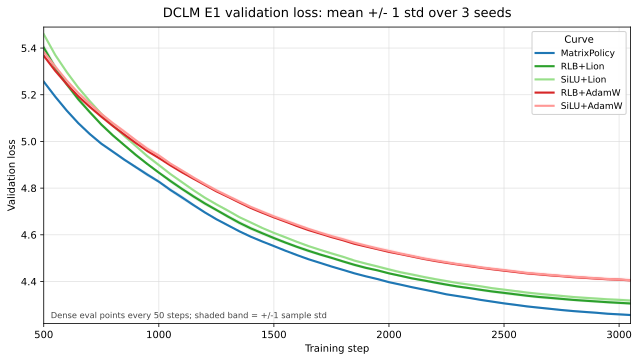

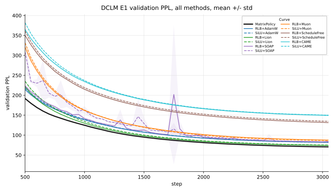

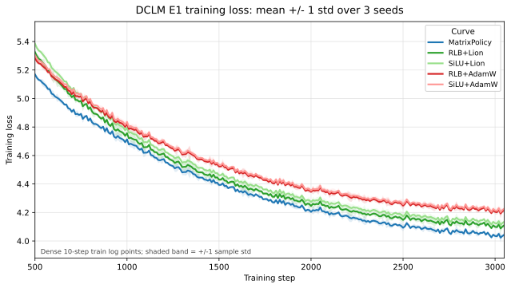

Clean comparison view:

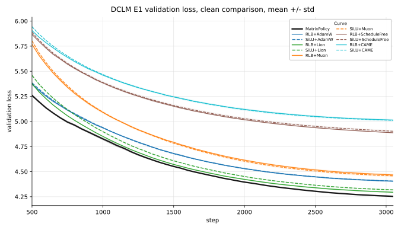

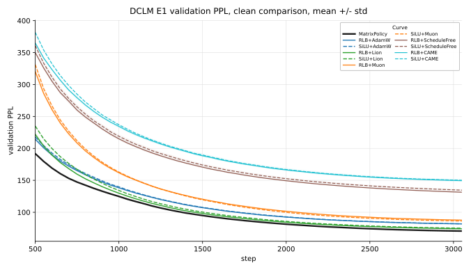

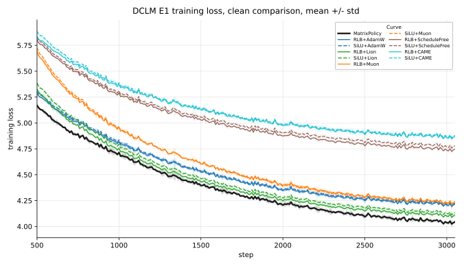

DCLM validation-loss checkpoint table, mean +/- sample std:

| Method | 500 | 1000 | 1500 | 2000 | 2500 | 3050 |
| --- | ---: | ---: | ---: | ---: | ---: | ---: |
| MatrixPolicy | 5.2599 +/- 0.0098 | 4.8260 +/- 0.0135 | 4.5508 +/- 0.0045 | 4.3952 +/- 0.0040 | 4.3031 +/- 0.0041 | 4.2524 +/- 0.0058 |
| RLB+AdamW | 5.3705 +/- 0.0106 | 4.9358 +/- 0.0053 | 4.6806 +/- 0.0058 | 4.5296 +/- 0.0064 | 4.4476 +/- 0.0064 | 4.4046 +/- 0.0081 |
| SiLU+AdamW | 5.3838 +/- 0.0115 | 4.9398 +/- 0.0091 | 4.6788 +/- 0.0083 | 4.5306 +/- 0.0101 | 4.4489 +/- 0.0086 | 4.4056 +/- 0.0099 |
| RLB+Lion | 5.3774 +/- 0.0061 | 4.8512 +/- 0.0015 | 4.5718 +/- 0.0051 | 4.4228 +/- 0.0080 | 4.3395 +/- 0.0082 | 4.2946 +/- 0.0083 |
| SiLU+Lion | 5.4593 +/- 0.0049 | 4.8989 +/- 0.0070 | 4.6081 +/- 0.0038 | 4.4516 +/- 0.0063 | 4.3649 +/- 0.0049 | 4.3183 +/- 0.0069 |
| RLB+SOAP | 5.4157 +/- 0.0190 | 4.9699 +/- 0.0310 | 4.7506 +/- 0.1164 | 4.5779 +/- 0.0431 | 4.4831 +/- 0.0468 | 4.4360 +/- 0.0442 |
| SiLU+SOAP | 5.7233 +/- 0.1468 | 5.0899 +/- 0.0598 | 4.8541 +/- 0.1178 | 4.5941 +/- 0.0321 | 4.4658 +/- 0.0017 | 4.4160 +/- 0.0038 |
| RLB+Muon | 5.7685 +/- 0.0105 | 5.0904 +/- 0.0132 | 4.7926 +/- 0.0066 | 4.6150 +/- 0.0076 | 4.5178 +/- 0.0118 | 4.4674 +/- 0.0121 |
| SiLU+Muon | 5.8027 +/- 0.0123 | 5.0927 +/- 0.0102 | 4.7831 +/- 0.0090 | 4.6036 +/- 0.0127 | 4.5065 +/- 0.0120 | 4.4572 +/- 0.0126 |
| RLB+ScheduleFree | 5.8673 +/- 0.0064 | 5.3840 +/- 0.0101 | 5.1513 +/- 0.0084 | 5.0169 +/- 0.0076 | 4.9378 +/- 0.0057 | 4.8871 +/- 0.0046 |
| SiLU+ScheduleFree | 5.8883 +/- 0.0112 | 5.3887 +/- 0.0131 | 5.1590 +/- 0.0136 | 5.0276 +/- 0.0134 | 4.9514 +/- 0.0116 | 4.9023 +/- 0.0111 |
| RLB+CAME | 5.9050 +/- 0.0056 | 5.4610 +/- 0.0110 | 5.2451 +/- 0.0109 | 5.1206 +/- 0.0101 | 5.0508 +/- 0.0091 | 5.0139 +/- 0.0086 |
| SiLU+CAME | 5.9441 +/- 0.0091 | 5.4677 +/- 0.0067 | 5.2453 +/- 0.0124 | 5.1177 +/- 0.0147 | 5.0477 +/- 0.0139 | 5.0107 +/- 0.0143 |
| RLB+ADeMaMix | 17.4993 +/- 4.8700 | 370.9679 +/- 490.7603 | 43330230.6667 +/- 59088752.2823 | 175540490.6667 +/- 74840716.6504 | 3782729864.0000 +/- 5062818831.9630 (n=2) | 246105152.0000 +/- 0.0000 (n=1) |
| SiLU+ADeMaMix | 6.9823 +/- 0.6147 | 247.6634 +/- 51.2342 | 78.1737 +/- 22.2689 | 62.7083 +/- 16.6845 | 53.5849 +/- 14.3896 | 48.6455 +/- 13.7255 |

#### FineWeb-Edu

All-method view:

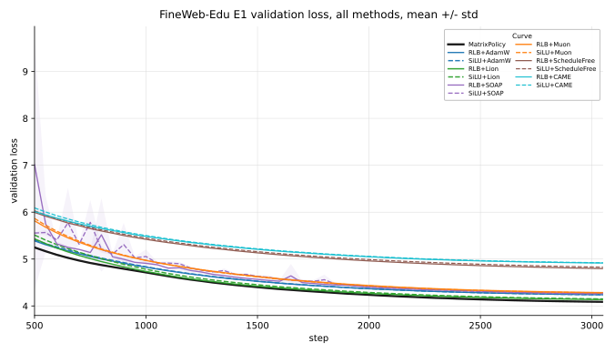

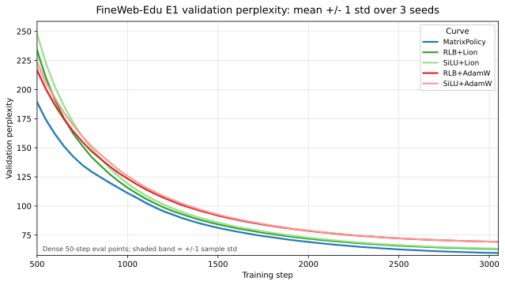

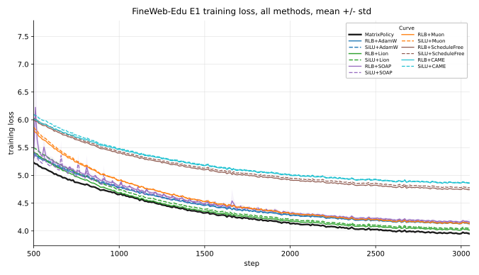

Clean comparison view:

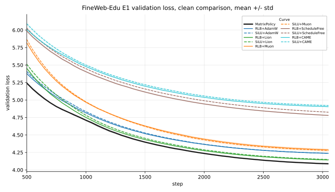

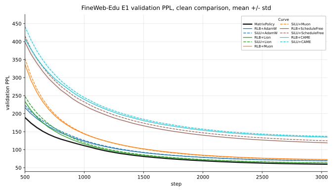

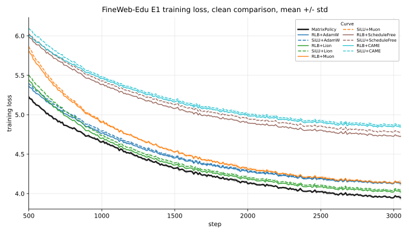

FineWeb-Edu validation-loss checkpoint table, mean +/- sample std:

| Method | 500 | 1000 | 1500 | 2000 | 2500 | 3050 |
| --- | ---: | ---: | ---: | ---: | ---: | ---: |
| MatrixPolicy | 5.2459 +/- 0.0139 | 4.7094 +/- 0.0141 | 4.3974 +/- 0.0123 | 4.2349 +/- 0.0090 | 4.1376 +/- 0.0096 | 4.0856 +/- 0.0100 |
| RLB+AdamW | 5.3867 +/- 0.0147 | 4.8258 +/- 0.0074 | 4.5241 +/- 0.0037 | 4.3686 +/- 0.0057 | 4.2815 +/- 0.0069 | 4.2392 +/- 0.0077 |
| SiLU+AdamW | 5.4084 +/- 0.0172 | 4.8348 +/- 0.0049 | 4.5281 +/- 0.0072 | 4.3683 +/- 0.0072 | 4.2811 +/- 0.0074 | 4.2375 +/- 0.0086 |
| RLB+Lion | 5.4312 +/- 0.0224 | 4.7354 +/- 0.0090 | 4.4223 +/- 0.0060 | 4.2676 +/- 0.0062 | 4.1801 +/- 0.0080 | 4.1361 +/- 0.0083 |
| SiLU+Lion | 5.5121 +/- 0.0186 | 4.7814 +/- 0.0167 | 4.4520 +/- 0.0124 | 4.2870 +/- 0.0101 | 4.1964 +/- 0.0086 | 4.1494 +/- 0.0092 |
| RLB+SOAP | 7.0136 +/- 2.6679 | 4.9088 +/- 0.0656 | 4.5665 +/- 0.0294 | 4.4008 +/- 0.0280 | 4.3143 +/- 0.0173 | 4.2747 +/- 0.0238 |
| SiLU+SOAP | 5.5541 +/- 0.0178 | 5.0548 +/- 0.1513 | 4.6308 +/- 0.0214 | 4.4105 +/- 0.0136 | 4.3051 +/- 0.0112 | 4.2630 +/- 0.0220 |
| RLB+Muon | 5.8150 +/- 0.0133 | 4.9704 +/- 0.0136 | 4.6266 +/- 0.0230 | 4.4336 +/- 0.0316 | 4.3332 +/- 0.0287 | 4.2831 +/- 0.0284 |
| SiLU+Muon | 5.8660 +/- 0.0098 | 4.9736 +/- 0.0094 | 4.6220 +/- 0.0117 | 4.4295 +/- 0.0202 | 4.3292 +/- 0.0230 | 4.2787 +/- 0.0243 |
| RLB+ScheduleFree | 5.9945 +/- 0.0241 | 5.4207 +/- 0.0187 | 5.1321 +/- 0.0164 | 4.9605 +/- 0.0148 | 4.8593 +/- 0.0134 | 4.7957 +/- 0.0133 |
| SiLU+ScheduleFree | 6.0279 +/- 0.0274 | 5.4487 +/- 0.0075 | 5.1579 +/- 0.0075 | 4.9894 +/- 0.0073 | 4.8896 +/- 0.0073 | 4.8258 +/- 0.0072 |
| RLB+CAME | 6.0142 +/- 0.0238 | 5.4838 +/- 0.0165 | 5.2069 +/- 0.0084 | 5.0487 +/- 0.0084 | 4.9596 +/- 0.0065 | 4.9150 +/- 0.0063 |
| SiLU+CAME | 6.0899 +/- 0.0329 | 5.5003 +/- 0.0147 | 5.2179 +/- 0.0104 | 5.0573 +/- 0.0103 | 4.9669 +/- 0.0110 | 4.9207 +/- 0.0123 |
| RLB+ADeMaMix | 11.5691 +/- 2.7283 | 772.2738 +/- 845.8176 | 2575.6854 +/- 3736.6125 | 2426.1191 +/- 2936.8239 | 5742.2397 +/- 8431.4467 | 7880.5115 +/- 12045.6569 |
| SiLU+ADeMaMix | 6.5917 +/- 0.0381 | 323.2475 +/- 232.2217 | 132.7501 +/- 91.4211 | 293.8233 +/- 355.2971 | 262.2238 +/- 285.4760 | 242.8537 +/- 242.0122 |

#### FineWeb

All-method view:

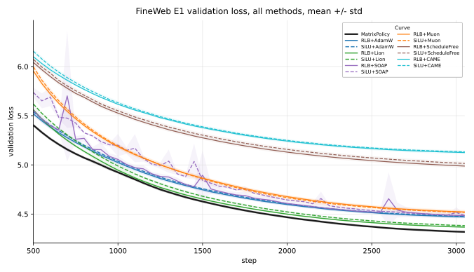

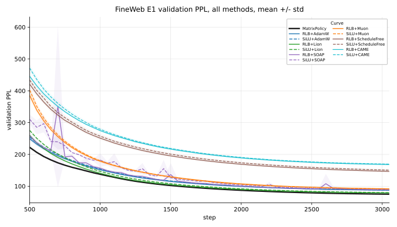

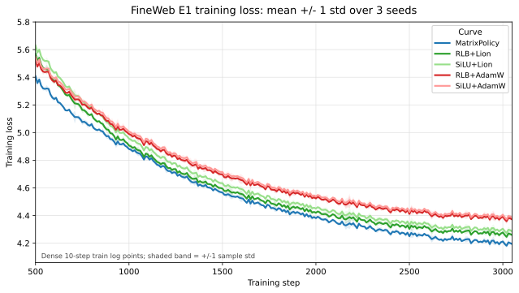

Clean comparison view:

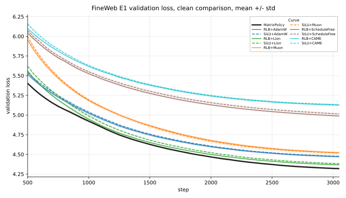

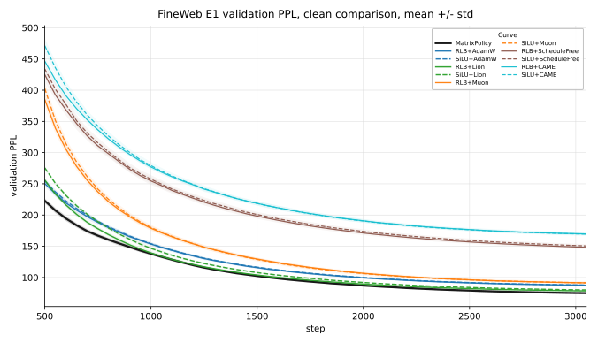

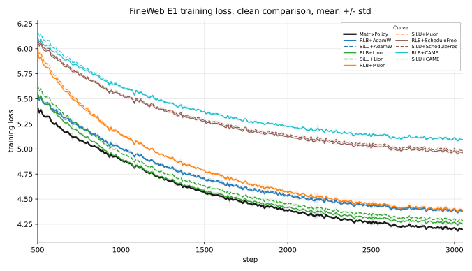

FineWeb validation-loss checkpoint table, mean +/- sample std:

| Method | 500 | 1000 | 1500 | 2000 | 2500 | 3050 |
| --- | ---: | ---: | ---: | ---: | ---: | ---: |
| MatrixPolicy | 5.4067 +/- 0.0182 | 4.9315 +/- 0.0170 | 4.6319 +/- 0.0163 | 4.4683 +/- 0.0134 | 4.3713 +/- 0.0134 | 4.3175 +/- 0.0133 |
| RLB+AdamW | 5.5229 +/- 0.0194 | 5.0340 +/- 0.0192 | 4.7520 +/- 0.0154 | 4.5993 +/- 0.0136 | 4.5156 +/- 0.0135 | 4.4717 +/- 0.0138 |
| SiLU+AdamW | 5.5394 +/- 0.0181 | 5.0366 +/- 0.0139 | 4.7579 +/- 0.0118 | 4.6047 +/- 0.0092 | 4.5202 +/- 0.0087 | 4.4758 +/- 0.0097 |
| RLB+Lion | 5.5451 +/- 0.0112 | 4.9360 +/- 0.0230 | 4.6439 +/- 0.0131 | 4.4936 +/- 0.0116 | 4.4081 +/- 0.0106 | 4.3626 +/- 0.0112 |
| SiLU+Lion | 5.6186 +/- 0.0104 | 4.9885 +/- 0.0180 | 4.6808 +/- 0.0122 | 4.5218 +/- 0.0101 | 4.4307 +/- 0.0075 | 4.3825 +/- 0.0083 |
| RLB+SOAP | 5.5391 +/- 0.0109 | 5.1085 +/- 0.0702 | 4.7768 +/- 0.0402 | 4.6122 +/- 0.0227 | 4.5386 +/- 0.0104 | 4.6893 +/- 0.3359 |
| SiLU+SOAP | 5.7363 +/- 0.0492 | 5.2006 +/- 0.1139 | 4.8417 +/- 0.0132 | 4.6430 +/- 0.0128 | 4.5362 +/- 0.0096 | 4.4840 +/- 0.0112 |
| RLB+Muon | 5.9533 +/- 0.0280 | 5.1860 +/- 0.0219 | 4.8638 +/- 0.0169 | 4.6706 +/- 0.0076 | 4.5673 +/- 0.0059 | 4.5157 +/- 0.0059 |
| SiLU+Muon | 5.9974 +/- 0.0298 | 5.1931 +/- 0.0229 | 4.8588 +/- 0.0247 | 4.6661 +/- 0.0269 | 4.5666 +/- 0.0259 | 4.5163 +/- 0.0264 |
| RLB+ScheduleFree | 6.0512 +/- 0.0263 | 5.5393 +/- 0.0248 | 5.2897 +/- 0.0215 | 5.1429 +/- 0.0201 | 5.0557 +/- 0.0193 | 4.9993 +/- 0.0192 |
| SiLU+ScheduleFree | 6.0727 +/- 0.0207 | 5.5504 +/- 0.0249 | 5.3021 +/- 0.0209 | 5.1573 +/- 0.0198 | 5.0707 +/- 0.0193 | 5.0142 +/- 0.0188 |
| RLB+CAME | 6.1009 +/- 0.0165 | 5.6239 +/- 0.0122 | 5.3876 +/- 0.0153 | 5.2511 +/- 0.0154 | 5.1745 +/- 0.0152 | 5.1340 +/- 0.0162 |
| SiLU+CAME | 6.1551 +/- 0.0249 | 5.6317 +/- 0.0207 | 5.3872 +/- 0.0165 | 5.2496 +/- 0.0148 | 5.1725 +/- 0.0124 | 5.1325 +/- 0.0126 |
| RLB+ADeMaMix | 129.7574 +/- 176.9669 | 41680578.9202 +/- 72192221.5413 | 44753414.1145 +/- 63289962.8122 (n=2) | 107762.9375 +/- 0.0000 (n=1) | 8023604.0000 +/- 0.0000 (n=1) | 3022914304.0000 +/- 0.0000 (n=1) |
| SiLU+ADeMaMix | 6.5763 +/- 0.2655 | 258.3239 +/- 44.9409 | 83.0640 +/- 6.9598 | 69.4284 +/- 15.1007 | 57.6825 +/- 14.4696 | 51.9965 +/- 15.1322 |

#### Dolma-sample

All-method view:

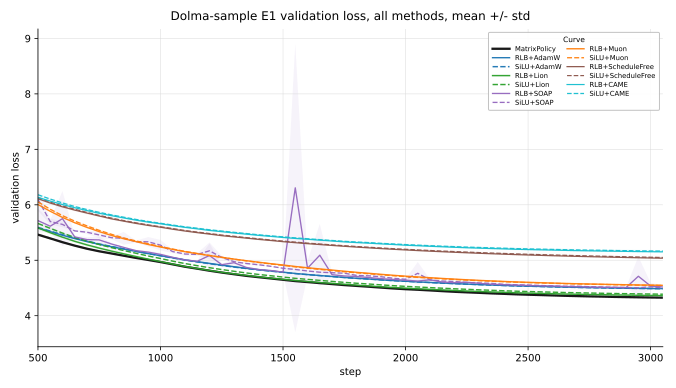

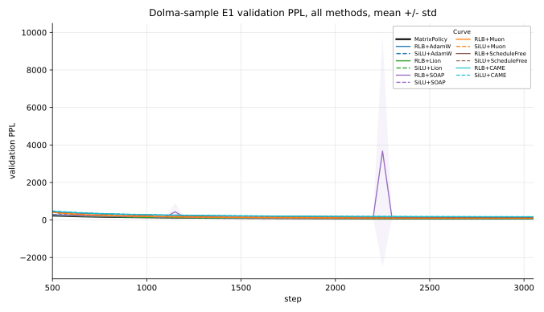

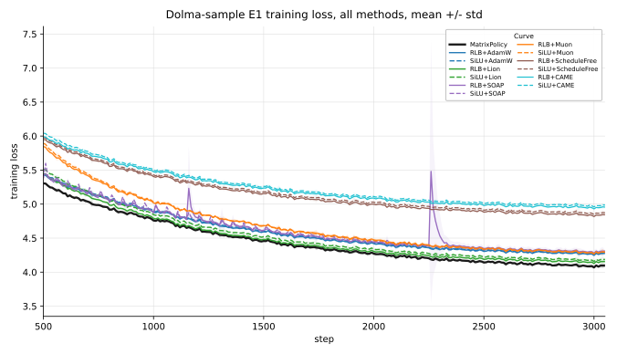

Clean comparison view:

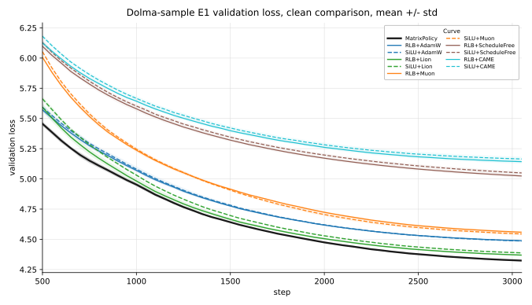

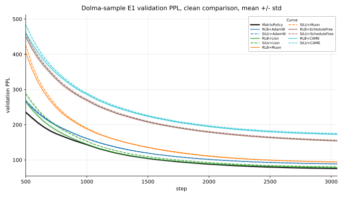

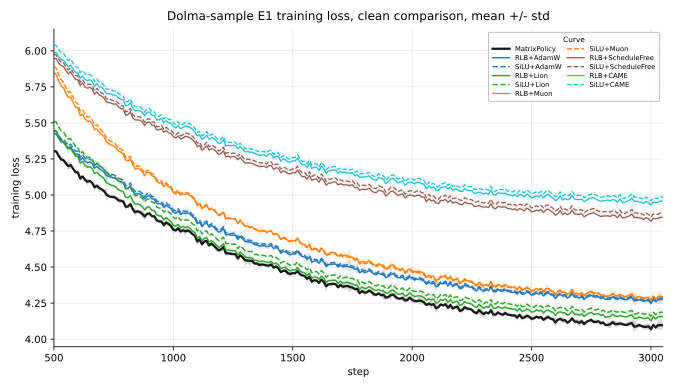

Dolma-sample validation-loss checkpoint table, mean +/- sample std:

| Method | 500 | 1000 | 1500 | 2000 | 2500 | 3050 |
| --- | ---: | ---: | ---: | ---: | ---: | ---: |
| MatrixPolicy | 5.4612 +/- 0.0157 | 4.9639 +/- 0.0121 | 4.6462 +/- 0.0041 | 4.4774 +/- 0.0037 | 4.3770 +/- 0.0026 | 4.3232 +/- 0.0036 |
| RLB+AdamW | 5.5801 +/- 0.0145 | 5.0818 +/- 0.0030 | 4.7848 +/- 0.0035 | 4.6214 +/- 0.0043 | 4.5332 +/- 0.0023 | 4.4878 +/- 0.0027 |
| SiLU+AdamW | 5.5934 +/- 0.0195 | 5.0809 +/- 0.0222 | 4.7821 +/- 0.0118 | 4.6197 +/- 0.0050 | 4.5310 +/- 0.0031 | 4.4862 +/- 0.0012 |
| RLB+Lion | 5.5839 +/- 0.0292 | 4.9760 +/- 0.0198 | 4.6559 +/- 0.0096 | 4.4967 +/- 0.0074 | 4.4075 +/- 0.0076 | 4.3622 +/- 0.0066 |
| SiLU+Lion | 5.6628 +/- 0.0202 | 5.0312 +/- 0.0103 | 4.6966 +/- 0.0021 | 4.5289 +/- 0.0051 | 4.4359 +/- 0.0042 | 4.3878 +/- 0.0046 |
| RLB+SOAP | 5.7146 +/- 0.2171 | 5.1055 +/- 0.0254 | 4.7865 +/- 0.0095 | 4.6408 +/- 0.0212 | 4.5442 +/- 0.0076 | 4.5183 +/- 0.0363 |
| SiLU+SOAP | 6.0964 +/- 0.2025 | 5.2723 +/- 0.0950 | 4.8553 +/- 0.0074 | 4.6570 +/- 0.0040 | 4.5539 +/- 0.0057 | 4.4987 +/- 0.0035 |
| RLB+Muon | 6.0047 +/- 0.0118 | 5.2386 +/- 0.0171 | 4.9146 +/- 0.0120 | 4.7130 +/- 0.0149 | 4.6017 +/- 0.0165 | 4.5476 +/- 0.0153 |
| SiLU+Muon | 6.0530 +/- 0.0100 | 5.2462 +/- 0.0160 | 4.9072 +/- 0.0101 | 4.7048 +/- 0.0142 | 4.5973 +/- 0.0117 | 4.5443 +/- 0.0108 |
| RLB+ScheduleFree | 6.1090 +/- 0.0221 | 5.5957 +/- 0.0242 | 5.3349 +/- 0.0149 | 5.1858 +/- 0.0138 | 5.0947 +/- 0.0139 | 5.0363 +/- 0.0129 |
| SiLU+ScheduleFree | 6.1296 +/- 0.0239 | 5.6030 +/- 0.0177 | 5.3454 +/- 0.0127 | 5.1974 +/- 0.0125 | 5.1075 +/- 0.0140 | 5.0494 +/- 0.0149 |
| RLB+CAME | 6.1329 +/- 0.0242 | 5.6577 +/- 0.0239 | 5.4109 +/- 0.0180 | 5.2711 +/- 0.0175 | 5.1925 +/- 0.0174 | 5.1514 +/- 0.0168 |
| SiLU+CAME | 6.1808 +/- 0.0170 | 5.6664 +/- 0.0188 | 5.4216 +/- 0.0168 | 5.2824 +/- 0.0187 | 5.2049 +/- 0.0189 | 5.1650 +/- 0.0189 |
| RLB+ADeMaMix | 11.7968 +/- 3.1344 | 66.6060 +/- 45.3556 | 2167414.5956 +/- 3683413.8351 | 10779257.3654 +/- 18662299.4102 | 570914604.1487 +/- 624651995.0860 | 1775543041.7179 +/- 2510996321.2383 (n=2) |
| SiLU+ADeMaMix | 6.4467 +/- 0.1480 | 168.0197 +/- 131.3544 | 5706.2408 +/- 5051.5183 | 10605.0472 +/- 10104.8045 | 30618.4067 +/- 44187.0559 | 28427.1854 +/- 40987.7167 |

#### C4

All-method view:

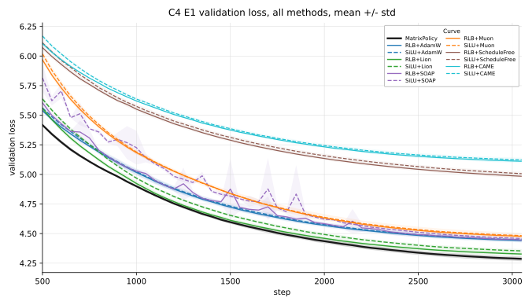

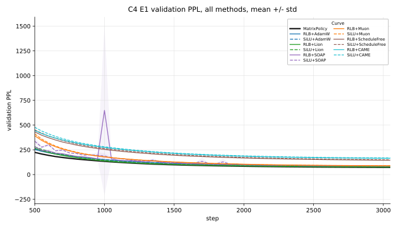

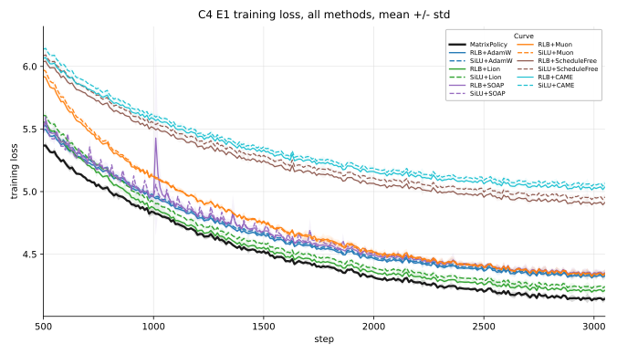

Clean comparison view:

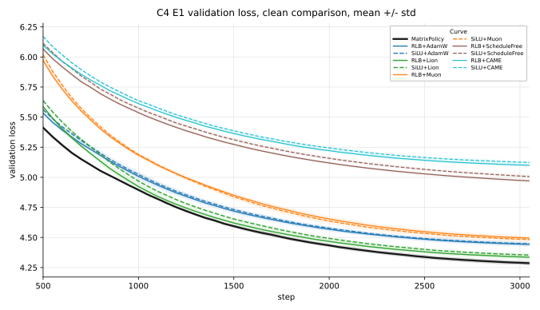

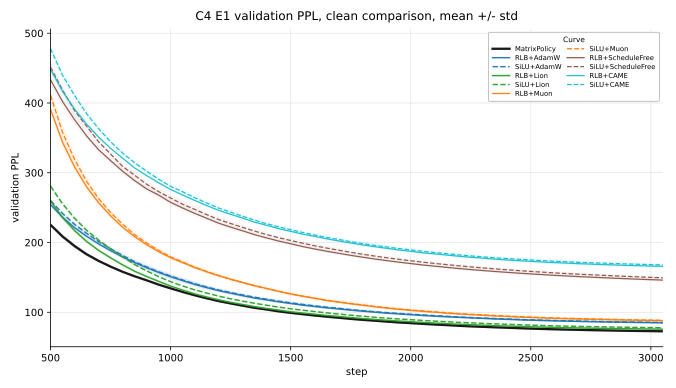

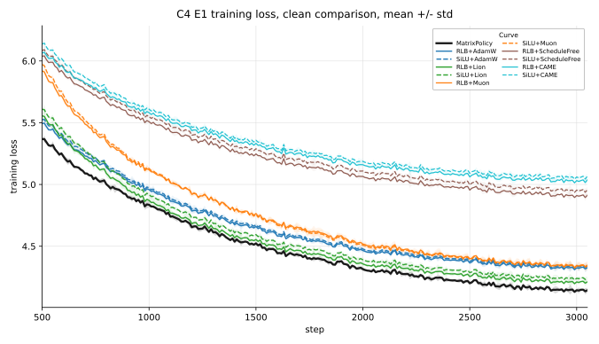

C4 validation-loss checkpoint table, mean +/- sample std:

| Method | 500 | 1000 | 1500 | 2000 | 2500 | 3050 |
| --- | ---: | ---: | ---: | ---: | ---: | ---: |
| MatrixPolicy | 5.4172 +/- 0.0098 | 4.8996 +/- 0.0082 | 4.5964 +/- 0.0137 | 4.4357 +/- 0.0179 | 4.3381 +/- 0.0182 | 4.2865 +/- 0.0200 |
| RLB+AdamW | 5.5384 +/- 0.0091 | 5.0165 +/- 0.0230 | 4.7234 +/- 0.0176 | 4.5694 +/- 0.0152 | 4.4843 +/- 0.0160 | 4.4412 +/- 0.0162 |
| SiLU+AdamW | 5.5616 +/- 0.0107 | 5.0231 +/- 0.0277 | 4.7320 +/- 0.0184 | 4.5768 +/- 0.0160 | 4.4906 +/- 0.0152 | 4.4469 +/- 0.0160 |
| RLB+Lion | 5.5576 +/- 0.0170 | 4.9231 +/- 0.0207 | 4.6120 +/- 0.0159 | 4.4597 +/- 0.0144 | 4.3722 +/- 0.0149 | 4.3271 +/- 0.0160 |
| SiLU+Lion | 5.6375 +/- 0.0126 | 4.9687 +/- 0.0115 | 4.6536 +/- 0.0128 | 4.4926 +/- 0.0136 | 4.4011 +/- 0.0144 | 4.3536 +/- 0.0156 |
| RLB+SOAP | 5.6053 +/- 0.0615 | 5.0274 +/- 0.0151 | 4.8760 +/- 0.2552 | 4.5835 +/- 0.0156 | 4.4907 +/- 0.0219 | 4.4458 +/- 0.0190 |
| SiLU+SOAP | 5.8159 +/- 0.1176 | 5.2260 +/- 0.1436 | 4.8170 +/- 0.0138 | 4.6212 +/- 0.0160 | 4.5109 +/- 0.0162 | 4.4582 +/- 0.0146 |
| RLB+Muon | 5.9682 +/- 0.0189 | 5.1833 +/- 0.0151 | 4.8388 +/- 0.0094 | 4.6316 +/- 0.0034 | 4.5271 +/- 0.0077 | 4.4764 +/- 0.0099 |
| SiLU+Muon | 6.0187 +/- 0.0276 | 5.1896 +/- 0.0198 | 4.8377 +/- 0.0242 | 4.6374 +/- 0.0268 | 4.5341 +/- 0.0244 | 4.4824 +/- 0.0233 |
| RLB+ScheduleFree | 6.0710 +/- 0.0196 | 5.5510 +/- 0.0162 | 5.2892 +/- 0.0148 | 5.1346 +/- 0.0134 | 5.0429 +/- 0.0147 | 4.9842 +/- 0.0164 |
| SiLU+ScheduleFree | 6.1120 +/- 0.0195 | 5.5750 +/- 0.0171 | 5.3125 +/- 0.0171 | 5.1580 +/- 0.0157 | 5.0659 +/- 0.0156 | 5.0064 +/- 0.0160 |
| RLB+CAME | 6.1056 +/- 0.0120 | 5.6203 +/- 0.0017 | 5.3752 +/- 0.0085 | 5.2330 +/- 0.0121 | 5.1531 +/- 0.0142 | 5.1109 +/- 0.0155 |
| SiLU+CAME | 6.1693 +/- 0.0157 | 5.6365 +/- 0.0144 | 5.3864 +/- 0.0149 | 5.2439 +/- 0.0156 | 5.1645 +/- 0.0170 | 5.1230 +/- 0.0178 |
| RLB+ADeMaMix | 20.4271 +/- 18.2844 | 1775.8338 +/- 2904.0404 | 5460.5850 +/- 8375.8913 | 677978.0837 +/- 1152345.9869 | 538384685.3267 +/- 932479138.1133 | 449788003.0859 +/- 779025043.4338 |
| SiLU+ADeMaMix | 6.6677 +/- 0.2286 | 718.5009 +/- 821.5844 | 579.6937 +/- 406.8724 | 377.1749 +/- 304.4101 | 351.8885 +/- 347.3860 | 344.9990 +/- 372.6250 |

## Current E2 M0/300M Results

E2 is complete across the same five datasets with three seeds and 15 fixed methods per seed. MatrixPolicy rows use the validated live-statistic correction manifest `corrections/matrixpolicy_live_stats_20260712/manifests/matrixpolicy_live_stats_20260712_main.csv`; non-MatrixPolicy RLB controls use `manifests/iclr26_global_rational_optimizer_controls_manifest.csv`; SiLU controls remain the completed main-manifest rows. All 15 corrected MatrixPolicy rows completed without restart. RLB+ADeMaMix stopped early with non-finite loss in every seed and remains reported rather than excluded.

### DCLM

Tracked package: `results/iclr26_e2_dclm_2026_06_10`.

Completed: 2026-06-10. Manifest rows `240-284` define the full DCLM E2 M0/300M cell: 3 seeds x 15 fixed methods. The cell contains 45 paper-facing rows; `3` stopped early and are reported as diverged/non-finite rather than excluded.

Each row uses `32768` global tokens/step for about `299.8M` train tokens. Validation uses the E2 DCLM slice from the manifest: `val_skip_tokens=610000000`, `val_tokens=8000000`, `eval_interval=50`.
MatrixPolicy entries use validated live-statistic-corrected `rlb_fused_global_rational` JSONL rows for the same method and seed; non-MatrixPolicy RLB optimizer controls use global-rational RLB (`rlb_fused_global_rational`) replacement rows; the `row` column remains the matched main-manifest E2 row, while `source_phase`/`source_row_id` record the actual timed run.

#### Final Validation Loss

| Method | Final val loss mean +/- sample std | Min | Max | Notes |
| --- | ---: | ---: | ---: | --- |
| rlb_matrixpolicy_original | 3.951745 +/- 0.029409 | 3.919839 | 3.977767 |  |
| rlb_lion | 3.988719 +/- 0.029477 | 3.955908 | 4.012966 |  |
| rlb_muon | 3.991273 +/- 0.026011 | 3.962160 | 4.012225 |  |
| silu_lion | 3.993430 +/- 0.023038 | 3.968264 | 4.013479 |  |
| silu_muon | 3.997266 +/- 0.030472 | 3.964678 | 4.025052 |  |
| silu_adamw | 4.049337 +/- 0.027469 | 4.018327 | 4.070612 |  |
| rlb_adamw | 4.049575 +/- 0.029796 | 4.016587 | 4.074533 |  |
| rlb_soap | 4.060841 +/- 0.033142 | 4.025086 | 4.090534 |  |
| silu_soap | 4.096430 +/- 0.029988 | 4.062710 | 4.120108 |  |
| rlb_schedulefree | 4.360681 +/- 0.034358 | 4.321111 | 4.382936 |  |
| silu_schedulefree | 4.365672 +/- 0.029805 | 4.332936 | 4.391239 |  |
| silu_came | 4.368189 +/- 0.022586 | 4.344955 | 4.390067 |  |
| rlb_came | 4.450261 +/- 0.042619 | 4.413764 | 4.497098 |  |
| rlb_ademamix | nan/diverged | nan | nan | 3 diverged/non-finite seeds |
| silu_ademamix | nan/diverged | nan | nan | 3 diverged/non-finite seeds |

MatrixPolicy is best on all three DCLM E2 seeds. Mean final val loss is `3.951745 +/- 0.029409`; the next-best aggregate methods are `rlb_lion` at `3.988719 +/- 0.029477`, `rlb_muon` at `3.991273 +/- 0.026011`, `silu_lion` at `3.993430 +/- 0.023038`.

#### Per-Seed MatrixPolicy Gap

| Seed | MatrixPolicy final loss | Best non-MP method | Best non-MP final loss | Gap |
| ---: | ---: | --- | ---: | ---: |
| 1337 | 3.957631 | rlb_lion | 3.997283 | 0.039652 |
| 2027 | 3.977767 | rlb_muon | 4.012225 | 0.034458 |
| 3407 | 3.919839 | rlb_lion | 3.955908 | 0.036069 |

#### Runtime Summary

`summary.total_seconds` is training-harness wall time for the manifest row. It excludes Slurm queue wait, dependency wait, token-cache construction, extension compilation, and launcher overhead. MatrixPolicy replacement rows must pass JSONL integrity checks and the denylisted-node guard; an optional per-step timing ceiling can be enabled manually, but is off by default. Failures abort generation and require rerun/repair rather than exclusion. Node assignments were not matched across methods or corrected MatrixPolicy rows, so wall-clock values are observed allocation-specific measurements rather than hardware-normalized optimizer timings.

| Method | Runs | Early stops | Mean runtime | Std | Range | Mean s/step | Mean tokens/s |
| --- | ---: | ---: | ---: | ---: | ---: | ---: | ---: |
| rlb_ademamix | 3 | 3 | 5.4 min | 1.9 min | 3.9-7.6 min | 0.4645 | 71263.8 |
| silu_lion | 3 | 0 | 67.6 min | 12.0 min | 60.5-81.5 min | 0.4265 | 78442.0 |
| silu_schedulefree | 3 | 0 | 68.9 min | 11.9 min | 61.6-82.6 min | 0.4343 | 76941.0 |
| silu_adamw | 3 | 0 | 70.9 min | 10.0 min | 61.1-81.2 min | 0.4478 | 74246.1 |
| rlb_soap | 3 | 0 | 71.2 min | 6.6 min | 65.2-78.3 min | 0.4402 | 74873.3 |
| silu_muon | 3 | 0 | 71.4 min | 14.8 min | 59.4-87.9 min | 0.4497 | 74940.2 |
| rlb_adamw | 3 | 0 | 71.7 min | 7.1 min | 63.5-75.9 min | 0.4434 | 74441.1 |
| rlb_lion | 3 | 0 | 71.8 min | 7.6 min | 63.0-76.3 min | 0.4437 | 74469.6 |
| rlb_matrixpolicy_original | 3 | 0 | 72.0 min | 5.3 min | 68.8-78.2 min | 0.4509 | 72952.2 |
| rlb_schedulefree | 3 | 0 | 72.5 min | 7.3 min | 64.1-77.7 min | 0.4486 | 73597.4 |
| rlb_muon | 3 | 0 | 72.5 min | 7.3 min | 68.2-81.0 min | 0.4493 | 73427.9 |
| rlb_came | 3 | 0 | 75.4 min | 7.0 min | 68.9-82.8 min | 0.4660 | 70690.7 |
| silu_came | 3 | 0 | 80.2 min | 11.7 min | 66.7-87.2 min | 0.5085 | 65529.0 |
| silu_ademamix | 3 | 0 | 85.3 min | 18.1 min | 64.5-96.1 min | 0.4823 | 69300.4 |
| silu_soap | 3 | 0 | 86.9 min | 12.3 min | 72.8-94.5 min | 0.5487 | 60587.7 |

#### Dense Curve Figures

All-method view:

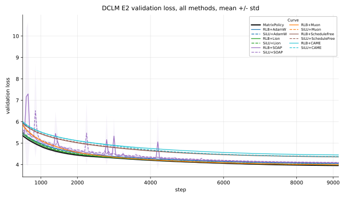

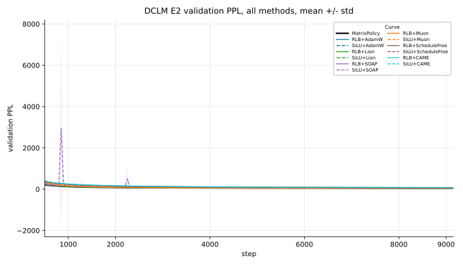

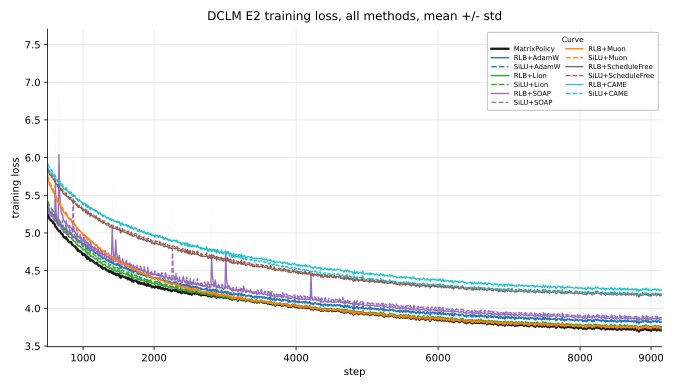

Clean comparison view:

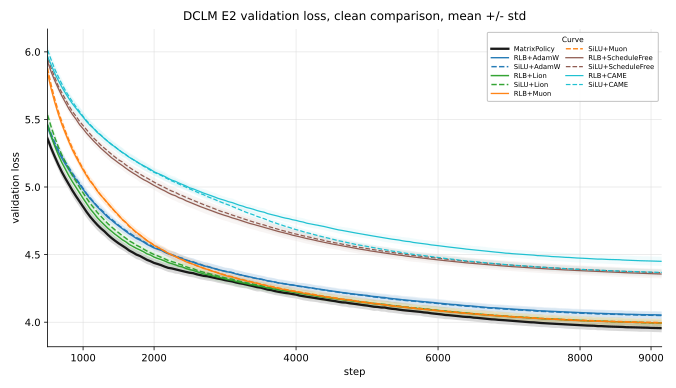

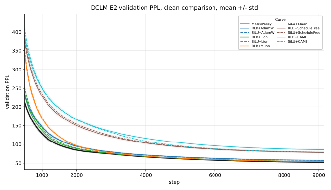

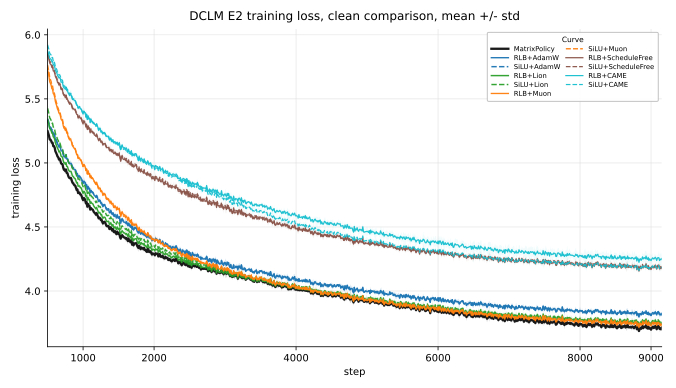

#### Token-To-Target Savings

This table asks how many training tokens were needed to first reach a validation-loss threshold. It does not change the fixed-budget protocol; all completed runs still trained to about `299.8M` tokens. The readout uses the native eval cadence of 50 steps, or `1.64M` tokens.

`Second-best` means the fastest non-MatrixPolicy method to reach the target within the same seed. `AdamW` means the standard `silu_adamw` row. Savings and proportions are computed only on seeds where both MatrixPolicy and the comparator reached the target, so the comparison column explicitly shows `MP -> comparator` tokens and the shared seed count.

| Target loss | MP all-hit mean | Vs fastest non-MP: MP -> comparator (seeds) | Saved | Saved % | Vs SiLU+AdamW: MP -> AdamW (seeds) | Saved | Saved % |
| ---: | ---: | --- | ---: | ---: | --- | ---: | ---: |
| 4.40 | 74.3M | 74.3M -> 80.3M (3/3) | 6.0M | 7.5% | 74.3M -> 93.4M (3/3) | 19.1M | 20.5% |
| 4.30 | 100.5M | 100.5M -> 103.8M (3/3) | 3.3M | 3.2% | 100.5M -> 120.7M (3/3) | 20.2M | 16.7% |
| 4.20 | 131.1M | 131.1M -> 137.1M (3/3) | 6.0M | 4.4% | 131.1M -> 161.1M (3/3) | 30.0M | 18.6% |
| 4.10 | 174.8M | 174.8M -> 185.7M (3/3) | 10.9M | 5.9% | 174.8M -> 227.7M (3/3) | 53.0M | 23.3% |
| 4.05 | 201.0M | 201.0M -> 220.1M (3/3) | 19.1M | 8.7% | 181.9M -> 244.1M (1/3) | 62.3M | 25.5% |
| 4.00 | 238.7M | 227.7M -> 262.1M (2/3) | 34.4M | 13.1% | not reached (0/3) | not reached | n/a |

#### Files

- `final_summary.csv`: aggregate final validation losses by method.
- `per_seed_summary.csv`: per-row final results and JSONL provenance paths.
- `runtime_summary.csv`: aggregate runtime by method.
- `token_savings.csv`: aggregate token-to-target savings.
- `token_savings_per_seed.csv`: per-seed threshold hits and comparator identities.

### FineWeb-Edu

Tracked package: `results/iclr26_e2_fineweb_edu_2026_06_12`.

Completed: 2026-06-12. Manifest rows `285-329` define the full FineWeb-Edu E2 M0/300M cell: 3 seeds x 15 fixed methods. The cell contains 45 paper-facing rows; `3` stopped early and are reported as diverged/non-finite rather than excluded.

Each row uses `32768` global tokens/step for about `299.8M` train tokens. Validation uses the E2 FineWeb-Edu slice from the manifest: `val_skip_tokens=610000000`, `val_tokens=8000000`, `eval_interval=50`.
MatrixPolicy entries use validated live-statistic-corrected `rlb_fused_global_rational` JSONL rows for the same method and seed; non-MatrixPolicy RLB optimizer controls use global-rational RLB (`rlb_fused_global_rational`) replacement rows; the `row` column remains the matched main-manifest E2 row, while `source_phase`/`source_row_id` record the actual timed run.

#### Final Validation Loss

| Method | Final val loss mean +/- sample std | Min | Max | Notes |
| --- | ---: | ---: | ---: | --- |
| rlb_matrixpolicy_original | 3.702151 +/- 0.020357 | 3.684000 | 3.724162 |  |
| rlb_muon | 3.737328 +/- 0.018698 | 3.717964 | 3.755280 |  |
| rlb_lion | 3.741625 +/- 0.021374 | 3.723632 | 3.765251 |  |
| silu_lion | 3.744017 +/- 0.020802 | 3.727149 | 3.767261 |  |
| silu_muon | 3.745389 +/- 0.017006 | 3.732584 | 3.764685 |  |
| rlb_adamw | 3.802446 +/- 0.020587 | 3.784051 | 3.824684 |  |
| silu_adamw | 3.803482 +/- 0.018186 | 3.788790 | 3.823822 |  |
| rlb_soap | 3.824008 +/- 0.012762 | 3.816362 | 3.838741 |  |
| silu_soap | 3.862925 +/- 0.020105 | 3.844579 | 3.884418 |  |
| rlb_schedulefree | 4.142110 +/- 0.021695 | 4.124335 | 4.166286 |  |
| silu_came | 4.150283 +/- 0.021107 | 4.137987 | 4.174655 |  |
| silu_schedulefree | 4.155890 +/- 0.023847 | 4.134111 | 4.181372 |  |
| rlb_came | 4.225476 +/- 0.035835 | 4.185758 | 4.255385 |  |
| rlb_ademamix | nan/diverged | nan | nan | 3 diverged/non-finite seeds |
| silu_ademamix | nan/diverged | nan | nan | 3 diverged/non-finite seeds |

MatrixPolicy is best on all three FineWeb-Edu E2 seeds. Mean final val loss is `3.702151 +/- 0.020357`; the next-best aggregate methods are `rlb_muon` at `3.737328 +/- 0.018698`, `rlb_lion` at `3.741625 +/- 0.021374`, `silu_lion` at `3.744017 +/- 0.020802`.

#### Per-Seed MatrixPolicy Gap

| Seed | MatrixPolicy final loss | Best non-MP method | Best non-MP final loss | Gap |
| ---: | ---: | --- | ---: | ---: |
| 1337 | 3.684000 | rlb_muon | 3.717964 | 0.033964 |
| 2027 | 3.724162 | rlb_muon | 3.755280 | 0.031118 |
| 3407 | 3.698291 | rlb_lion | 3.735992 | 0.037700 |

#### Runtime Summary

`summary.total_seconds` is training-harness wall time for the manifest row. It excludes Slurm queue wait, dependency wait, token-cache construction, extension compilation, and launcher overhead. MatrixPolicy replacement rows must pass JSONL integrity checks and the denylisted-node guard; an optional per-step timing ceiling can be enabled manually, but is off by default. Failures abort generation and require rerun/repair rather than exclusion. Node assignments were not matched across methods or corrected MatrixPolicy rows, so wall-clock values are observed allocation-specific measurements rather than hardware-normalized optimizer timings.

| Method | Runs | Early stops | Mean runtime | Std | Range | Mean s/step | Mean tokens/s |
| --- | ---: | ---: | ---: | ---: | ---: | ---: | ---: |
| rlb_ademamix | 3 | 3 | 4.7 min | 0.4 min | 4.3-5.1 min | 0.4286 | 76584.8 |
| rlb_lion | 3 | 0 | 66.1 min | 1.5 min | 65.2-67.8 min | 0.4078 | 80381.3 |
| rlb_adamw | 3 | 0 | 66.4 min | 1.7 min | 65.3-68.3 min | 0.4097 | 80014.3 |
| rlb_schedulefree | 3 | 0 | 71.0 min | 3.9 min | 66.6-73.9 min | 0.4401 | 74619.9 |
| rlb_soap | 3 | 0 | 71.4 min | 3.7 min | 67.2-73.6 min | 0.4427 | 74163.4 |
| silu_muon | 3 | 0 | 72.8 min | 12.9 min | 63.8-87.6 min | 0.4585 | 72920.4 |
| silu_lion | 3 | 0 | 74.5 min | 11.5 min | 61.2-81.1 min | 0.4709 | 70923.0 |
| silu_adamw | 3 | 0 | 75.2 min | 14.0 min | 61.4-89.4 min | 0.4754 | 70683.2 |
| rlb_came | 3 | 0 | 75.2 min | 3.6 min | 71.1-77.3 min | 0.4678 | 70158.2 |
| silu_schedulefree | 3 | 0 | 75.5 min | 11.9 min | 61.8-82.4 min | 0.4781 | 69904.1 |
| rlb_muon | 3 | 0 | 78.0 min | 2.5 min | 76.6-80.9 min | 0.4852 | 67576.3 |
| rlb_matrixpolicy_original | 3 | 0 | 79.3 min | 9.2 min | 68.9-86.1 min | 0.4987 | 66388.7 |
| silu_came | 3 | 0 | 80.2 min | 11.7 min | 66.7-87.0 min | 0.5079 | 65602.6 |
| silu_soap | 3 | 0 | 86.8 min | 12.0 min | 72.9-93.8 min | 0.5475 | 60685.2 |
| silu_ademamix | 3 | 0 | 88.5 min | 10.7 min | 76.5-97.0 min | 0.4762 | 70175.4 |

#### Dense Curve Figures

All-method view:

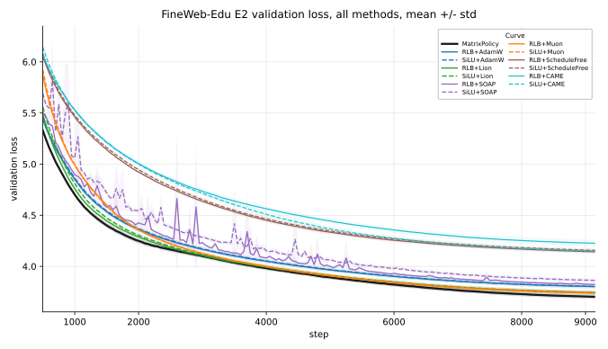

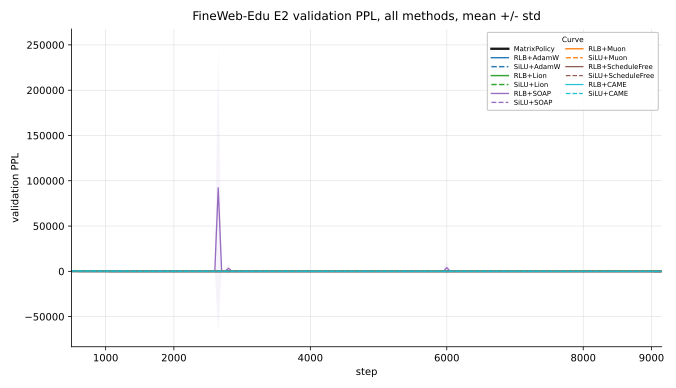

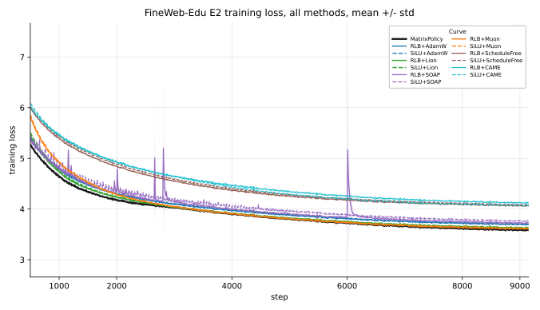

Clean comparison view:

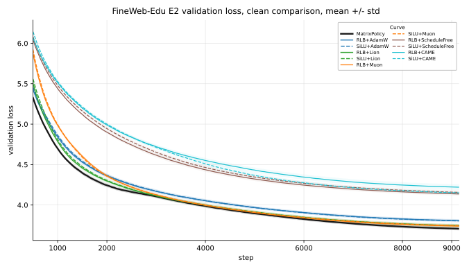

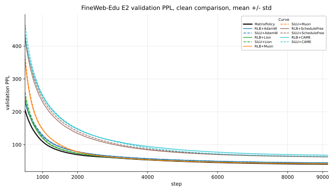

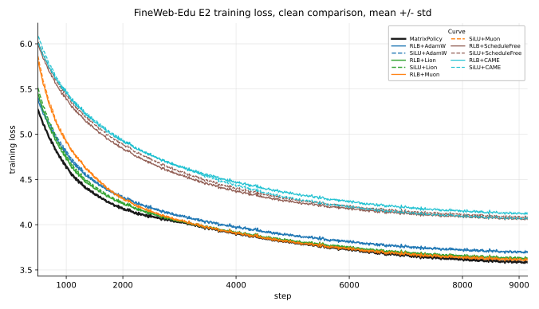

#### Token-To-Target Savings

This table asks how many training tokens were needed to first reach a validation-loss threshold. It does not change the fixed-budget protocol; all completed runs still trained to about `299.8M` tokens. The readout uses the native eval cadence of 50 steps, or `1.64M` tokens.

`Second-best` means the fastest non-MatrixPolicy method to reach the target within the same seed. `AdamW` means the standard `silu_adamw` row. Savings and proportions are computed only on seeds where both MatrixPolicy and the comparator reached the target, so the comparison column explicitly shows `MP -> comparator` tokens and the shared seed count.

| Target loss | MP all-hit mean | Vs fastest non-MP: MP -> comparator (seeds) | Saved | Saved % | Vs SiLU+AdamW: MP -> AdamW (seeds) | Saved | Saved % |
| ---: | ---: | --- | ---: | ---: | --- | ---: | ---: |
| 4.20 | 74.8M | 74.8M -> 79.7M (3/3) | 4.9M | 6.2% | 74.8M -> 93.4M (3/3) | 18.6M | 19.9% |
| 4.10 | 98.9M | 98.9M -> 99.9M (3/3) | 1.1M | 1.1% | 98.9M -> 118.0M (3/3) | 19.1M | 16.2% |
| 4.00 | 126.7M | 126.7M -> 128.3M (3/3) | 1.6M | 1.3% | 126.7M -> 151.8M (3/3) | 25.1M | 16.5% |
| 3.90 | 162.2M | 162.2M -> 166.6M (3/3) | 4.4M | 2.6% | 162.2M -> 200.4M (3/3) | 38.2M | 19.1% |
| 3.85 | 183.5M | 183.5M -> 191.1M (3/3) | 7.6M | 4.0% | 183.5M -> 237.0M (3/3) | 53.5M | 22.6% |
| 3.80 | 209.7M | 209.7M -> 223.4M (3/3) | 13.7M | 6.1% | 203.2M -> 287.5M (2/3) | 84.4M | 29.3% |
| 3.75 | 244.1M | 234.3M -> 263.0M (2/3) | 28.7M | 10.9% | not reached (0/3) | not reached | n/a |

#### Files

- `final_summary.csv`: aggregate final validation losses by method.
- `per_seed_summary.csv`: per-row final results and JSONL provenance paths.
- `runtime_summary.csv`: aggregate runtime by method.
- `token_savings.csv`: aggregate token-to-target savings.
- `token_savings_per_seed.csv`: per-seed threshold hits and comparator identities.

### FineWeb

Tracked package: `results/iclr26_e2_fineweb_2026_06_15`.

Completed: 2026-06-15. Manifest rows `330-374` define the full FineWeb E2 M0/300M cell: 3 seeds x 15 fixed methods. The cell contains 45 paper-facing rows; `3` stopped early and are reported as diverged/non-finite rather than excluded.

Each row uses `32768` global tokens/step for about `299.8M` train tokens. Validation uses the E2 FineWeb slice from the manifest: `val_skip_tokens=610000000`, `val_tokens=8000000`, `eval_interval=50`.
MatrixPolicy entries use validated live-statistic-corrected `rlb_fused_global_rational` JSONL rows for the same method and seed; non-MatrixPolicy RLB optimizer controls use global-rational RLB (`rlb_fused_global_rational`) replacement rows; the `row` column remains the matched main-manifest E2 row, while `source_phase`/`source_row_id` record the actual timed run.

#### Final Validation Loss

| Method | Final val loss mean +/- sample std | Min | Max | Notes |
| --- | ---: | ---: | ---: | --- |
| rlb_matrixpolicy_original | 3.962942 +/- 0.008025 | 3.957386 | 3.972143 |  |
| rlb_lion | 3.996049 +/- 0.010524 | 3.987987 | 4.007955 |  |
| rlb_muon | 3.999136 +/- 0.011036 | 3.989010 | 4.010900 |  |
| silu_lion | 4.001499 +/- 0.008463 | 3.995715 | 4.011213 |  |
| silu_muon | 4.006567 +/- 0.012834 | 3.996716 | 4.021081 |  |
| rlb_adamw | 4.060118 +/- 0.011034 | 4.050111 | 4.071951 |  |
| silu_adamw | 4.061199 +/- 0.010087 | 4.053473 | 4.072610 |  |
| rlb_soap | 4.108142 +/- 0.032040 | 4.088771 | 4.145125 |  |
| silu_soap | 4.113942 +/- 0.010095 | 4.104786 | 4.124768 |  |
| rlb_schedulefree | 4.386402 +/- 0.008098 | 4.380481 | 4.395631 |  |
| silu_schedulefree | 4.397873 +/- 0.010600 | 4.390438 | 4.410011 |  |
| silu_came | 4.406034 +/- 0.018922 | 4.393516 | 4.427802 |  |
| rlb_came | 4.480350 +/- 0.006438 | 4.472957 | 4.484715 |  |
| silu_ademamix | 1361.414062 +/- 0.000000 | 1361.414062 | 1361.414062 | 2 diverged/non-finite seeds |
| rlb_ademamix | nan/diverged | nan | nan | 3 diverged/non-finite seeds |

MatrixPolicy is best on all three FineWeb E2 seeds. Mean final val loss is `3.962942 +/- 0.008025`; the next-best aggregate methods are `rlb_lion` at `3.996049 +/- 0.010524`, `rlb_muon` at `3.999136 +/- 0.011036`, `silu_lion` at `4.001499 +/- 0.008463`.

#### Per-Seed MatrixPolicy Gap

| Seed | MatrixPolicy final loss | Best non-MP method | Best non-MP final loss | Gap |
| ---: | ---: | --- | ---: | ---: |
| 1337 | 3.972143 | rlb_lion | 4.007955 | 0.035812 |
| 2027 | 3.957386 | rlb_muon | 3.989010 | 0.031625 |
| 3407 | 3.959298 | rlb_lion | 3.987987 | 0.028689 |

#### Runtime Summary

`summary.total_seconds` is training-harness wall time for the manifest row. It excludes Slurm queue wait, dependency wait, token-cache construction, extension compilation, and launcher overhead. MatrixPolicy replacement rows must pass JSONL integrity checks and the denylisted-node guard; an optional per-step timing ceiling can be enabled manually, but is off by default. Failures abort generation and require rerun/repair rather than exclusion. Node assignments were not matched across methods or corrected MatrixPolicy rows, so wall-clock values are observed allocation-specific measurements rather than hardware-normalized optimizer timings.

| Method | Runs | Early stops | Mean runtime | Std | Range | Mean s/step | Mean tokens/s |
| --- | ---: | ---: | ---: | ---: | ---: | ---: | ---: |
| rlb_ademamix | 3 | 3 | 4.6 min | 0.4 min | 4.1-4.9 min | 0.4335 | 75932.0 |
| silu_schedulefree | 3 | 0 | 61.7 min | 0.4 min | 61.3-62.1 min | 0.3875 | 84557.5 |
| silu_lion | 3 | 0 | 64.6 min | 6.3 min | 61.0-71.9 min | 0.4066 | 81108.9 |
| rlb_lion | 3 | 0 | 68.2 min | 5.4 min | 61.9-71.3 min | 0.4219 | 78036.9 |
| rlb_soap | 3 | 0 | 68.2 min | 5.0 min | 63.7-73.6 min | 0.4223 | 77878.7 |
| rlb_schedulefree | 3 | 0 | 69.2 min | 5.5 min | 62.8-72.5 min | 0.4285 | 76829.9 |
| rlb_adamw | 3 | 0 | 69.6 min | 3.4 min | 65.6-71.8 min | 0.4309 | 76194.5 |
| silu_muon | 3 | 0 | 69.7 min | 6.2 min | 65.6-76.8 min | 0.4385 | 75078.6 |
| rlb_muon | 3 | 0 | 71.4 min | 4.9 min | 67.0-76.6 min | 0.4430 | 74205.6 |
| rlb_came | 3 | 0 | 72.0 min | 5.1 min | 67.3-77.5 min | 0.4473 | 73518.9 |
| silu_soap | 3 | 0 | 72.3 min | 0.6 min | 71.7-72.9 min | 0.4571 | 71696.4 |
| rlb_matrixpolicy_original | 3 | 0 | 74.5 min | 9.6 min | 69.0-85.7 min | 0.4670 | 70940.7 |
| silu_adamw | 3 | 0 | 76.4 min | 18.9 min | 60.2-97.1 min | 0.4840 | 70588.2 |
| silu_came | 3 | 0 | 147.2 min | 139.2 min | 66.6-307.9 min | 0.9476 | 57383.1 |
| silu_ademamix | 3 | 0 | 150.6 min | 143.3 min | 62.6-316.0 min | 0.9251 | 60189.7 |

#### Dense Curve Figures

All-method view:

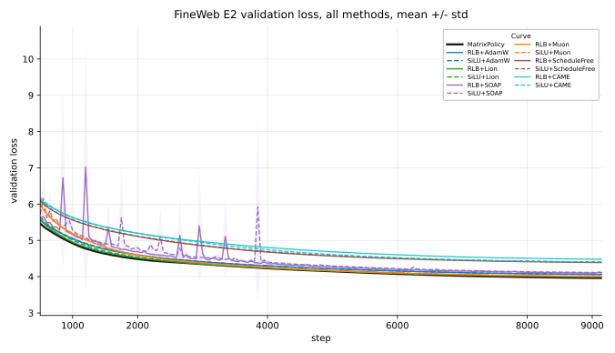

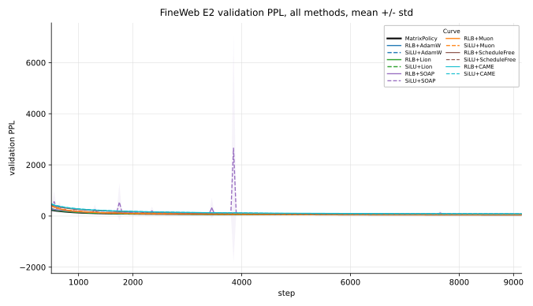

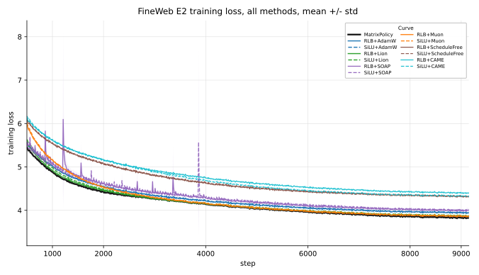

Clean comparison view:

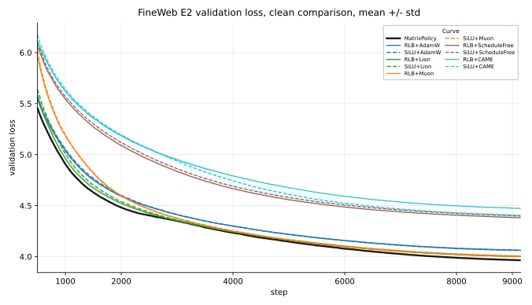

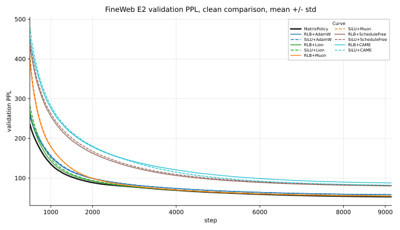

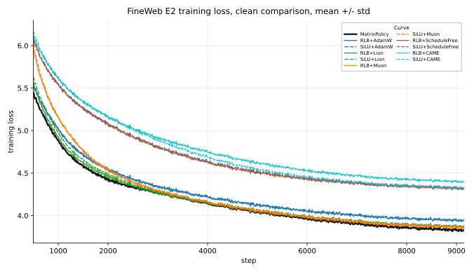

#### Token-To-Target Savings

This table asks how many training tokens were needed to first reach a validation-loss threshold. It does not change the fixed-budget protocol; all completed runs still trained to about `299.8M` tokens. The readout uses the native eval cadence of 50 steps, or `1.64M` tokens.

`Second-best` means the fastest non-MatrixPolicy method to reach the target within the same seed. `AdamW` means the standard `silu_adamw` row. Savings and proportions are computed only on seeds where both MatrixPolicy and the comparator reached the target, so the comparison column explicitly shows `MP -> comparator` tokens and the shared seed count.

| Target loss | MP all-hit mean | Vs fastest non-MP: MP -> comparator (seeds) | Saved | Saved % | Vs SiLU+AdamW: MP -> AdamW (seeds) | Saved | Saved % |
| ---: | ---: | --- | ---: | ---: | --- | ---: | ---: |
| 4.40 | 84.1M | 84.1M -> 87.4M (3/3) | 3.3M | 3.8% | 84.1M -> 102.1M (3/3) | 18.0M | 17.6% |
| 4.30 | 110.9M | 110.9M -> 111.4M (3/3) | 0.5M | 0.5% | 110.9M -> 132.2M (3/3) | 21.3M | 16.1% |
| 4.20 | 143.6M | 143.6M -> 145.8M (3/3) | 2.2M | 1.5% | 143.6M -> 173.1M (3/3) | 29.5M | 17.0% |
| 4.10 | 186.2M | 186.2M -> 194.4M (3/3) | 8.2M | 4.2% | 186.2M -> 241.4M (3/3) | 55.2M | 22.9% |
| 4.05 | 212.4M | 212.4M -> 228.8M (3/3) | 16.4M | 7.2% | not reached (0/3) | not reached | n/a |
| 4.00 | 250.1M | 245.8M -> 276.1M (2/3) | 30.3M | 11.0% | not reached (0/3) | not reached | n/a |

#### Files

- `final_summary.csv`: aggregate final validation losses by method.
- `per_seed_summary.csv`: per-row final results and JSONL provenance paths.
- `runtime_summary.csv`: aggregate runtime by method.
- `token_savings.csv`: aggregate token-to-target savings.
- `token_savings_per_seed.csv`: per-seed threshold hits and comparator identities.

### Dolma-sample

Tracked package: `results/iclr26_e2_dolma_sample_2026_06_17`.

Completed: 2026-06-17. Manifest rows `375-419` define the full Dolma-sample E2 M0/300M cell: 3 seeds x 15 fixed methods. The cell contains 45 paper-facing rows; `3` stopped early and are reported as diverged/non-finite rather than excluded.

Each row uses `32768` global tokens/step for about `299.8M` train tokens. Validation uses the E2 Dolma-sample slice from the manifest: `val_skip_tokens=610000000`, `val_tokens=8000000`, `eval_interval=50`.
MatrixPolicy entries use validated live-statistic-corrected `rlb_fused_global_rational` JSONL rows for the same method and seed; non-MatrixPolicy RLB optimizer controls use global-rational RLB (`rlb_fused_global_rational`) replacement rows; the `row` column remains the matched main-manifest E2 row, while `source_phase`/`source_row_id` record the actual timed run.

#### Final Validation Loss

| Method | Final val loss mean +/- sample std | Min | Max | Notes |
| --- | ---: | ---: | ---: | --- |
| rlb_matrixpolicy_original | 3.805292 +/- 0.007943 | 3.796139 | 3.810371 |  |
| rlb_lion | 3.841206 +/- 0.008478 | 3.831467 | 3.846927 |  |
| silu_lion | 3.847523 +/- 0.009363 | 3.836884 | 3.854513 |  |
| rlb_muon | 3.847789 +/- 0.004708 | 3.843204 | 3.852611 |  |
| silu_muon | 3.858114 +/- 0.010066 | 3.846854 | 3.866242 |  |
| silu_adamw | 3.903690 +/- 0.009091 | 3.893635 | 3.911328 |  |
| rlb_adamw | 3.904543 +/- 0.008210 | 3.896088 | 3.912484 |  |
| rlb_soap | 3.926881 +/- 0.012526 | 3.915837 | 3.940492 |  |
| silu_soap | 3.956834 +/- 0.009319 | 3.946098 | 3.962839 |  |
| rlb_schedulefree | 4.212122 +/- 0.011229 | 4.199156 | 4.218638 |  |
| silu_schedulefree | 4.215105 +/- 0.005319 | 4.210405 | 4.220879 |  |
| silu_came | 4.249166 +/- 0.026981 | 4.223768 | 4.277492 |  |
| rlb_came | 4.266527 +/- 0.040923 | 4.233150 | 4.312184 |  |
| rlb_ademamix | nan/diverged | nan | nan | 3 diverged/non-finite seeds |
| silu_ademamix | nan/diverged | nan | nan | 3 diverged/non-finite seeds |

MatrixPolicy is best on all three Dolma-sample E2 seeds. Mean final val loss is `3.805292 +/- 0.007943`; the next-best aggregate methods are `rlb_lion` at `3.841206 +/- 0.008478`, `silu_lion` at `3.847523 +/- 0.009363`, `rlb_muon` at `3.847789 +/- 0.004708`.

#### Per-Seed MatrixPolicy Gap

| Seed | MatrixPolicy final loss | Best non-MP method | Best non-MP final loss | Gap |
| ---: | ---: | --- | ---: | ---: |
| 1337 | 3.810371 | rlb_lion | 3.846927 | 0.036556 |
| 2027 | 3.809366 | rlb_lion | 3.845225 | 0.035859 |
| 3407 | 3.796139 | rlb_lion | 3.831467 | 0.035327 |

#### Runtime Summary

`summary.total_seconds` is training-harness wall time for the manifest row. It excludes Slurm queue wait, dependency wait, token-cache construction, extension compilation, and launcher overhead. MatrixPolicy replacement rows must pass JSONL integrity checks and the denylisted-node guard; an optional per-step timing ceiling can be enabled manually, but is off by default. Failures abort generation and require rerun/repair rather than exclusion. Node assignments were not matched across methods or corrected MatrixPolicy rows, so wall-clock values are observed allocation-specific measurements rather than hardware-normalized optimizer timings.

| Method | Runs | Early stops | Mean runtime | Std | Range | Mean s/step | Mean tokens/s |
| --- | ---: | ---: | ---: | ---: | ---: | ---: | ---: |
| rlb_ademamix | 3 | 3 | 5.4 min | 2.5 min | 3.8-8.3 min | 0.4134 | 79606.0 |
| silu_schedulefree | 3 | 0 | 60.3 min | 1.9 min | 58.7-62.4 min | 0.3777 | 86810.7 |
| silu_lion | 3 | 0 | 62.8 min | 5.2 min | 58.5-68.5 min | 0.3942 | 83530.1 |
| silu_adamw | 3 | 0 | 63.5 min | 6.1 min | 58.4-70.3 min | 0.3991 | 82647.8 |
| rlb_lion | 3 | 0 | 64.8 min | 5.6 min | 61.5-71.3 min | 0.4002 | 82307.0 |
| rlb_adamw | 3 | 0 | 65.1 min | 5.8 min | 61.8-71.8 min | 0.4025 | 81843.6 |
| silu_came | 3 | 0 | 65.6 min | 2.3 min | 63.7-68.2 min | 0.4116 | 79666.0 |
| rlb_schedulefree | 3 | 0 | 66.1 min | 5.8 min | 62.7-72.7 min | 0.4085 | 80634.0 |
| rlb_soap | 3 | 0 | 70.2 min | 5.8 min | 63.5-73.7 min | 0.4351 | 75686.6 |
| rlb_muon | 3 | 0 | 73.5 min | 5.9 min | 66.7-77.1 min | 0.4562 | 72159.8 |
| rlb_came | 3 | 0 | 74.1 min | 5.9 min | 67.3-77.6 min | 0.4608 | 71450.7 |
| rlb_matrixpolicy_original | 3 | 0 | 76.4 min | 7.1 min | 69.2-83.3 min | 0.4785 | 68920.3 |
| silu_muon | 3 | 0 | 78.0 min | 21.0 min | 64.2-102.2 min | 0.4937 | 69498.1 |
| silu_soap | 3 | 0 | 79.6 min | 11.8 min | 71.5-93.2 min | 0.5025 | 66102.2 |
| silu_ademamix | 3 | 0 | 79.7 min | 12.5 min | 70.9-94.0 min | 0.4279 | 78310.3 |

#### Dense Curve Figures

All-method view:

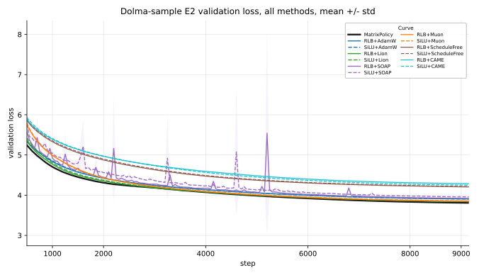

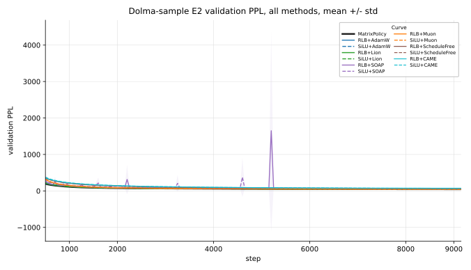

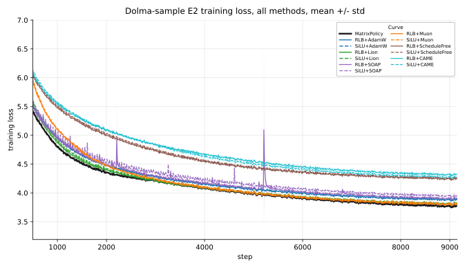

Clean comparison view:

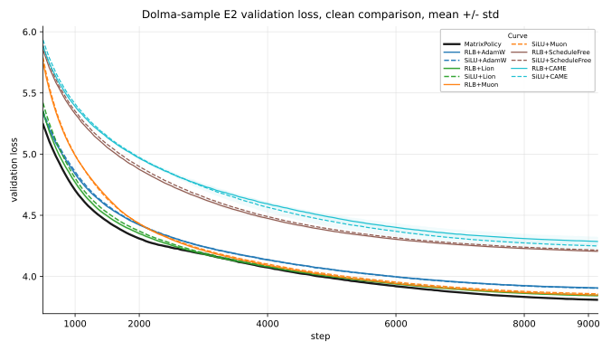

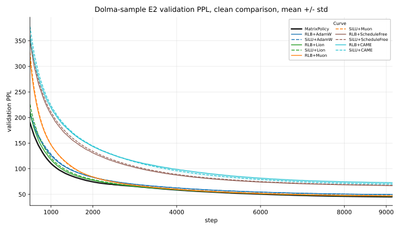

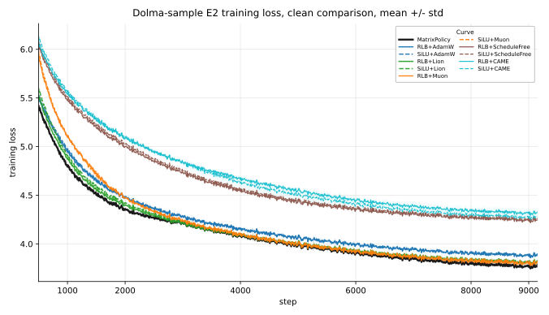

#### Token-To-Target Savings

This table asks how many training tokens were needed to first reach a validation-loss threshold. It does not change the fixed-budget protocol; all completed runs still trained to about `299.8M` tokens. The readout uses the native eval cadence of 50 steps, or `1.64M` tokens.

`Second-best` means the fastest non-MatrixPolicy method to reach the target within the same seed. `AdamW` means the standard `silu_adamw` row. Savings and proportions are computed only on seeds where both MatrixPolicy and the comparator reached the target, so the comparison column explicitly shows `MP -> comparator` tokens and the shared seed count.

| Target loss | MP all-hit mean | Vs fastest non-MP: MP -> comparator (seeds) | Saved | Saved % | Vs SiLU+AdamW: MP -> AdamW (seeds) | Saved | Saved % |
| ---: | ---: | --- | ---: | ---: | --- | ---: | ---: |
| 4.20 | 93.4M | 93.4M -> 94.5M (3/3) | 1.1M | 1.2% | 93.4M -> 110.9M (3/3) | 17.5M | 15.8% |
| 4.10 | 121.2M | 121.2M -> 124.5M (3/3) | 3.3M | 2.6% | 121.2M -> 145.3M (3/3) | 24.0M | 16.5% |
| 4.00 | 156.7M | 156.7M -> 162.7M (3/3) | 6.0M | 3.7% | 156.7M -> 195.0M (3/3) | 38.2M | 19.6% |
| 3.95 | 179.1M | 179.1M -> 189.5M (3/3) | 10.4M | 5.5% | 179.1M -> 232.7M (3/3) | 53.5M | 23.0% |
| 3.90 | 205.3M | 205.3M -> 222.8M (3/3) | 17.5M | 7.8% | 199.9M -> 283.4M (1/3) | 83.6M | 29.5% |
| 3.85 | 241.9M | 241.9M -> 280.2M (3/3) | 38.2M | 13.6% | not reached (0/3) | not reached | n/a |
| 3.82 | 274.2M | not reached (0/3) | not reached | n/a | not reached (0/3) | not reached | n/a |

#### Files

- `final_summary.csv`: aggregate final validation losses by method.
- `per_seed_summary.csv`: per-row final results and JSONL provenance paths.
- `runtime_summary.csv`: aggregate runtime by method.
- `token_savings.csv`: aggregate token-to-target savings.
- `token_savings_per_seed.csv`: per-seed threshold hits and comparator identities.

### C4

Tracked package: `results/iclr26_e2_c4_2026_06_19`.

Completed: 2026-06-19. Manifest rows `420-464` define the full C4 E2 M0/300M cell: 3 seeds x 15 fixed methods. The cell contains 45 paper-facing rows; `3` stopped early and are reported as diverged/non-finite rather than excluded.

Each row uses `32768` global tokens/step for about `299.8M` train tokens. Validation uses the E2 C4 slice from the manifest: `val_skip_tokens=0`, `val_tokens=8000000`, `eval_interval=50`.
MatrixPolicy entries use validated live-statistic-corrected `rlb_fused_global_rational` JSONL rows for the same method and seed; non-MatrixPolicy RLB optimizer controls use global-rational RLB (`rlb_fused_global_rational`) replacement rows; the `row` column remains the matched main-manifest E2 row, while `source_phase`/`source_row_id` record the actual timed run.

#### Final Validation Loss

| Method | Final val loss mean +/- sample std | Min | Max | Notes |
| --- | ---: | ---: | ---: | --- |
| rlb_matrixpolicy_original | 3.878322 +/- 0.015039 | 3.868123 | 3.895594 |  |
| rlb_lion | 3.913219 +/- 0.013928 | 3.900077 | 3.927818 |  |
| rlb_muon | 3.918867 +/- 0.014875 | 3.908324 | 3.935881 |  |
| silu_lion | 3.921326 +/- 0.010538 | 3.913904 | 3.933388 |  |
| silu_muon | 3.925105 +/- 0.013434 | 3.911359 | 3.938204 |  |
| rlb_adamw | 3.978731 +/- 0.009773 | 3.970975 | 3.989709 |  |
| silu_adamw | 3.981105 +/- 0.012752 | 3.969709 | 3.994878 |  |
| rlb_soap | 4.002413 +/- 0.019369 | 3.990991 | 4.024777 |  |
| silu_soap | 4.034903 +/- 0.010776 | 4.027885 | 4.047310 |  |
| rlb_schedulefree | 4.308438 +/- 0.007124 | 4.302670 | 4.316401 |  |
| silu_schedulefree | 4.316317 +/- 0.010736 | 4.308978 | 4.328640 |  |
| silu_came | 4.329752 +/- 0.014752 | 4.314537 | 4.343993 |  |
| rlb_came | 4.365085 +/- 0.058182 | 4.320882 | 4.431001 |  |
| rlb_ademamix | nan/diverged | nan | nan | 3 diverged/non-finite seeds |
| silu_ademamix | nan/diverged | nan | nan | 3 diverged/non-finite seeds |

MatrixPolicy is best on all three C4 E2 seeds. Mean final val loss is `3.878322 +/- 0.015039`; the next-best aggregate methods are `rlb_lion` at `3.913219 +/- 0.013928`, `rlb_muon` at `3.918867 +/- 0.014875`, `silu_lion` at `3.921326 +/- 0.010538`.

#### Per-Seed MatrixPolicy Gap

| Seed | MatrixPolicy final loss | Best non-MP method | Best non-MP final loss | Gap |
| ---: | ---: | --- | ---: | ---: |
| 1337 | 3.871248 | rlb_lion | 3.911761 | 0.040512 |
| 2027 | 3.895594 | rlb_lion | 3.927818 | 0.032225 |
| 3407 | 3.868123 | rlb_lion | 3.900077 | 0.031954 |

#### Runtime Summary

`summary.total_seconds` is training-harness wall time for the manifest row. It excludes Slurm queue wait, dependency wait, token-cache construction, extension compilation, and launcher overhead. MatrixPolicy replacement rows must pass JSONL integrity checks and the denylisted-node guard; an optional per-step timing ceiling can be enabled manually, but is off by default. Failures abort generation and require rerun/repair rather than exclusion. Node assignments were not matched across methods or corrected MatrixPolicy rows, so wall-clock values are observed allocation-specific measurements rather than hardware-normalized optimizer timings.

| Method | Runs | Early stops | Mean runtime | Std | Range | Mean s/step | Mean tokens/s |
| --- | ---: | ---: | ---: | ---: | ---: | ---: | ---: |
| rlb_ademamix | 3 | 3 | 4.8 min | 0.9 min | 3.9-5.7 min | 0.4339 | 75864.4 |
| rlb_schedulefree | 3 | 0 | 66.0 min | 5.4 min | 62.8-72.3 min | 0.4083 | 80613.8 |
| rlb_lion | 3 | 0 | 68.0 min | 5.4 min | 61.7-71.1 min | 0.4206 | 78275.3 |
| rlb_adamw | 3 | 0 | 68.4 min | 5.5 min | 62.0-71.7 min | 0.4237 | 77714.4 |
| silu_lion | 3 | 0 | 72.0 min | 15.9 min | 53.7-81.6 min | 0.4555 | 74962.8 |
| silu_adamw | 3 | 0 | 73.1 min | 13.1 min | 58.0-81.0 min | 0.4623 | 72773.1 |
| rlb_matrixpolicy_original | 3 | 0 | 74.1 min | 8.6 min | 68.9-84.0 min | 0.4639 | 71288.7 |
| rlb_muon | 3 | 0 | 74.5 min | 6.6 min | 66.9-78.5 min | 0.4631 | 71183.7 |
| silu_schedulefree | 3 | 0 | 76.3 min | 12.4 min | 62.0-84.0 min | 0.4827 | 69317.2 |
| rlb_soap | 3 | 0 | 78.0 min | 17.2 min | 63.7-97.2 min | 0.4864 | 69648.4 |
| silu_muon | 3 | 0 | 78.1 min | 16.1 min | 59.6-88.2 min | 0.4937 | 68698.4 |
| rlb_came | 3 | 0 | 80.3 min | 14.8 min | 67.3-96.5 min | 0.5011 | 66954.0 |
| silu_came | 3 | 0 | 80.7 min | 12.1 min | 66.7-88.0 min | 0.5119 | 65146.4 |
| silu_soap | 3 | 0 | 87.2 min | 12.3 min | 73.0-94.6 min | 0.5517 | 60276.0 |
| silu_ademamix | 3 | 0 | 90.7 min | 11.4 min | 77.6-98.5 min | 0.4792 | 69794.4 |

#### Dense Curve Figures

All-method view:

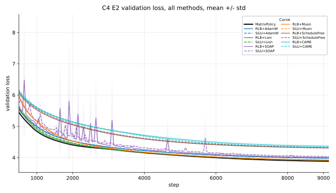

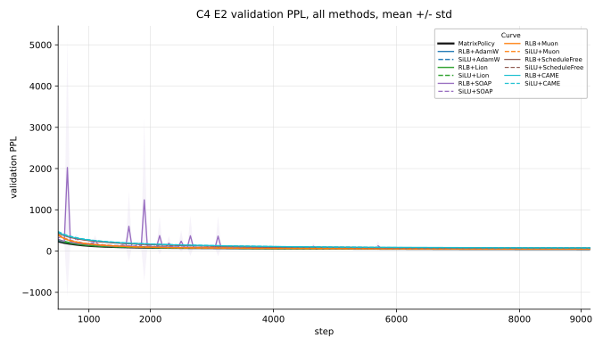

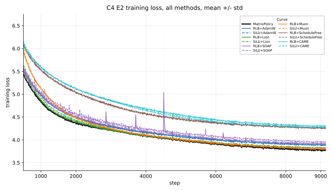

Clean comparison view:

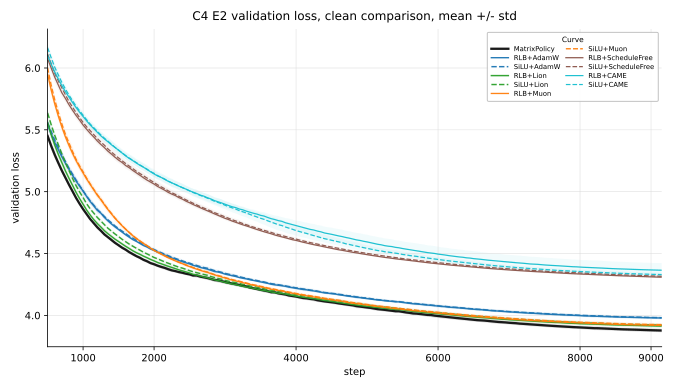

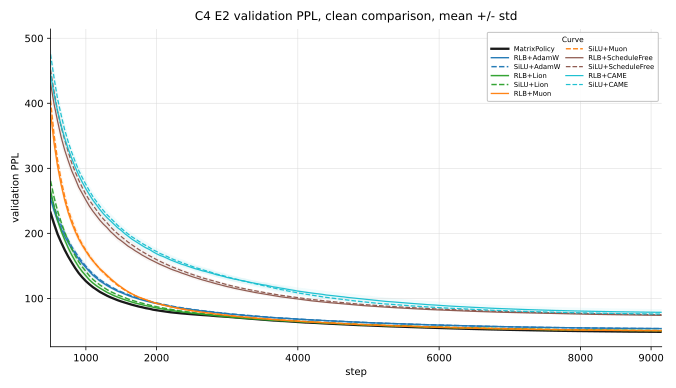

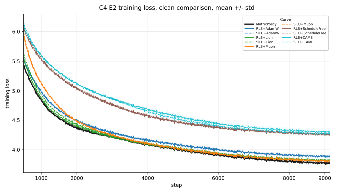

#### Token-To-Target Savings

This table asks how many training tokens were needed to first reach a validation-loss threshold. It does not change the fixed-budget protocol; all completed runs still trained to about `299.8M` tokens. The readout uses the native eval cadence of 50 steps, or `1.64M` tokens.

`Second-best` means the fastest non-MatrixPolicy method to reach the target within the same seed. `AdamW` means the standard `silu_adamw` row. Savings and proportions are computed only on seeds where both MatrixPolicy and the comparator reached the target, so the comparison column explicitly shows `MP -> comparator` tokens and the shared seed count.

| Target loss | MP all-hit mean | Vs fastest non-MP: MP -> comparator (seeds) | Saved | Saved % | Vs SiLU+AdamW: MP -> AdamW (seeds) | Saved | Saved % |
| ---: | ---: | --- | ---: | ---: | --- | ---: | ---: |
| 4.40 | 68.3M | 68.3M -> 72.6M (3/3) | 4.4M | 6.0% | 68.3M -> 86.8M (3/3) | 18.6M | 21.4% |
| 4.30 | 91.8M | 91.8M -> 91.8M (3/3) | 0.0M | 0.0% | 91.8M -> 108.1M (3/3) | 16.4M | 15.2% |
| 4.20 | 117.4M | 117.4M -> 118.5M (3/3) | 1.1M | 0.9% | 117.4M -> 139.8M (3/3) | 22.4M | 16.0% |
| 4.10 | 149.6M | 149.6M -> 153.5M (3/3) | 3.8M | 2.5% | 149.6M -> 185.1M (3/3) | 35.5M | 19.2% |
| 4.05 | 170.4M | 170.4M -> 176.9M (3/3) | 6.6M | 3.7% | 170.4M -> 216.3M (3/3) | 45.9M | 21.2% |
| 4.00 | 195.0M | 195.0M -> 204.8M (3/3) | 9.8M | 4.8% | 195.0M -> 264.9M (3/3) | 69.9M | 26.4% |

#### Files

- `final_summary.csv`: aggregate final validation losses by method.
- `per_seed_summary.csv`: per-row final results and JSONL provenance paths.
- `runtime_summary.csv`: aggregate runtime by method.
- `token_savings.csv`: aggregate token-to-target savings.
- `token_savings_per_seed.csv`: per-seed threshold hits and comparator identities.

### E2 Runtime Tables

#### DCLM

| Combo | Runs | Early stops | Mean runtime | Std | Range | Mean s/step | Mean tokens/s |
| --- | ---: | ---: | ---: | ---: | ---: | ---: | ---: |
| RLB+MatrixPolicy | 3 | 0 | 72.0 min | 5.3 min | 68.8 min-78.2 min | 0.4509 | 72952.2 |
| SiLU+AdamW | 3 | 0 | 70.9 min | 10.0 min | 61.1 min-81.2 min | 0.4478 | 74246.1 |
| RLB+AdamW | 3 | 0 | 71.7 min | 7.1 min | 63.5 min-75.9 min | 0.4434 | 74441.1 |
| SiLU+Muon | 3 | 0 | 71.4 min | 14.8 min | 59.4 min-87.9 min | 0.4497 | 74940.2 |
| RLB+Muon | 3 | 0 | 72.5 min | 7.3 min | 68.2 min-81.0 min | 0.4493 | 73427.9 |
| SiLU+Lion | 3 | 0 | 67.6 min | 12.0 min | 60.5 min-81.5 min | 0.4265 | 78442.0 |
| RLB+Lion | 3 | 0 | 71.8 min | 7.6 min | 63.0 min-76.3 min | 0.4437 | 74469.6 |
| SiLU+SOAP | 3 | 0 | 86.9 min | 12.3 min | 72.8 min-94.5 min | 0.5487 | 60587.7 |
| RLB+SOAP | 3 | 0 | 71.2 min | 6.6 min | 65.2 min-78.3 min | 0.4402 | 74873.3 |
| SiLU+ADeMaMix | 3 | 0 | 85.3 min | 18.1 min | 64.5 min-96.1 min | 0.4823 | 69300.4 |
| RLB+ADeMaMix | 3 | 3 | 5.4 min | 1.9 min | 3.9 min-7.6 min | 0.4645 | 71263.8 |
| SiLU+CAME | 3 | 0 | 80.2 min | 11.7 min | 66.7 min-87.2 min | 0.5085 | 65529.0 |
| RLB+CAME | 3 | 0 | 75.4 min | 7.0 min | 68.9 min-82.8 min | 0.4660 | 70690.7 |
| SiLU+ScheduleFree | 3 | 0 | 68.9 min | 11.9 min | 61.6 min-82.6 min | 0.4343 | 76941.0 |
| RLB+ScheduleFree | 3 | 0 | 72.5 min | 7.3 min | 64.1 min-77.7 min | 0.4486 | 73597.4 |

#### FineWeb-Edu

| Combo | Runs | Early stops | Mean runtime | Std | Range | Mean s/step | Mean tokens/s |
| --- | ---: | ---: | ---: | ---: | ---: | ---: | ---: |
| RLB+MatrixPolicy | 3 | 0 | 79.3 min | 9.2 min | 68.9 min-86.1 min | 0.4987 | 66388.7 |
| SiLU+AdamW | 3 | 0 | 75.2 min | 14.0 min | 61.4 min-89.4 min | 0.4754 | 70683.2 |
| RLB+AdamW | 3 | 0 | 66.4 min | 1.7 min | 65.3 min-68.3 min | 0.4097 | 80014.3 |
| SiLU+Muon | 3 | 0 | 72.8 min | 12.9 min | 63.8 min-87.6 min | 0.4585 | 72920.4 |
| RLB+Muon | 3 | 0 | 78.0 min | 2.5 min | 76.6 min-80.9 min | 0.4852 | 67576.3 |
| SiLU+Lion | 3 | 0 | 74.5 min | 11.5 min | 61.2 min-81.1 min | 0.4709 | 70923.0 |
| RLB+Lion | 3 | 0 | 66.1 min | 1.5 min | 65.2 min-67.8 min | 0.4078 | 80381.3 |
| SiLU+SOAP | 3 | 0 | 86.8 min | 12.0 min | 72.9 min-93.8 min | 0.5475 | 60685.2 |
| RLB+SOAP | 3 | 0 | 71.4 min | 3.7 min | 67.2 min-73.6 min | 0.4427 | 74163.4 |
| SiLU+ADeMaMix | 3 | 0 | 88.5 min | 10.7 min | 76.5 min-97.0 min | 0.4762 | 70175.4 |
| RLB+ADeMaMix | 3 | 3 | 4.7 min | 0.4 min | 4.3 min-5.1 min | 0.4286 | 76584.8 |
| SiLU+CAME | 3 | 0 | 80.2 min | 11.7 min | 66.7 min-87.0 min | 0.5079 | 65602.6 |
| RLB+CAME | 3 | 0 | 75.2 min | 3.6 min | 71.1 min-77.3 min | 0.4678 | 70158.2 |
| SiLU+ScheduleFree | 3 | 0 | 75.5 min | 11.9 min | 61.8 min-82.4 min | 0.4781 | 69904.1 |
| RLB+ScheduleFree | 3 | 0 | 71.0 min | 3.9 min | 66.6 min-73.9 min | 0.4401 | 74619.9 |

#### FineWeb

| Combo | Runs | Early stops | Mean runtime | Std | Range | Mean s/step | Mean tokens/s |
| --- | ---: | ---: | ---: | ---: | ---: | ---: | ---: |
| RLB+MatrixPolicy | 3 | 0 | 74.5 min | 9.6 min | 69.0 min-85.7 min | 0.4670 | 70940.7 |
| SiLU+AdamW | 3 | 0 | 76.4 min | 18.9 min | 60.2 min-97.1 min | 0.4840 | 70588.2 |
| RLB+AdamW | 3 | 0 | 69.6 min | 3.4 min | 65.6 min-71.8 min | 0.4309 | 76194.5 |
| SiLU+Muon | 3 | 0 | 69.7 min | 6.2 min | 65.6 min-76.8 min | 0.4385 | 75078.6 |
| RLB+Muon | 3 | 0 | 71.4 min | 4.9 min | 67.0 min-76.6 min | 0.4430 | 74205.6 |
| SiLU+Lion | 3 | 0 | 64.6 min | 6.3 min | 61.0 min-71.9 min | 0.4066 | 81108.9 |
| RLB+Lion | 3 | 0 | 68.2 min | 5.4 min | 61.9 min-71.3 min | 0.4219 | 78036.9 |
| SiLU+SOAP | 3 | 0 | 72.3 min | 0.6 min | 71.7 min-72.9 min | 0.4571 | 71696.4 |
| RLB+SOAP | 3 | 0 | 68.2 min | 5.0 min | 63.7 min-73.6 min | 0.4223 | 77878.7 |
| SiLU+ADeMaMix | 3 | 0 | 150.6 min | 143.3 min | 62.6 min-316.0 min | 0.9251 | 60189.7 |
| RLB+ADeMaMix | 3 | 3 | 4.6 min | 0.4 min | 4.1 min-4.9 min | 0.4335 | 75932.0 |
| SiLU+CAME | 3 | 0 | 147.2 min | 139.2 min | 66.6 min-307.9 min | 0.9476 | 57383.1 |
| RLB+CAME | 3 | 0 | 72.0 min | 5.1 min | 67.3 min-77.5 min | 0.4473 | 73518.9 |
| SiLU+ScheduleFree | 3 | 0 | 61.7 min | 0.4 min | 61.3 min-62.1 min | 0.3875 | 84557.5 |
| RLB+ScheduleFree | 3 | 0 | 69.2 min | 5.5 min | 62.8 min-72.5 min | 0.4285 | 76829.9 |

#### Dolma-sample

| Combo | Runs | Early stops | Mean runtime | Std | Range | Mean s/step | Mean tokens/s |
| --- | ---: | ---: | ---: | ---: | ---: | ---: | ---: |
| RLB+MatrixPolicy | 3 | 0 | 76.4 min | 7.1 min | 69.2 min-83.3 min | 0.4785 | 68920.3 |
| SiLU+AdamW | 3 | 0 | 63.5 min | 6.1 min | 58.4 min-70.3 min | 0.3991 | 82647.8 |
| RLB+AdamW | 3 | 0 | 65.1 min | 5.8 min | 61.8 min-71.8 min | 0.4025 | 81843.6 |
| SiLU+Muon | 3 | 0 | 78.0 min | 21.0 min | 64.2 min-102.2 min | 0.4937 | 69498.1 |
| RLB+Muon | 3 | 0 | 73.5 min | 5.9 min | 66.7 min-77.1 min | 0.4562 | 72159.8 |
| SiLU+Lion | 3 | 0 | 62.8 min | 5.2 min | 58.5 min-68.5 min | 0.3942 | 83530.1 |
| RLB+Lion | 3 | 0 | 64.8 min | 5.6 min | 61.5 min-71.3 min | 0.4002 | 82307.0 |
| SiLU+SOAP | 3 | 0 | 79.6 min | 11.8 min | 71.5 min-93.2 min | 0.5025 | 66102.2 |
| RLB+SOAP | 3 | 0 | 70.2 min | 5.8 min | 63.5 min-73.7 min | 0.4351 | 75686.6 |
| SiLU+ADeMaMix | 3 | 0 | 79.7 min | 12.5 min | 70.9 min-94.0 min | 0.4279 | 78310.3 |
| RLB+ADeMaMix | 3 | 3 | 5.4 min | 2.5 min | 3.8 min-8.3 min | 0.4134 | 79606.0 |
| SiLU+CAME | 3 | 0 | 65.6 min | 2.3 min | 63.7 min-68.2 min | 0.4116 | 79666.0 |
| RLB+CAME | 3 | 0 | 74.1 min | 5.9 min | 67.3 min-77.6 min | 0.4608 | 71450.7 |
| SiLU+ScheduleFree | 3 | 0 | 60.3 min | 1.9 min | 58.7 min-62.4 min | 0.3777 | 86810.7 |
| RLB+ScheduleFree | 3 | 0 | 66.1 min | 5.8 min | 62.7 min-72.7 min | 0.4085 | 80634.0 |

#### C4

| Combo | Runs | Early stops | Mean runtime | Std | Range | Mean s/step | Mean tokens/s |
| --- | ---: | ---: | ---: | ---: | ---: | ---: | ---: |
| RLB+MatrixPolicy | 3 | 0 | 74.1 min | 8.6 min | 68.9 min-84.0 min | 0.4639 | 71288.7 |
| SiLU+AdamW | 3 | 0 | 73.1 min | 13.1 min | 58.0 min-81.0 min | 0.4623 | 72773.1 |
| RLB+AdamW | 3 | 0 | 68.4 min | 5.5 min | 62.0 min-71.7 min | 0.4237 | 77714.4 |
| SiLU+Muon | 3 | 0 | 78.1 min | 16.1 min | 59.6 min-88.2 min | 0.4937 | 68698.4 |
| RLB+Muon | 3 | 0 | 74.5 min | 6.6 min | 66.9 min-78.5 min | 0.4631 | 71183.7 |
| SiLU+Lion | 3 | 0 | 72.0 min | 15.9 min | 53.7 min-81.6 min | 0.4555 | 74962.8 |
| RLB+Lion | 3 | 0 | 68.0 min | 5.4 min | 61.7 min-71.1 min | 0.4206 | 78275.3 |
| SiLU+SOAP | 3 | 0 | 87.2 min | 12.3 min | 73.0 min-94.6 min | 0.5517 | 60276.0 |
| RLB+SOAP | 3 | 0 | 78.0 min | 17.2 min | 63.7 min-97.2 min | 0.4864 | 69648.4 |
| SiLU+ADeMaMix | 3 | 0 | 90.7 min | 11.4 min | 77.6 min-98.5 min | 0.4792 | 69794.4 |
| RLB+ADeMaMix | 3 | 3 | 4.8 min | 0.9 min | 3.9 min-5.7 min | 0.4339 | 75864.4 |
| SiLU+CAME | 3 | 0 | 80.7 min | 12.1 min | 66.7 min-88.0 min | 0.5119 | 65146.4 |
| RLB+CAME | 3 | 0 | 80.3 min | 14.8 min | 67.3 min-96.5 min | 0.5011 | 66954.0 |
| SiLU+ScheduleFree | 3 | 0 | 76.3 min | 12.4 min | 62.0 min-84.0 min | 0.4827 | 69317.2 |
| RLB+ScheduleFree | 3 | 0 | 66.0 min | 5.4 min | 62.8 min-72.3 min | 0.4083 | 80613.8 |

### E2 Dense Curves And Checkpoint Tables

Completed E2 M0/300M datasets: DCLM, FineWeb-Edu, FineWeb, Dolma-sample, and C4. Figures use every native JSONL log point from step 500 through 9150. Validation curves use every 50-step eval; training-loss curves use every 10-step train log. Shaded bands are mean +/- 1 sample std over three seeds.

MatrixPolicy curves use the validated live-statistic-corrected `rlb_fused_global_rational` rows passed with `--matrixpolicy-manifest`; the corrected path synchronizes optimizer-consumed RLB statistics across ranks and prevents validation forwards from refreshing the training cache. Non-MatrixPolicy RLB optimizer controls use the global-rational RLB (`rlb_fused_global_rational`) replacement rows passed with `--replacement-manifest`; SiLU controls use the main E2 rows.

Final validation-loss overview across completed E2 datasets. Lower is better; cells are mean +/- sample std over three seeds.

| Method | DCLM final | FineWeb-Edu final | FineWeb final | Dolma-sample final | C4 final |
| --- | ---: | ---: | ---: | ---: | ---: |
| MatrixPolicy | 3.9517 +/- 0.0294 | 3.7022 +/- 0.0204 | 3.9629 +/- 0.0080 | 3.8053 +/- 0.0079 | 3.8783 +/- 0.0150 |
| RLB+AdamW | 4.0496 +/- 0.0298 | 3.8024 +/- 0.0206 | 4.0601 +/- 0.0110 | 3.9045 +/- 0.0082 | 3.9787 +/- 0.0098 |
| SiLU+AdamW | 4.0493 +/- 0.0275 | 3.8035 +/- 0.0182 | 4.0612 +/- 0.0101 | 3.9037 +/- 0.0091 | 3.9811 +/- 0.0128 |
| RLB+Lion | 3.9887 +/- 0.0295 | 3.7416 +/- 0.0214 | 3.9960 +/- 0.0105 | 3.8412 +/- 0.0085 | 3.9132 +/- 0.0139 |
| SiLU+Lion | 3.9934 +/- 0.0230 | 3.7440 +/- 0.0208 | 4.0015 +/- 0.0085 | 3.8475 +/- 0.0094 | 3.9213 +/- 0.0105 |
| RLB+SOAP | 4.0608 +/- 0.0331 | 3.8240 +/- 0.0128 | 4.1081 +/- 0.0320 | 3.9269 +/- 0.0125 | 4.0024 +/- 0.0194 |
| SiLU+SOAP | 4.0964 +/- 0.0300 | 3.8629 +/- 0.0201 | 4.1139 +/- 0.0101 | 3.9568 +/- 0.0093 | 4.0349 +/- 0.0108 |
| RLB+Muon | 3.9913 +/- 0.0260 | 3.7373 +/- 0.0187 | 3.9991 +/- 0.0110 | 3.8478 +/- 0.0047 | 3.9189 +/- 0.0149 |
| SiLU+Muon | 3.9973 +/- 0.0305 | 3.7454 +/- 0.0170 | 4.0066 +/- 0.0128 | 3.8581 +/- 0.0101 | 3.9251 +/- 0.0134 |
| RLB+ScheduleFree | 4.3607 +/- 0.0344 | 4.1421 +/- 0.0217 | 4.3864 +/- 0.0081 | 4.2121 +/- 0.0112 | 4.3084 +/- 0.0071 |
| SiLU+ScheduleFree | 4.3657 +/- 0.0298 | 4.1559 +/- 0.0238 | 4.3979 +/- 0.0106 | 4.2151 +/- 0.0053 | 4.3163 +/- 0.0107 |
| RLB+CAME | 4.4503 +/- 0.0426 | 4.2255 +/- 0.0358 | 4.4804 +/- 0.0064 | 4.2665 +/- 0.0409 | 4.3651 +/- 0.0582 |
| SiLU+CAME | 4.3682 +/- 0.0226 | 4.1503 +/- 0.0211 | 4.4060 +/- 0.0189 | 4.2492 +/- 0.0270 | 4.3298 +/- 0.0148 |
| RLB+ADeMaMix | -- | -- | -- | -- | -- |
| SiLU+ADeMaMix | -- | -- | 1361.4141 +/- 0.0000 (n=1) | -- | -- |

#### DCLM

All-method view:

Clean comparison view:

DCLM E2 validation-loss checkpoint table, mean +/- sample std:

| Method | 1000 | 2000 | 4000 | 6000 | 8000 | 9150 |
| --- | ---: | ---: | ---: | ---: | ---: | ---: |
| MatrixPolicy | 4.8552 +/- 0.0472 | 4.4414 +/- 0.0315 | 4.1972 +/- 0.0274 | 4.0550 +/- 0.0289 | 3.9727 +/- 0.0282 | 3.9517 +/- 0.0294 |
| RLB+AdamW | 4.9860 +/- 0.0322 | 4.5477 +/- 0.0292 | 4.2697 +/- 0.0283 | 4.1394 +/- 0.0315 | 4.0676 +/- 0.0299 | 4.0496 +/- 0.0298 |
| SiLU+AdamW | 4.9903 +/- 0.0383 | 4.5538 +/- 0.0272 | 4.2691 +/- 0.0242 | 4.1383 +/- 0.0272 | 4.0667 +/- 0.0268 | 4.0493 +/- 0.0275 |
| RLB+Lion | 4.9103 +/- 0.0427 | 4.4743 +/- 0.0318 | 4.2123 +/- 0.0265 | 4.0805 +/- 0.0294 | 4.0068 +/- 0.0295 | 3.9887 +/- 0.0295 |
| SiLU+Lion | 4.9565 +/- 0.0352 | 4.5005 +/- 0.0231 | 4.2217 +/- 0.0219 | 4.0876 +/- 0.0241 | 4.0126 +/- 0.0228 | 3.9934 +/- 0.0230 |
| RLB+SOAP | 4.9971 +/- 0.0416 | 4.5865 +/- 0.0608 | 4.2984 +/- 0.0078 | 4.1464 +/- 0.0341 | 4.0754 +/- 0.0281 | 4.0608 +/- 0.0331 |
| SiLU+SOAP | 5.1360 +/- 0.0184 | 4.6909 +/- 0.0570 | 4.3574 +/- 0.0355 | 4.1959 +/- 0.0296 | 4.1163 +/- 0.0290 | 4.0964 +/- 0.0300 |
| RLB+Muon | 5.1313 +/- 0.0302 | 4.5676 +/- 0.0317 | 4.2230 +/- 0.0267 | 4.0829 +/- 0.0269 | 4.0088 +/- 0.0266 | 3.9913 +/- 0.0260 |
| SiLU+Muon | 5.1356 +/- 0.0339 | 4.5702 +/- 0.0325 | 4.2298 +/- 0.0306 | 4.0879 +/- 0.0310 | 4.0158 +/- 0.0305 | 3.9973 +/- 0.0305 |
| RLB+ScheduleFree | 5.4438 +/- 0.0343 | 5.0255 +/- 0.0361 | 4.6505 +/- 0.0395 | 4.4681 +/- 0.0363 | 4.3863 +/- 0.0341 | 4.3607 +/- 0.0344 |
| SiLU+ScheduleFree | 5.4545 +/- 0.0291 | 5.0363 +/- 0.0325 | 4.6521 +/- 0.0334 | 4.4730 +/- 0.0313 | 4.3908 +/- 0.0298 | 4.3657 +/- 0.0298 |
| RLB+CAME | 5.5213 +/- 0.0384 | 5.1190 +/- 0.0288 | 4.7592 +/- 0.0273 | 4.5640 +/- 0.0381 | 4.4736 +/- 0.0416 | 4.4503 +/- 0.0426 |
| SiLU+CAME | 5.5228 +/- 0.0322 | 5.1088 +/- 0.0252 | 4.6850 +/- 0.0205 | 4.4791 +/- 0.0221 | 4.3907 +/- 0.0223 | 4.3682 +/- 0.0226 |
| RLB+ADeMaMix | 7522.7668 +/- 12918.9198 | -- | -- | -- | -- | -- |
| SiLU+ADeMaMix | 1709.6780 +/- 585.9580 | 2931159.8867 +/- 4767520.6794 | 11241.5732 +/- 0.0000 (n=1) | 196344.0312 +/- 0.0000 (n=1) | 34853138432.0000 +/- 0.0000 (n=1) | -- |

#### FineWeb-Edu

All-method view:

Clean comparison view:

FineWeb-Edu E2 validation-loss checkpoint table, mean +/- sample std:

| Method | 1000 | 2000 | 4000 | 6000 | 8000 | 9150 |
| --- | ---: | ---: | ---: | ---: | ---: | ---: |
| MatrixPolicy | 4.7019 +/- 0.0186 | 4.2484 +/- 0.0246 | 3.9826 +/- 0.0212 | 3.8221 +/- 0.0207 | 3.7289 +/- 0.0214 | 3.7022 +/- 0.0204 |
| RLB+AdamW | 4.8515 +/- 0.0270 | 4.3616 +/- 0.0263 | 4.0497 +/- 0.0226 | 3.9023 +/- 0.0199 | 3.8238 +/- 0.0209 | 3.8024 +/- 0.0206 |
| SiLU+AdamW | 4.8639 +/- 0.0168 | 4.3679 +/- 0.0200 | 4.0543 +/- 0.0197 | 3.9046 +/- 0.0184 | 3.8255 +/- 0.0186 | 3.8035 +/- 0.0182 |
| RLB+Lion | 4.7597 +/- 0.0237 | 4.2879 +/- 0.0256 | 3.9920 +/- 0.0233 | 3.8432 +/- 0.0209 | 3.7636 +/- 0.0227 | 3.7416 +/- 0.0214 |
| SiLU+Lion | 4.8099 +/- 0.0075 | 4.3046 +/- 0.0220 | 3.9982 +/- 0.0231 | 3.8478 +/- 0.0196 | 3.7659 +/- 0.0215 | 3.7440 +/- 0.0208 |
| RLB+SOAP | 4.8982 +/- 0.0420 | 4.4264 +/- 0.0336 | 4.0819 +/- 0.0121 | 3.9314 +/- 0.0240 | 3.8468 +/- 0.0192 | 3.8240 +/- 0.0128 |
| SiLU+SOAP | 5.0606 +/- 0.0646 | 4.5418 +/- 0.0216 | 4.1519 +/- 0.0262 | 3.9789 +/- 0.0195 | 3.8866 +/- 0.0212 | 3.8629 +/- 0.0201 |
| RLB+Muon | 4.9903 +/- 0.0154 | 4.3571 +/- 0.0185 | 3.9970 +/- 0.0185 | 3.8406 +/- 0.0175 | 3.7586 +/- 0.0184 | 3.7373 +/- 0.0187 |
| SiLU+Muon | 4.9953 +/- 0.0177 | 4.3557 +/- 0.0228 | 4.0009 +/- 0.0183 | 3.8475 +/- 0.0161 | 3.7663 +/- 0.0175 | 3.7454 +/- 0.0170 |
| RLB+ScheduleFree | 5.4615 +/- 0.0119 | 4.9220 +/- 0.0147 | 4.4509 +/- 0.0261 | 4.2553 +/- 0.0232 | 4.1689 +/- 0.0220 | 4.1421 +/- 0.0217 |
| SiLU+ScheduleFree | 5.4788 +/- 0.0185 | 4.9453 +/- 0.0231 | 4.4643 +/- 0.0258 | 4.2687 +/- 0.0247 | 4.1826 +/- 0.0246 | 4.1559 +/- 0.0238 |
| RLB+CAME | 5.5313 +/- 0.0176 | 5.0050 +/- 0.0209 | 4.5633 +/- 0.0268 | 4.3561 +/- 0.0283 | 4.2529 +/- 0.0348 | 4.2255 +/- 0.0358 |
| SiLU+CAME | 5.5271 +/- 0.0210 | 5.0004 +/- 0.0184 | 4.5080 +/- 0.0339 | 4.2755 +/- 0.0247 | 4.1761 +/- 0.0218 | 4.1503 +/- 0.0211 |
| RLB+ADeMaMix | 27698.5969 +/- 47596.7828 | 4962161216.0000 +/- 6009468964.3189 (n=2) | -- | -- | -- | -- |
| SiLU+ADeMaMix | 1388.9467 +/- 438.1649 | 929392.9245 +/- 1048745.5316 | 1370518.8750 +/- 0.0000 (n=1) | -- | -- | -- |

#### FineWeb

All-method view:

Clean comparison view:

FineWeb E2 validation-loss checkpoint table, mean +/- sample std:

| Method | 1000 | 2000 | 4000 | 6000 | 8000 | 9150 |
| --- | ---: | ---: | ---: | ---: | ---: | ---: |
| MatrixPolicy | 4.9153 +/- 0.0183 | 4.4852 +/- 0.0068 | 4.2313 +/- 0.0101 | 4.0770 +/- 0.0070 | 3.9867 +/- 0.0082 | 3.9629 +/- 0.0080 |
| RLB+AdamW | 5.0480 +/- 0.0115 | 4.5930 +/- 0.0068 | 4.2973 +/- 0.0115 | 4.1554 +/- 0.0105 | 4.0795 +/- 0.0102 | 4.0601 +/- 0.0110 |
| SiLU+AdamW | 5.0527 +/- 0.0192 | 4.6013 +/- 0.0095 | 4.2990 +/- 0.0101 | 4.1566 +/- 0.0097 | 4.0805 +/- 0.0098 | 4.0612 +/- 0.0101 |
| RLB+Lion | 4.9539 +/- 0.0114 | 4.5179 +/- 0.0112 | 4.2366 +/- 0.0122 | 4.0943 +/- 0.0107 | 4.0161 +/- 0.0103 | 3.9960 +/- 0.0105 |
| SiLU+Lion | 5.0084 +/- 0.0139 | 4.5399 +/- 0.0078 | 4.2458 +/- 0.0089 | 4.1009 +/- 0.0102 | 4.0221 +/- 0.0085 | 4.0015 +/- 0.0085 |
| RLB+SOAP | 5.1606 +/- 0.0137 | 4.6923 +/- 0.0454 | 4.3622 +/- 0.0324 | 4.1973 +/- 0.0154 | 4.1192 +/- 0.0103 | 4.1081 +/- 0.0320 |
| SiLU+SOAP | 5.2775 +/- 0.0437 | 4.7942 +/- 0.1152 | 4.4121 +/- 0.0185 | 4.2201 +/- 0.0089 | 4.1358 +/- 0.0106 | 4.1139 +/- 0.0101 |
| RLB+Muon | 5.1855 +/- 0.0153 | 4.5923 +/- 0.0183 | 4.2471 +/- 0.0138 | 4.0966 +/- 0.0107 | 4.0200 +/- 0.0102 | 3.9991 +/- 0.0110 |
| SiLU+Muon | 5.1938 +/- 0.0130 | 4.5962 +/- 0.0095 | 4.2524 +/- 0.0119 | 4.1027 +/- 0.0121 | 4.0266 +/- 0.0117 | 4.0066 +/- 0.0128 |
| RLB+ScheduleFree | 5.5567 +/- 0.0163 | 5.1058 +/- 0.0172 | 4.6764 +/- 0.0084 | 4.4933 +/- 0.0078 | 4.4117 +/- 0.0080 | 4.3864 +/- 0.0081 |
| SiLU+ScheduleFree | 5.5684 +/- 0.0117 | 5.1193 +/- 0.0137 | 4.6901 +/- 0.0124 | 4.5060 +/- 0.0105 | 4.4236 +/- 0.0103 | 4.3979 +/- 0.0106 |
| RLB+CAME | 5.6293 +/- 0.0197 | 5.1998 +/- 0.0126 | 4.8045 +/- 0.0092 | 4.6015 +/- 0.0077 | 4.5053 +/- 0.0061 | 4.4804 +/- 0.0064 |
| SiLU+CAME | 5.6395 +/- 0.0158 | 5.1935 +/- 0.0228 | 4.7432 +/- 0.0503 | 4.5220 +/- 0.0254 | 4.4301 +/- 0.0193 | 4.4060 +/- 0.0189 |
| RLB+ADeMaMix | 257.9755 +/- 250.1753 | 1633877367.1458 +/- 2533289655.0567 | -- | -- | -- | -- |
| SiLU+ADeMaMix | 1046.3267 +/- 385.1340 | 386.1834 +/- 120.1352 | 18508.4055 +/- 25038.3317 (n=2) | 1100.8079 +/- 0.0000 (n=1) | 2696.9573 +/- 0.0000 (n=1) | 1361.4141 +/- 0.0000 (n=1) |

#### Dolma-sample

All-method view:

Clean comparison view:

Dolma-sample E2 validation-loss checkpoint table, mean +/- sample std:

| Method | 1000 | 2000 | 4000 | 6000 | 8000 | 9150 |
| --- | ---: | ---: | ---: | ---: | ---: | ---: |
| MatrixPolicy | 4.7148 +/- 0.0082 | 4.3113 +/- 0.0050 | 4.0673 +/- 0.0089 | 3.9147 +/- 0.0091 | 3.8281 +/- 0.0073 | 3.8053 +/- 0.0079 |
| RLB+AdamW | 4.8475 +/- 0.0112 | 4.4228 +/- 0.0070 | 4.1366 +/- 0.0099 | 3.9964 +/- 0.0087 | 3.9231 +/- 0.0078 | 3.9045 +/- 0.0082 |
| SiLU+AdamW | 4.8563 +/- 0.0014 | 4.4240 +/- 0.0099 | 4.1350 +/- 0.0106 | 3.9963 +/- 0.0097 | 3.9227 +/- 0.0091 | 3.9037 +/- 0.0091 |
| RLB+Lion | 4.7624 +/- 0.0186 | 4.3478 +/- 0.0144 | 4.0769 +/- 0.0121 | 3.9361 +/- 0.0106 | 3.8607 +/- 0.0089 | 3.8412 +/- 0.0085 |
| SiLU+Lion | 4.8041 +/- 0.0041 | 4.3710 +/- 0.0090 | 4.0847 +/- 0.0104 | 3.9425 +/- 0.0101 | 3.8670 +/- 0.0094 | 3.8475 +/- 0.0094 |
| RLB+SOAP | 4.8764 +/- 0.0334 | 4.4635 +/- 0.0252 | 4.2149 +/- 0.0260 | 4.0424 +/- 0.0406 | 3.9457 +/- 0.0099 | 3.9269 +/- 0.0125 |
| SiLU+SOAP | 5.0463 +/- 0.0622 | 4.5589 +/- 0.0265 | 4.2314 +/- 0.0103 | 4.0647 +/- 0.0121 | 3.9780 +/- 0.0081 | 3.9568 +/- 0.0093 |
| RLB+Muon | 4.9914 +/- 0.0078 | 4.4326 +/- 0.0103 | 4.0917 +/- 0.0076 | 3.9430 +/- 0.0047 | 3.8677 +/- 0.0046 | 3.8478 +/- 0.0047 |
| SiLU+Muon | 4.9932 +/- 0.0054 | 4.4333 +/- 0.0060 | 4.1013 +/- 0.0120 | 3.9535 +/- 0.0103 | 3.8776 +/- 0.0095 | 3.8581 +/- 0.0101 |
| RLB+ScheduleFree | 5.3440 +/- 0.0087 | 4.8938 +/- 0.0061 | 4.4897 +/- 0.0102 | 4.3132 +/- 0.0109 | 4.2360 +/- 0.0112 | 4.2121 +/- 0.0112 |
| SiLU+ScheduleFree | 5.3512 +/- 0.0087 | 4.8985 +/- 0.0056 | 4.4895 +/- 0.0060 | 4.3161 +/- 0.0042 | 4.2391 +/- 0.0055 | 4.2151 +/- 0.0053 |
| RLB+CAME | 5.4015 +/- 0.0110 | 4.9762 +/- 0.0145 | 4.5928 +/- 0.0262 | 4.3822 +/- 0.0414 | 4.2907 +/- 0.0422 | 4.2665 +/- 0.0409 |
| SiLU+CAME | 5.4110 +/- 0.0084 | 4.9728 +/- 0.0149 | 4.5654 +/- 0.0444 | 4.3689 +/- 0.0414 | 4.2734 +/- 0.0294 | 4.2492 +/- 0.0270 |
| RLB+ADeMaMix | 28371.7812 +/- 2941.2476 | 2482927104.0000 +/- 2466098821.8411 (n=2) | -- | -- | -- | -- |
| SiLU+ADeMaMix | 1127.4188 +/- 977.4469 | 1608323.0966 +/- 2563013.6932 | 70147874816.0000 +/- 0.0000 (n=1) | -- | -- | -- |

#### C4

All-method view:

Clean comparison view:

C4 E2 validation-loss checkpoint table, mean +/- sample std:

| Method | 1000 | 2000 | 4000 | 6000 | 8000 | 9150 |
| --- | ---: | ---: | ---: | ---: | ---: | ---: |
| MatrixPolicy | 4.8573 +/- 0.0124 | 4.4116 +/- 0.0124 | 4.1525 +/- 0.0112 | 3.9945 +/- 0.0153 | 3.9033 +/- 0.0134 | 3.8783 +/- 0.0150 |
| RLB+AdamW | 5.0046 +/- 0.0293 | 4.5251 +/- 0.0107 | 4.2188 +/- 0.0097 | 4.0755 +/- 0.0115 | 3.9980 +/- 0.0101 | 3.9787 +/- 0.0098 |
| SiLU+AdamW | 5.0066 +/- 0.0246 | 4.5330 +/- 0.0144 | 4.2225 +/- 0.0137 | 4.0777 +/- 0.0133 | 4.0005 +/- 0.0114 | 3.9811 +/- 0.0128 |
| RLB+Lion | 4.8989 +/- 0.0205 | 4.4407 +/- 0.0113 | 4.1554 +/- 0.0124 | 4.0137 +/- 0.0148 | 3.9327 +/- 0.0132 | 3.9132 +/- 0.0139 |
| SiLU+Lion | 4.9530 +/- 0.0226 | 4.4680 +/- 0.0107 | 4.1678 +/- 0.0108 | 4.0211 +/- 0.0103 | 3.9407 +/- 0.0113 | 3.9213 +/- 0.0105 |
| RLB+SOAP | 5.1604 +/- 0.2205 | 4.5515 +/- 0.0133 | 4.2526 +/- 0.0263 | 4.1011 +/- 0.0219 | 4.0193 +/- 0.0176 | 4.0024 +/- 0.0194 |
| SiLU+SOAP | 5.1948 +/- 0.0604 | 4.6889 +/- 0.0405 | 4.3065 +/- 0.0112 | 4.1452 +/- 0.0118 | 4.0716 +/- 0.0224 | 4.0349 +/- 0.0108 |
| RLB+Muon | 5.1513 +/- 0.0273 | 4.5259 +/- 0.0109 | 4.1730 +/- 0.0110 | 4.0181 +/- 0.0146 | 3.9381 +/- 0.0140 | 3.9189 +/- 0.0149 |
| SiLU+Muon | 5.1609 +/- 0.0341 | 4.5248 +/- 0.0117 | 4.1777 +/- 0.0099 | 4.0254 +/- 0.0140 | 3.9448 +/- 0.0125 | 3.9251 +/- 0.0134 |
| RLB+ScheduleFree | 5.5390 +/- 0.0303 | 5.0615 +/- 0.0202 | 4.6063 +/- 0.0090 | 4.4169 +/- 0.0077 | 4.3340 +/- 0.0075 | 4.3084 +/- 0.0071 |
| SiLU+ScheduleFree | 5.5598 +/- 0.0344 | 5.0728 +/- 0.0242 | 4.6171 +/- 0.0131 | 4.4261 +/- 0.0100 | 4.3422 +/- 0.0104 | 4.3163 +/- 0.0107 |
| RLB+CAME | 5.6076 +/- 0.0244 | 5.1431 +/- 0.0247 | 4.7251 +/- 0.0416 | 4.4954 +/- 0.0600 | 4.3902 +/- 0.0582 | 4.3651 +/- 0.0582 |
| SiLU+CAME | 5.6174 +/- 0.0280 | 5.1482 +/- 0.0327 | 4.6857 +/- 0.0411 | 4.4522 +/- 0.0187 | 4.3543 +/- 0.0153 | 4.3298 +/- 0.0148 |
| RLB+ADeMaMix | 414.2971 +/- 77.7608 | 553095678.5990 +/- 943240014.0699 | 1687480172544.0000 +/- 0.0000 (n=1) | -- | -- | -- |
| SiLU+ADeMaMix | 1104.9656 +/- 565.1435 | 180791.1562 +/- 0.0000 (n=1) | -- | -- | -- | -- |
