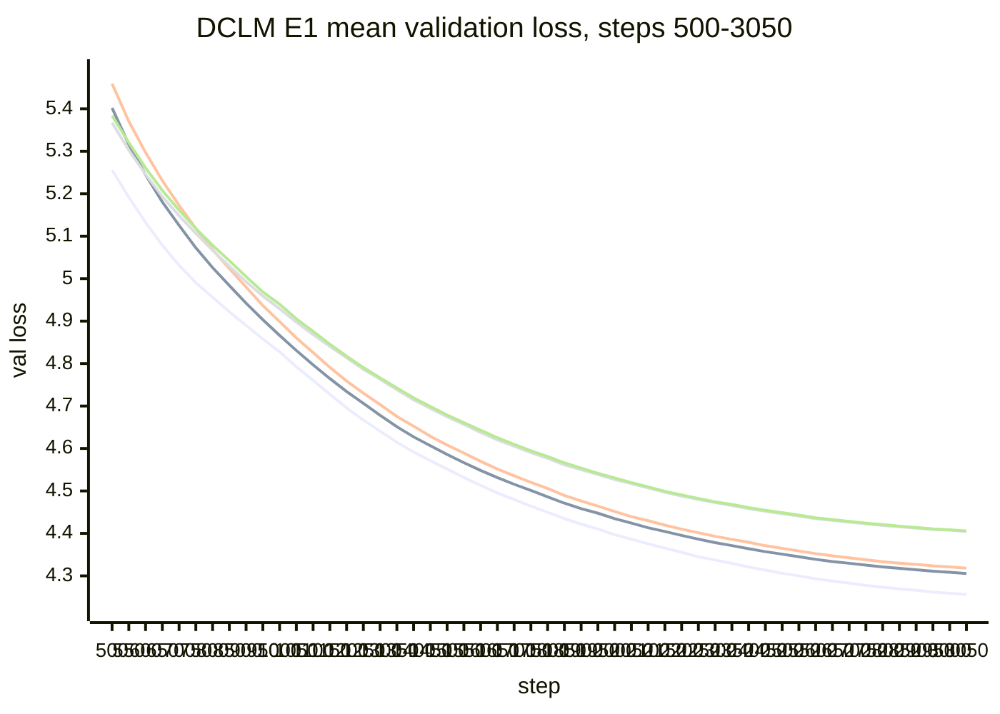
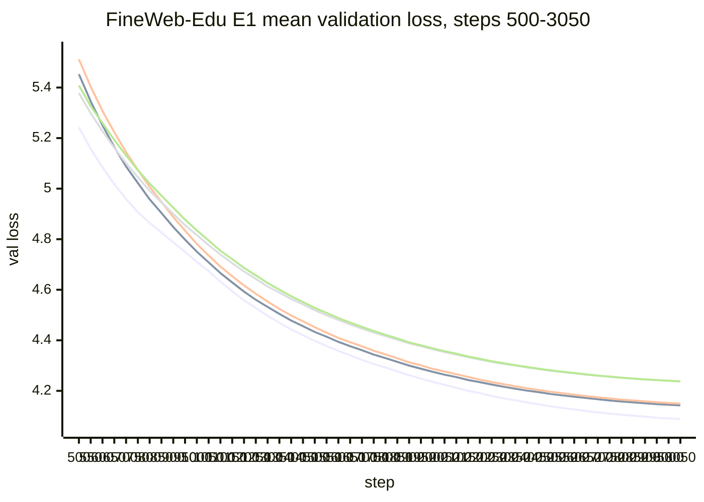
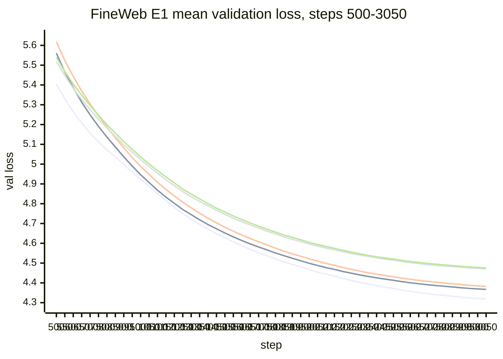
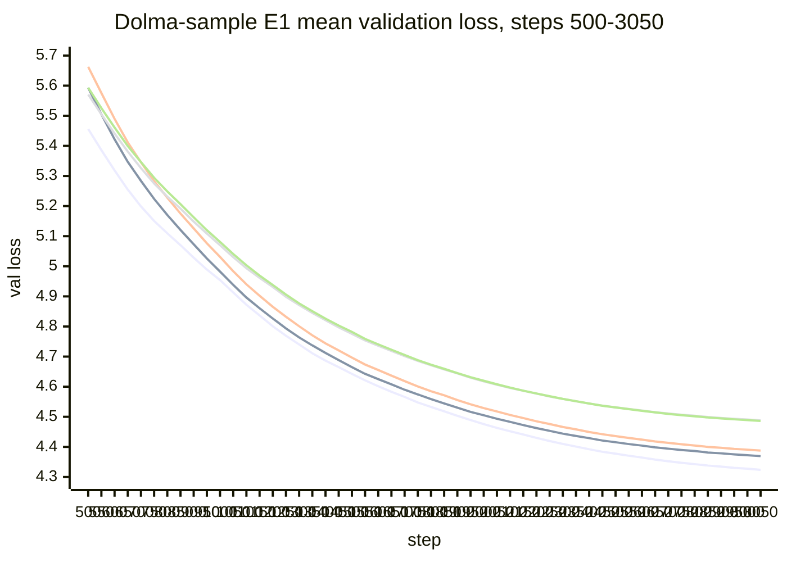

# ICLR Run Status

Updated: 2026-06-07 16:04:25 EDT  
Manifest: `experiments/manifests/iclr26_main_manifest.csv`

## Scheduler State

| Job | Phase rows | State | Exit | GPUs | Elapsed | Node |
| --- | --- | --- | --- | --- | --- | --- |
| `151609` | E0 rows 0-8 | completed | `0:0` | 4 A6000 | 00:38:17 | `ma-compute-02` |
| `151610` | E0 rows 9-14 | completed | `0:0` | 4 A6000 | 00:17:14 | `bala-compute-02` |

E0 is complete. E1 has started from whole matched 15-row cells.

## E0 Preflight

E0 is a 15-row smoke pass: 5 corpora times 3 matched methods. Each dataset cell uses the same outer training config across `silu_adamw`, `rlb_adamw`, and `rlb_matrixpolicy_original`: `lr=0.0003`, `min_lr=0.00003`, `weight_decay=0.10`, seed `1337`, `steps=80`, `eval_interval=40`, 4 A6000.

All rows have three eval points: step 1, step 40, and step 80.

## E0 Final Loss Summary

| Dataset | SiLU AdamW | RLB AdamW | MatrixPolicy original | MP gap vs SiLU | MP gap vs RLB AdamW |
| --- | ---: | ---: | ---: | ---: | ---: |
| dclm | 7.346231 | 7.238834 | 7.121294 | 0.224937 | 0.117540 |
| fineweb_edu | 7.426810 | 7.211745 | 7.035759 | 0.391051 | 0.175986 |
| fineweb | 7.527949 | 7.257327 | 7.101671 | 0.426279 | 0.155656 |
| dolma_sample | 8.201650 | 8.212225 | 8.189895 | 0.011755 | 0.022330 |
| c4_en | 7.579340 | 7.278966 | 7.207716 | 0.371624 | 0.071249 |

## E0 Row Table With Runtime, Params, And Eval Curves

`Run time` is `summary.total_seconds` from the JSONL record for that row. The Slurm job wall times above include dataset preparation and sequential row execution.

| Row | Dataset | Method | Params | Run time s | Mean s/step | Final val loss | Tokens/s | Eval curve `step:val_loss` |
| ---: | --- | --- | ---: | ---: | ---: | ---: | ---: | --- |
| 0 | dclm | silu_adamw | 123,551,232 | 53.20 | 0.6213 | 7.346231 | 52741.71 | 1:10.798578, 40:7.553685, 80:7.346231 |
| 1 | dclm | rlb_adamw | 123,553,824 | 60.56 | 0.6929 | 7.238834 | 47290.45 | 1:10.533360, 40:7.471305, 80:7.238834 |
| 2 | dclm | rlb_matrixpolicy_original | 123,553,824 | 60.86 | 0.6975 | 7.121294 | 46977.61 | 1:10.301031, 40:7.391489, 80:7.121294 |
| 3 | fineweb_edu | silu_adamw | 123,551,232 | 53.14 | 0.6177 | 7.426810 | 53050.87 | 1:10.775492, 40:7.637898, 80:7.426810 |
| 4 | fineweb_edu | rlb_adamw | 123,553,824 | 60.63 | 0.6932 | 7.211745 | 47273.08 | 1:10.528216, 40:7.452968, 80:7.211745 |
| 5 | fineweb_edu | rlb_matrixpolicy_original | 123,553,824 | 61.41 | 0.7033 | 7.035759 | 46593.49 | 1:10.283565, 40:7.335752, 80:7.035759 |
| 6 | fineweb | silu_adamw | 123,551,232 | 52.99 | 0.6195 | 7.527949 | 52895.84 | 1:10.824485, 40:7.717688, 80:7.527949 |
| 7 | fineweb | rlb_adamw | 123,553,824 | 60.51 | 0.6893 | 7.257327 | 47540.86 | 1:10.569622, 40:7.519713, 80:7.257327 |
| 8 | fineweb | rlb_matrixpolicy_original | 123,553,824 | 61.12 | 0.7009 | 7.101671 | 46753.24 | 1:10.334897, 40:7.368423, 80:7.101671 |
| 9 | dolma_sample | silu_adamw | 123,551,232 | 53.77 | 0.6234 | 8.201650 | 52563.79 | 1:10.863197, 40:8.279759, 80:8.201650 |
| 10 | dolma_sample | rlb_adamw | 123,553,824 | 61.00 | 0.6954 | 8.212225 | 47123.59 | 1:10.679456, 40:8.226797, 80:8.212225 |
| 11 | dolma_sample | rlb_matrixpolicy_original | 123,553,824 | 61.00 | 0.7008 | 8.189895 | 46758.65 | 1:10.488925, 40:8.187285, 80:8.189895 |
| 12 | c4_en | silu_adamw | 123,551,232 | 53.37 | 0.6232 | 7.579340 | 52581.93 | 1:10.825615, 40:7.731586, 80:7.579340 |
| 13 | c4_en | rlb_adamw | 123,553,824 | 60.63 | 0.6931 | 7.278966 | 47277.57 | 1:10.567333, 40:7.533151, 80:7.278966 |
| 14 | c4_en | rlb_matrixpolicy_original | 123,553,824 | 60.86 | 0.6994 | 7.207716 | 46848.39 | 1:10.340908, 40:7.446258, 80:7.207716 |

## E1 Scheduler State

E1 uses whole matched 15-row cells. Each job uses 4 A6000. The queue is dependency-chained in pairs, except the final single C4 cell.

| Job | Rows | Cell | State at update | GPUs | Elapsed | Node |
| --- | --- | --- | --- | --- | --- | --- |
| `155411` | 15-29 | dclm seed 1337 | completed | 4 A6000 | 09:23:24 | `ma-compute-02` |
| `155412` | 30-44 | dclm seed 2027 | completed | 4 A6000 | 09:15:36 | `bala-compute-02` |
| `158114` | 45-59 | dclm seed 3407 | completed | 4 A6000 | 09:28:58 | `ma-compute-02` |
| `158115` | 60-74 | fineweb_edu seed 1337 | completed | 4 A6000 | 09:11:18 | `bala-compute-02` |
| `158117` | 75-89 | fineweb_edu seed 2027 | completed, `Restarts=6` | 4 A6000 | 16:04:13 | `monakhova-compute-01` |
| `158118` | 90-104 | fineweb_edu seed 3407 | completed | 4 A6000 | 09:02:26 | `bala-compute-02` |
| `158155` | 105-119 | fineweb seed 1337 | completed | 4 A6000 | 05:52:37 | `elor-compute-01` |
| `158156` | 120-134 | fineweb seed 2027 | completed | 4 A6000 | 08:02:33 | `lil-compute-04` |
| `158163` | 135-149 | fineweb seed 3407 | completed | 4 A6000 | 07:53:18 | `ellis-compute-02` |
| `158164` | 150-164 | dolma_sample seed 1337 | completed | 4 A6000 | 08:12:23 | `ellis-compute-02` |
| `158166` | 165-179 | dolma_sample seed 2027 | completed | 4 A6000 | 07:44:29 | `ellis-compute-02` |
| `158165` | 180-194 | dolma_sample seed 3407 | completed | 4 A6000 | 06:15:00 | `damle-compute-01` |
| `158168` | 195-209 | c4_en seed 1337 | running | 4 A6000 | 7:08:27 | `ellis-compute-02` |
| `158167` | 210-224 | c4_en seed 2027 | completed | 4 A6000 | 06:16:59 | `damle-compute-01` |
| `158169` | 225-239 | c4_en seed 3407 | pending dependency | 4 A6000 | 0:00 | `(Dependency)` |

Active allocation at update: 4 A6000 total.

## E1 Continuation Queue

E1 cells are queued in whole 15-row matched blocks. Each job uses 4 A6000. Dependencies advance in pairs until the final single C4 seed.

| Wave | Dependency | Job | Rows | Cell | State at update |
| ---: | --- | --- | --- | --- | --- |
| 0 | none | `155411` | 15-29 | dclm seed 1337 | completed |
| 0 | none | `155412` | 30-44 | dclm seed 2027 | completed |
| 1 | afterok:`155411`:`155412` | `158114` | 45-59 | dclm seed 3407 | completed |
| 1 | afterok:`155411`:`155412` | `158115` | 60-74 | fineweb_edu seed 1337 | completed |
| 2 | afterok:`158114`:`158115` | `158117` | 75-89 | fineweb_edu seed 2027 | completed, `Restarts=6` |
| 2 | afterok:`158114`:`158115` | `158118` | 90-104 | fineweb_edu seed 3407 | completed |
| 3 | afterok:`158117`:`158118` | `158155` | 105-119 | fineweb seed 1337 | completed |
| 3 | afterok:`158117`:`158118` | `158156` | 120-134 | fineweb seed 2027 | completed |
| 4 | afterok:`158155`:`158156` | `158163` | 135-149 | fineweb seed 3407 | completed |
| 4 | afterok:`158155`:`158156` | `158164` | 150-164 | dolma_sample seed 1337 | completed |
| 5 | afterok:`158163`:`158164` | `158166` | 165-179 | dolma_sample seed 2027 | completed |
| 5 | afterok:`158163`:`158164` | `158165` | 180-194 | dolma_sample seed 3407 | completed |
| 6 | afterok:`158166`:`158165` | `158168` | 195-209 | c4_en seed 1337 | running |
| 6 | afterok:`158166`:`158165` | `158167` | 210-224 | c4_en seed 2027 | completed |
| 7 | afterok:`158168`:`158167` | `158169` | 225-239 | c4_en seed 3407 | pending dependency |

## E1 Live Timing

Current check: 2026-06-07 16:04:25 EDT. Running job(s): `158168`.

| Job | Current row | Dataset/seed | Method | Elapsed | Latest progress | Latest val loss | State |
| --- | ---: | --- | --- | --- | ---: | ---: | --- |
| `158168` | 208 | c4_en / 1337 | rlb_schedulefree | 7:08:27 | train 2190, eval 2150 / 3050 | 5.071837 | running |

Completed E1 rows: 208. Running rows: 1. Remaining rows: 17. Active allocation at check: 4 A6000 total.

At this check, C4 seed 1337 is on row 208 of 209 and C4 seed 3407 is still dependency-pending. If the current node speed holds and there is no preemption, E1 should finish in roughly 6.5-8.5 hours after this update.

## E1 Dense Curve Figures

Markdown-only figures below are computed from completed E1 JSONL eval events. Each curve is the three-seed mean validation loss at every 50-step eval from step 500 through 3050. Lower is better.

### DCLM: Core Mean Validation Curves

| Curve | Final mean | Final std |
| --- | ---: | ---: |
| MatrixPolicy | 4.256224 | 0.004972 |
| RLB+Lion | 4.305728 | 0.005836 |
| SiLU+Lion | 4.318333 | 0.006893 |
| RLB+AdamW | 4.404748 | 0.004551 |
| SiLU+AdamW | 4.405574 | 0.009903 |

### FineWeb-Edu: Core Mean Validation Curves

| Curve | Final mean | Final std |
| --- | ---: | ---: |
| MatrixPolicy | 4.088240 | 0.009434 |
| RLB+Lion | 4.142669 | 0.006812 |
| SiLU+Lion | 4.149366 | 0.009180 |
| RLB+AdamW | 4.237991 | 0.006110 |
| SiLU+AdamW | 4.237481 | 0.008644 |

### FineWeb: Core Mean Validation Curves

| Curve | Final mean | Final std |
| --- | ---: | ---: |
| MatrixPolicy | 4.318581 | 0.010914 |
| RLB+Lion | 4.367062 | 0.007532 |
| SiLU+Lion | 4.382518 | 0.008308 |
| RLB+AdamW | 4.470531 | 0.013305 |
| SiLU+AdamW | 4.475841 | 0.009656 |

### Dolma-sample: Core Mean Validation Curves

| Curve | Final mean | Final std |
| --- | ---: | ---: |
| MatrixPolicy | 4.323851 | 0.004565 |
| RLB+Lion | 4.369254 | 0.005561 |
| SiLU+Lion | 4.387783 | 0.004605 |
| RLB+AdamW | 4.488137 | 0.000894 |
| SiLU+AdamW | 4.486162 | 0.001204 |

## E1 Results Snapshot

DCLM is complete for all three E1 seeds. Final validation loss, mean and sample std over seeds:

| Method | Complete seeds | Mean | Std | Seed values |
| --- | ---: | ---: | ---: | --- |
| rlb_matrixpolicy_original | 3 | 4.256224 | 0.004972 | 4.251434, 4.261359, 4.255877 |
| rlb_lion | 3 | 4.305728 | 0.005836 | 4.307827, 4.310225, 4.299133 |
| silu_lion | 3 | 4.318333 | 0.006893 | 4.310379, 4.322079, 4.322542 |
| rlb_adamw | 3 | 4.404748 | 0.004551 | 4.401357, 4.409920, 4.402967 |
| silu_adamw | 3 | 4.405574 | 0.009903 | 4.394192, 4.412221, 4.410308 |
| silu_soap | 3 | 4.415980 | 0.003818 | 4.412983, 4.420279, 4.414679 |
| rlb_soap | 3 | 4.435091 | 0.021706 | 4.458359, 4.431526, 4.415388 |
| silu_muon | 3 | 4.457165 | 0.012562 | 4.442778, 4.465955, 4.462763 |
| rlb_muon | 3 | 4.474236 | 0.004136 | 4.477408, 4.475743, 4.469558 |
| rlb_schedulefree | 3 | 4.878139 | 0.005538 | 4.872795, 4.877769, 4.883852 |
| silu_schedulefree | 3 | 4.902321 | 0.011067 | 4.891297, 4.902236, 4.913431 |
| rlb_came | 3 | 5.007375 | 0.008213 | 5.005087, 5.000548, 5.016489 |
| silu_came | 3 | 5.010657 | 0.014306 | 5.000495, 5.004458, 5.027017 |
| silu_ademamix | 3 | 48.645454 | 13.725481 | 34.271767, 61.614742, 50.049854 |
| rlb_ademamix | 1 | 246105152.000000 | 0.000000 | 246105152.000000, non-finite, non-finite |

FineWeb-Edu is complete for all three E1 seeds. Final validation loss, mean and sample std over seeds:

| Method | Complete seeds | Mean | Std | Seed values |
| --- | ---: | ---: | ---: | --- |
| rlb_matrixpolicy_original | 3 | 4.088240 | 0.009434 | 4.092051, 4.077497, 4.095173 |
| rlb_lion | 3 | 4.142669 | 0.006812 | 4.144132, 4.135244, 4.148631 |
| silu_lion | 3 | 4.149366 | 0.009180 | 4.154374, 4.138771, 4.154952 |
| silu_adamw | 3 | 4.237481 | 0.008644 | 4.242263, 4.227503, 4.242677 |
| rlb_adamw | 3 | 4.237991 | 0.006110 | 4.240171, 4.231090, 4.242713 |
| rlb_soap | 3 | 4.262287 | 0.013054 | 4.260798, 4.276021, 4.250041 |
| silu_soap | 3 | 4.263003 | 0.022048 | 4.262650, 4.241133, 4.285225 |
| silu_muon | 3 | 4.278738 | 0.024267 | 4.280360, 4.253700, 4.302153 |
| rlb_muon | 3 | 4.287684 | 0.019926 | 4.306664, 4.266931, 4.289457 |
| rlb_schedulefree | 3 | 4.779696 | 0.011289 | 4.792676, 4.774242, 4.772171 |
| silu_schedulefree | 3 | 4.825844 | 0.007242 | 4.834194, 4.822071, 4.821268 |
| rlb_came | 3 | 4.904335 | 0.004631 | 4.909057, 4.899800, 4.904150 |
| silu_came | 3 | 4.920688 | 0.012317 | 4.929064, 4.906546, 4.926455 |
| silu_ademamix | 3 | 242.853696 | 242.012155 | 104.331055, 522.301819, 101.928215 |
| rlb_ademamix | 3 | 7880.511495 | 12045.656859 | 1178.819824, 676.105286, 21786.609375 |

FineWeb is complete for all three E1 seeds. Final validation loss, mean and sample std over seeds:

| Method | Complete seeds | Mean | Std | Seed values |
| --- | ---: | ---: | ---: | --- |
| rlb_matrixpolicy_original | 3 | 4.318581 | 0.010914 | 4.306077, 4.323467, 4.326198 |
| rlb_lion | 3 | 4.367062 | 0.007532 | 4.358393, 4.370788, 4.372005 |
| silu_lion | 3 | 4.382518 | 0.008308 | 4.373947, 4.390535, 4.383072 |
| rlb_adamw | 3 | 4.470531 | 0.013305 | 4.455188, 4.478891, 4.477512 |
| silu_adamw | 3 | 4.475841 | 0.009656 | 4.464763, 4.480283, 4.482476 |
| silu_soap | 3 | 4.484025 | 0.011241 | 4.472078, 4.485604, 4.494392 |
| rlb_soap | 3 | 4.484953 | 0.025544 | 4.462595, 4.512793, 4.479470 |
| silu_muon | 3 | 4.516342 | 0.026358 | 4.490554, 4.515236, 4.543236 |
| rlb_muon | 3 | 4.521560 | 0.011976 | 4.508226, 4.525053, 4.531402 |
| rlb_schedulefree | 3 | 4.987660 | 0.019623 | 4.965375, 5.002351, 4.995253 |
| silu_schedulefree | 3 | 5.014212 | 0.018820 | 4.993041, 5.029044, 5.020551 |
| rlb_came | 3 | 5.125061 | 0.017257 | 5.105318, 5.137263, 5.132603 |
| silu_came | 3 | 5.132548 | 0.012598 | 5.118973, 5.143862, 5.134809 |
| silu_ademamix | 3 | 51.996538 | 15.132243 | 51.005760, 67.599823, 37.384029 |
| rlb_ademamix | 1 | 3022914304.000000 | 0.000000 | 3022914304.000000, non-finite, non-finite |

Dolma-sample is complete for all three E1 seeds. Final validation loss, mean and sample std over seeds:

| Method | Complete seeds | Mean | Std | Seed values |
| --- | ---: | ---: | ---: | --- |
| rlb_matrixpolicy_original | 3 | 4.323851 | 0.004565 | 4.319835, 4.328816, 4.322902 |
| rlb_lion | 3 | 4.369254 | 0.005561 | 4.374695, 4.369488, 4.363580 |
| silu_lion | 3 | 4.387783 | 0.004605 | 4.382976, 4.392156, 4.388218 |
| silu_adamw | 3 | 4.486162 | 0.001204 | 4.487082, 4.486603, 4.484799 |
| rlb_adamw | 3 | 4.488137 | 0.000894 | 4.487473, 4.487784, 4.489154 |
| silu_soap | 3 | 4.498726 | 0.003535 | 4.498732, 4.502258, 4.495188 |
| rlb_soap | 3 | 4.502910 | 0.015749 | 4.489188, 4.499438, 4.520106 |
| silu_muon | 3 | 4.544263 | 0.010821 | 4.536290, 4.539918, 4.556581 |
| rlb_muon | 3 | 4.558568 | 0.009268 | 4.549397, 4.567930, 4.558376 |
| rlb_schedulefree | 3 | 5.024134 | 0.013642 | 5.039133, 5.020803, 5.012465 |
| silu_schedulefree | 3 | 5.049396 | 0.014883 | 5.066480, 5.039243, 5.042466 |
| rlb_came | 3 | 5.142537 | 0.016354 | 5.159671, 5.140844, 5.127095 |
| silu_came | 3 | 5.164954 | 0.018870 | 5.184652, 5.163172, 5.147038 |
| silu_ademamix | 3 | 28427.185402 | 40987.716727 | 9786.633789, 75422.257812, 72.664604 |
| rlb_ademamix | 2 | 1775543041.717896 | 2510996321.238340 | 515.435791, 3551085568.000000, non-finite |

C4 status at check:

| Seed | Complete rows | Running row | Notes |
| ---: | ---: | --- | --- |
| 1337 | 13 / 15 | row 208 rlb_schedulefree | latest train 2190, eval 2150, val 5.071837 |
| 2027 | 15 / 15 | none | MatrixPolicy final val loss 4.301276 |
| 3407 | 0 / 15 | none | pending dependency |

C4 partial aggregate from completed rows only:

| Method | Complete seeds | Mean | Std | Seed values |
| --- | ---: | ---: | ---: | --- |
| rlb_matrixpolicy_original | 1 | 4.301276 | 0.000000 | 4.301276 |
| rlb_lion | 2 | 4.334202 | 0.029364 | 4.313438, 4.354966 |
| silu_lion | 2 | 4.352276 | 0.021835 | 4.336836, 4.367715 |
| rlb_adamw | 2 | 4.436585 | 0.023792 | 4.419761, 4.453408 |
| silu_adamw | 2 | 4.442621 | 0.020000 | 4.428479, 4.456763 |
| rlb_soap | 2 | 4.451351 | 0.002696 | 4.449445, 4.453258 |
| silu_soap | 2 | 4.452748 | 0.015767 | 4.441599, 4.463897 |
| silu_muon | 2 | 4.471201 | 0.018488 | 4.458128, 4.484274 |
| rlb_muon | 2 | 4.482270 | 0.008022 | 4.476597, 4.487942 |
| rlb_schedulefree | 1 | 4.982551 | 0.000000 | 4.982551 |
| silu_schedulefree | 2 | 5.002830 | 0.020899 | 4.988052, 5.017608 |
| rlb_came | 2 | 5.098529 | 0.021289 | 5.083476, 5.113583 |
| silu_came | 2 | 5.121805 | 0.025034 | 5.104103, 5.139506 |
| silu_ademamix | 2 | 466.353416 | 435.129243 | 158.670578, 774.036255 |
| rlb_ademamix | 2 | 17684.628784 | 20105.625797 | 31901.453125, 3467.804443 |

## Parameter Counts

M0 parameter counts from the run config records:

| Row family | Activation family | Parameter count |
| --- | --- | ---: |
| `silu_*` | SiLU FFN | 123,551,232 |
| `rlb_*` | RLB FFN | 123,553,824 |
| `rlb_matrixpolicy_original` | RLB FFN with MatrixPolicy optimizer | 123,553,824 |
