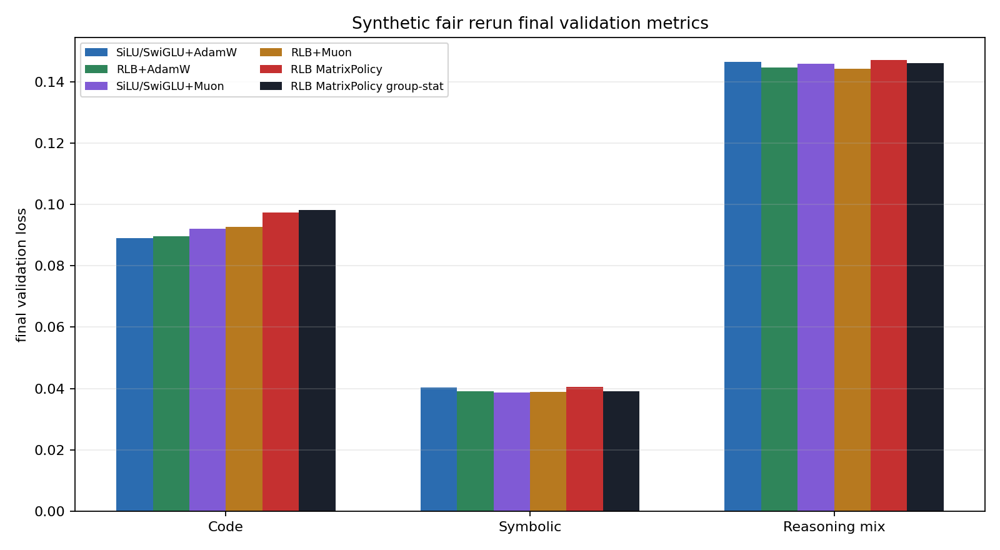
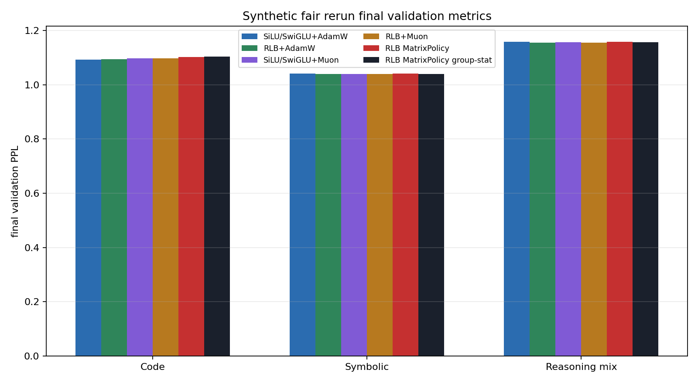

# Experiments

This folder contains launchers, summarizers, and compact committed result artifacts. Raw JSONL files and Slurm logs stay under `experiments/runs/` and are not committed.

## Experiment Families

| family | purpose | status |
| --- | --- | --- |
| WikiText-103 same-LR comparison | Main real-LM evidence for MatrixPolicy-Muon. | Committed result figures under `results/rlb_matrix_policy_muon_switch_2026_05_28/`. |
| Sparse synthetic fair comparison | Early curve signal on Code, Symbolic, and Reasoning mix. | Committed but provisional because sampling is sparse and tasks saturate. |
| Dense synthetic curves | Measures training every 10 steps and validation every 25 steps from step 1. | Running raw job; summarize after completion. |
| RLB gauge stress | Tests optimizer sensitivity to equivalent-function positive gauge reparameterization. | Running raw job; result is the next mechanism check. |

The experiment sequence is organized as falsifiable tests: same-LR real LM evidence, dense curve verification, gauge-stress mechanism, then harder non-saturated transfer.

## Main Result

| row | final loss | final PPL | readout |
| --- | ---: | ---: | --- |
| RLB MatrixPolicy-Muon | 3.476232 | 32.34 | best verified row |
| RLB Smooth-MatrixPolicy | 3.493210 | 32.89 | older smooth policy |
| SiLU/SwiGLU+AdamW beta2=0.999 | 3.549346 | 34.79 | strongest AdamW control |
| RLB+AdamW beta2=0.999 | 3.550018 | 34.81 | generic AdamW on RLB |
| RLB+AdamW | 3.617501 | 37.24 | untuned generic AdamW |
| SiLU/SwiGLU+AdamW | 3.621982 | 37.41 | original AdamW control |
| SiLU/SwiGLU+Muon | 3.644921 | 38.28 | generic Muon control |
| RLB+Muon | 3.657877 | 38.78 | generic Muon on RLB |

## Figures

WikiText-103 validation loss:


WikiText-103 validation PPL:


WikiText-103 training loss from step 1:


Sparse synthetic validation curves:


Secondary final-state plots:





## Synthetic Interpretation

| task | useful signal | limitation |
| --- | --- | --- |
| Code | RLB rows drop much faster early; MatrixPolicy group-stat is far ahead at step 250 in the sparse run. | The task later approaches the floor, so final PPL is compressed. |
| Symbolic | MatrixPolicy has the fastest sampled early curve. | All methods nearly solve it, so final differences are not meaningful. |
| Reasoning mix | MatrixPolicy/group-stat lead early and mid curve. | Final generic `RLB+Muon` is slightly best in the sparse run, so mechanism needs more analysis. |

The dense rerun is required because the sparse artifact logs validation only every 250 steps and training only every 100 steps. For optimizer research, the training curve matters as much as validation because it reveals slope, instability, and phase changes.

## Gauge Stress Protocol

The gauge-stress experiment applies an initialization-only positive reparameterization to RLB groups:

```text
W_in[g]  <- a_g W_in[g]
W_out[g] <- W_out[g] / a_g
```

The represented function is unchanged for `a_g > 0`, but optimizer conditioning changes. The pass criterion is not just lower final loss; it is smaller degradation under gauge stress:

```text
degradation = curve_metric(gauge_log_scale=2.0) - curve_metric(gauge_log_scale=0.0)
```

Report train AUC degradation, validation AUC degradation, time-to-threshold degradation, and final loss degradation for `RLB+AdamW`, `RLB+Muon`, `RLB MatrixPolicy`, and `RLB MatrixPolicy group-stat`.

## Summaries

Regenerate the committed sparse synthetic artifact with:

```bash
.venv-cu128/bin/python experiments/scripts/summarize_synthetic_fair_full_20260529.py
```

After the dense run finishes, summarize it with:

```bash
.venv-cu128/bin/python experiments/scripts/summarize_synthetic_fair_full_20260529.py \
  --run-root experiments/runs/synthetic_dense_curves_20260529 \
  --suffix 20260529_dense_curve \
  --result-dir experiments/results/synthetic_dense_curves_2026_05_29
```

GPU rule for new experiments:

```text
Use A6000 only.
Do not exceed 8 active A6000s total.
```
