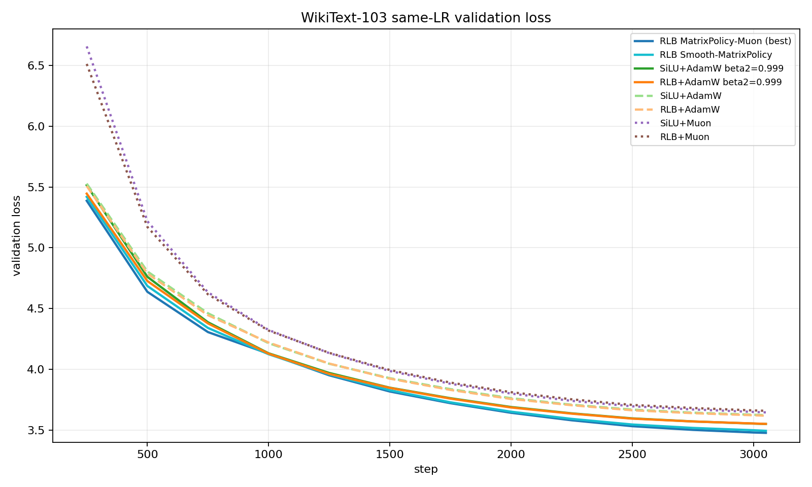
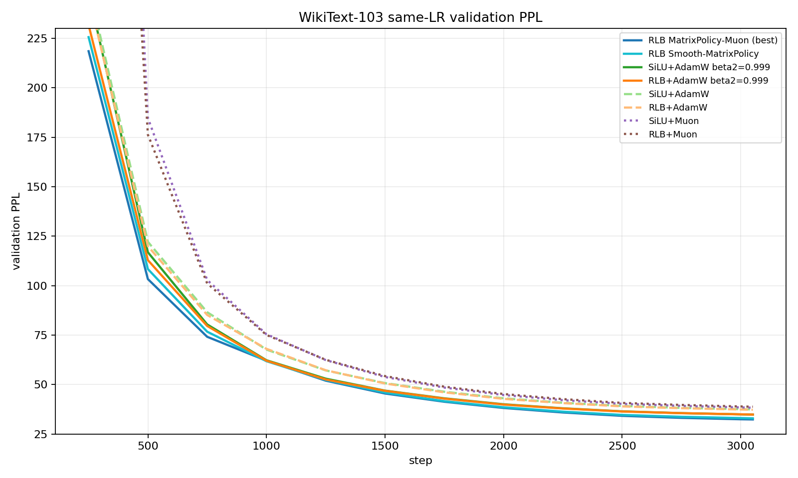
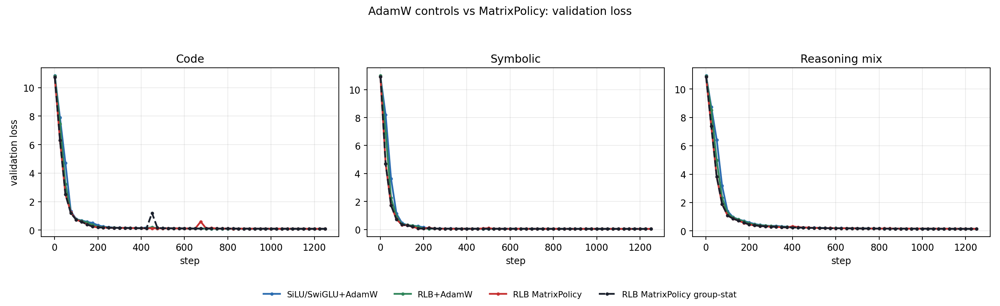
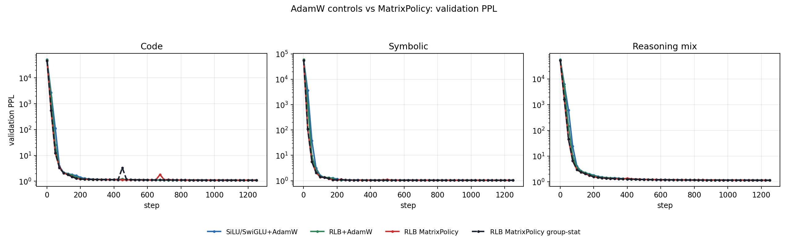
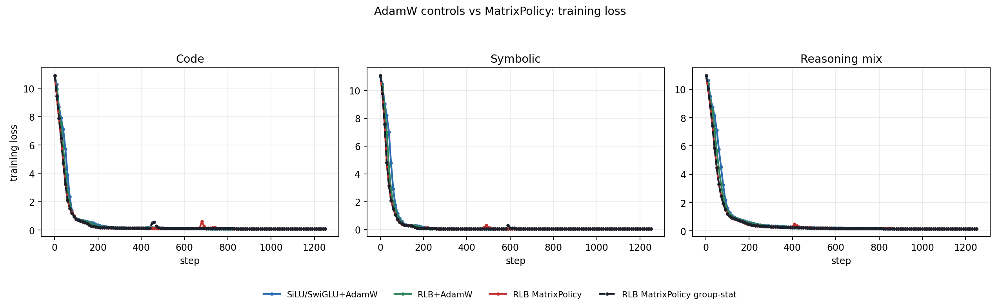
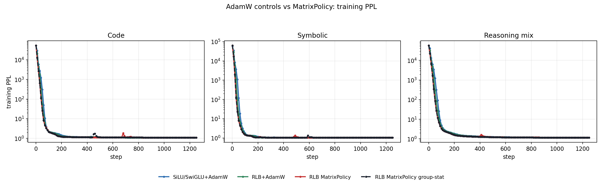
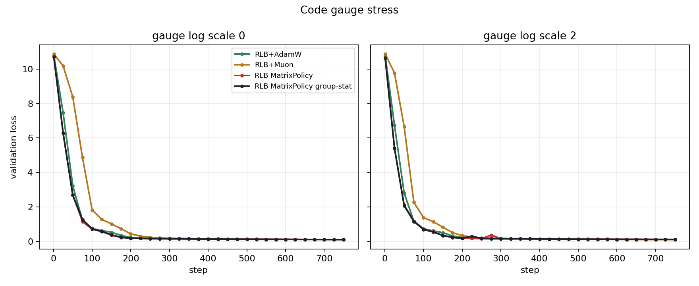
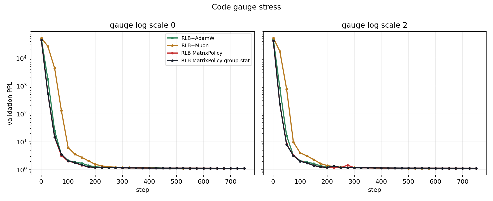
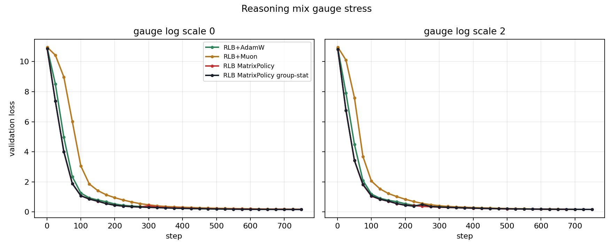
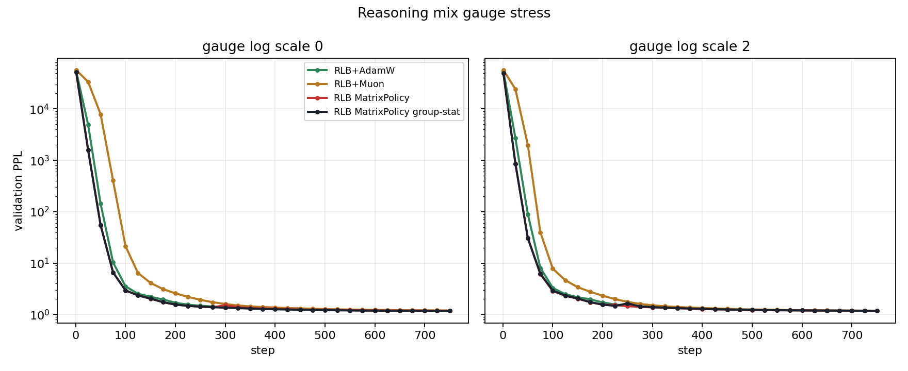

# Experiments

This folder contains launchers, summarizers, and committed result artifacts. The purpose is to make each experiment answer a specific research question.

Raw JSONL files and Slurm logs stay under `experiments/runs/` and are not committed. Research-facing artifacts live under `experiments/results/`.

## Experimental Questions

| experiment family | question | current status |
| --- | --- | --- |
| WikiText-103 same-LR comparison | Does MatrixPolicy beat strong generic controls on a real LM task? | yes, modest final gap |
| Dense synthetic curves | Is the early rational speed visible from step 1 in train and validation curves? | yes, clear curve-speed advantage |
| Positive gauge stress | Does MatrixPolicy handle equivalent-function RLB reparameterizations better than generic optimizers? | incomplete: MatrixPolicy stays fast, but gauge stress is not monotone degradation |
| Hard non-saturated tasks | Does early speed become a real final-loss gap when the task is not near the floor? | still needed |
| Real-corpus transfer screen | Does the MatrixPolicy curve lead survive modern web LM pretraining beyond WikiText-103? | running: FineWeb-Edu and FineWeb |

## Active Runs

The May 30 real-LM screen uses `experiments/scripts/run_real_lm_screen_20260530.sh`. It streams HF datasets and caches only bounded token tensors, with validation taken after a 110M-token stream offset and a repository-size guard at 190 GiB. Each Slurm job requests exactly 4 A6000s; the intended cap is two active jobs, or 8 A6000s total.

Current launched tasks:

| job family | dataset/config | rows |
| --- | --- | --- |
| `fineweb_edu` | `HuggingFaceFW/fineweb-edu`, `sample-10BT` | AdamW controls, Muon controls, MatrixPolicy group-stat |
| `fineweb` | `HuggingFaceFW/fineweb`, `sample-10BT` | AdamW controls, Muon controls, MatrixPolicy group-stat |

DCLM and Dolma remain important paper targets, but they were not launched in this environment: DCLM needs zstd support in the active Python environment, and the current installed `datasets` rejects Dolma's dataset-script format. Those are environment issues, not optimizer results.

## Result Packages

| package | contents |
| --- | --- |
| `results/rlb_matrix_policy_muon_switch_2026_05_28/` | WikiText-103 same-LR comparison and plots. |
| `results/synthetic_dense_curves_2026_05_29/` | Dense train/validation curves, PPL/loss plots, horizon-AUC speed metrics. |
| `results/rlb_gauge_stress_2026_05_29/` | Gauge-stress train/validation curves, PPL/loss plots, sensitivity tables. |
| `results/synthetic_fair_full_2026_05_29/` | Older sparse synthetic summary retained for provenance; use dense curves for current claims. |

## WikiText-103 Result

| method | final loss | final PPL |
| --- | ---: | ---: |
| RLB MatrixPolicy-Muon | 3.476232 | 32.34 |
| RLB Smooth-MatrixPolicy | 3.493210 | 32.89 |
| SiLU/SwiGLU+AdamW beta2=0.999 | 3.549346 | 34.79 |
| RLB+AdamW beta2=0.999 | 3.550018 | 34.81 |
| RLB+AdamW | 3.617501 | 37.24 |
| SiLU/SwiGLU+AdamW | 3.621982 | 37.41 |
| SiLU/SwiGLU+Muon | 3.644921 | 38.28 |
| RLB+Muon | 3.657877 | 38.78 |

The loss gap is `0.0731`, below the target `0.2-0.3`. Treat it as positive but not paper-complete.

## Dense Synthetic Curves

Dense rerun settings: `LOG_INTERVAL=10`, `EVAL_INTERVAL=25`, 1250 steps, 100M synthetic tokens, same model and base LR across controls. Final loss is secondary because Code and Symbolic approach the floor.

Mean validation loss AUC through step 200:

| task | best MatrixPolicy row | MatrixPolicy AUC200 | RLB+AdamW AUC200 | SiLU+AdamW AUC200 | RLB+Muon AUC200 | SiLU+Muon AUC200 |
| --- | --- | ---: | ---: | ---: | ---: | ---: |
| Code | group-stat | 2.1462 | 2.4336 | 2.7252 | 4.2146 | 4.9058 |
| Symbolic | group-stat | 1.6594 | 2.0576 | 2.4332 | 3.7027 | 4.4547 |
| Reasoning mix | MatrixPolicy | 2.7143 | 3.1170 | 3.4677 | 4.8270 | 5.6531 |

Time to validation loss `<= 0.2`:

| task | MatrixPolicy best | RLB+AdamW | SiLU+AdamW | RLB+Muon | SiLU+Muon |
| --- | ---: | ---: | ---: | ---: | ---: |
| Code | 200 | 250 | 275 | 325 | 300 |
| Symbolic | 150 | 175 | 200 | 175 | 200 |
| Reasoning mix | 525 | 550 | 575 | 625 | 625 |

The main interpretation is curve-speed, not final loss. MatrixPolicy reaches useful loss levels earlier on all three tasks. On reasoning_mix, group-stat also has the best final row: loss `0.142429`, PPL `1.1531`.

## Gauge-Stress Result

Gauge stress applies the exact RLB transform at initialization:

```text
W_in[g]  <- a_g W_in[g]
W_out[g] <- W_out[g] / a_g
log a_g ~ Uniform[-s, s]
```

The represented function is unchanged for `a_g > 0`. The May 29 run used `s = 0.0` and `s = 2.0` on Code and Reasoning mix.

Mean validation loss AUC through step 200:

| task | gauge | MatrixPolicy best | RLB+AdamW | RLB+Muon | final interpretation |
| --- | ---: | ---: | ---: | ---: | --- |
| Code | 0.0 | 2.1541 | 2.4297 | 4.2148 | MatrixPolicy fastest early; AdamW/Muon catch up late. |
| Code | 2.0 | 1.9561 | 2.2702 | 3.4906 | Gauge stress does not hurt early curves; Muon wins final. |
| Reasoning mix | 0.0 | 2.7346 | 3.1179 | 4.8260 | MatrixPolicy fastest early; group-stat wins final. |
| Reasoning mix | 2.0 | 2.5668 | 2.9404 | 4.1080 | MatrixPolicy fastest early; group-stat wins final. |

This is not yet a proof of gauge invariance. Gauge `2.0` often lowers early AUC for every optimizer, so the benchmark reveals gauge sensitivity rather than clean degradation. The next version needs multiple gauge seeds/scales and direct gauge-drift/function-change diagnostics.

## Figures

WikiText-103 validation loss:



WikiText-103 validation PPL:



Dense synthetic AdamW-control plots. Generic Muon rows are intentionally omitted from this figure set so the comparison is focused on `SiLU+AdamW`, `RLB+AdamW`, and MatrixPolicy:









Muon-inclusive per-task plots are still committed in `results/synthetic_dense_curves_2026_05_29/` for completeness.

Gauge-stress validation loss and PPL:









## Regeneration

Dense synthetic plots and tables:

```bash
.venv-cu128/bin/python experiments/scripts/summarize_synthetic_fair_full_20260529.py \
  --run-root experiments/runs/synthetic_dense_curves_20260529 \
  --suffix 20260529_dense_curve \
  --result-dir experiments/results/synthetic_dense_curves_2026_05_29
.venv-cu128/bin/python experiments/scripts/summarize_dense_curve_speed_20260529.py
.venv-cu128/bin/python experiments/scripts/plot_adam_only_comparisons_20260530.py
```

Gauge-stress plots and tables:

```bash
.venv-cu128/bin/python experiments/scripts/summarize_rlb_gauge_stress_20260529.py
```

New experiments should use A6000 GPUs only and keep total active allocation at or below 8 A6000s.
