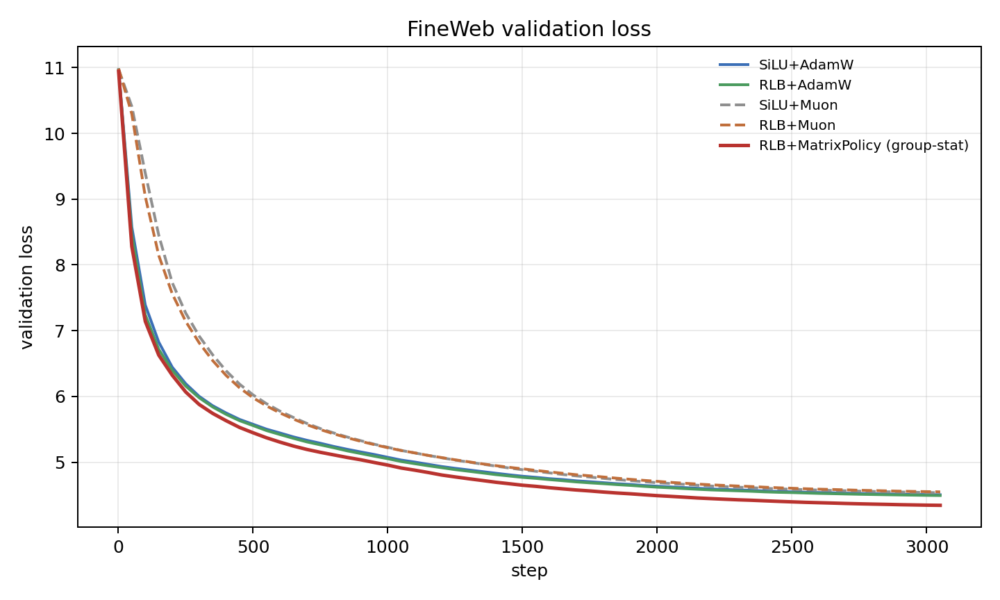
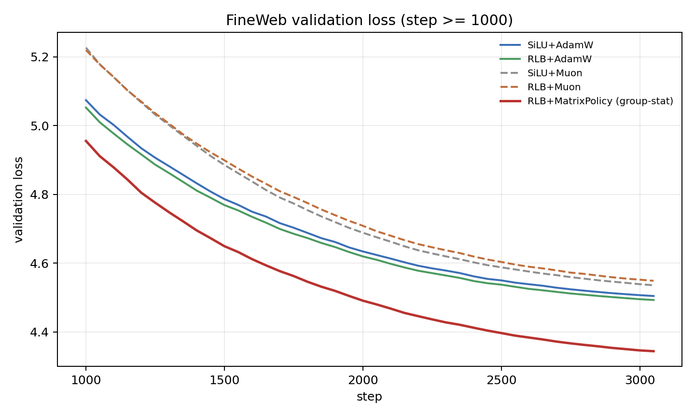
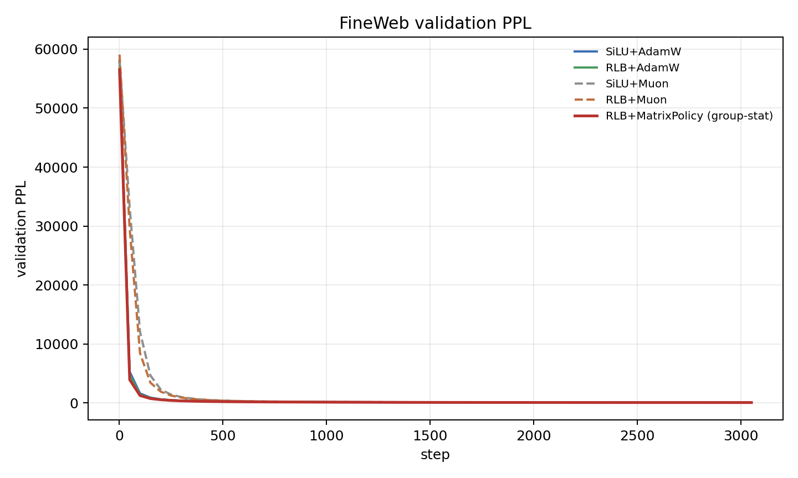
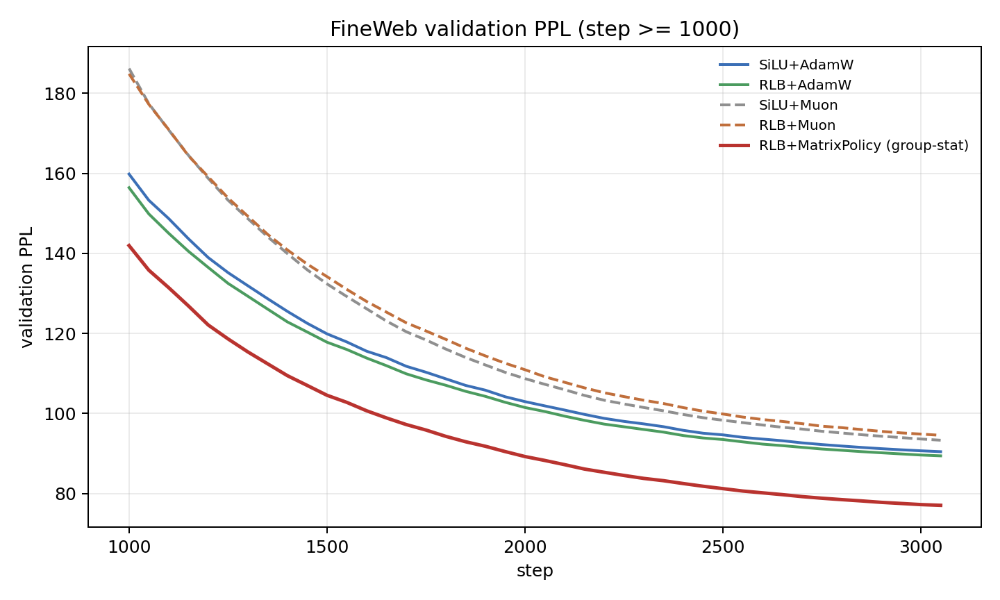
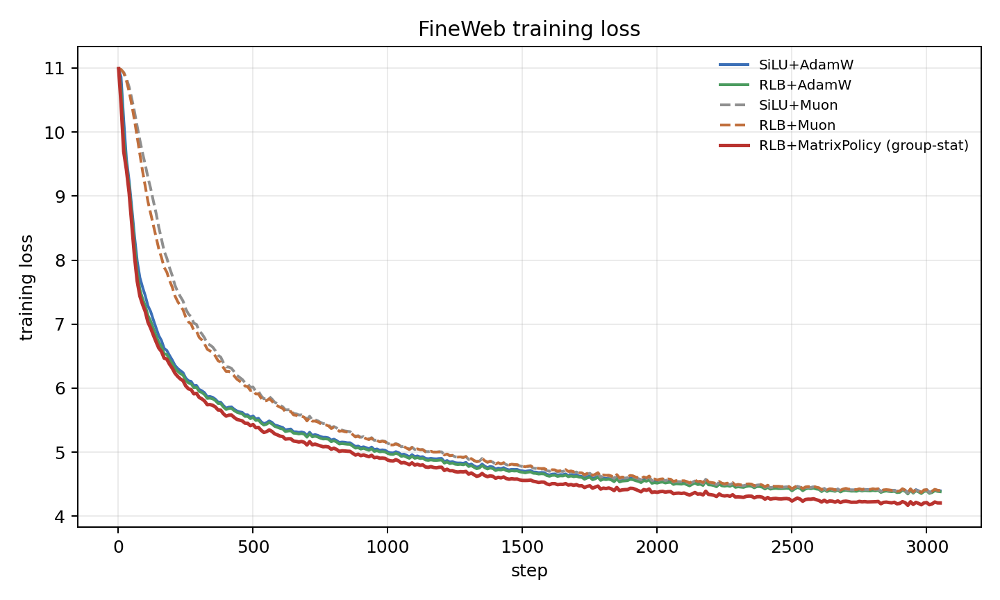
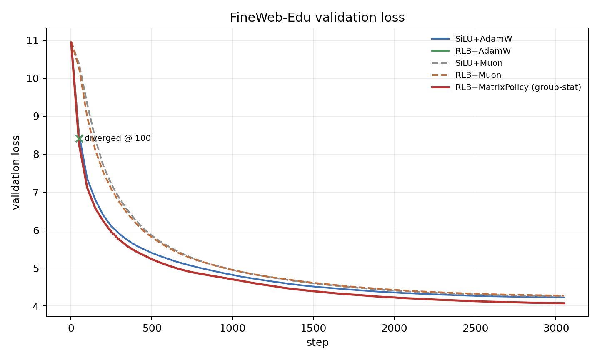
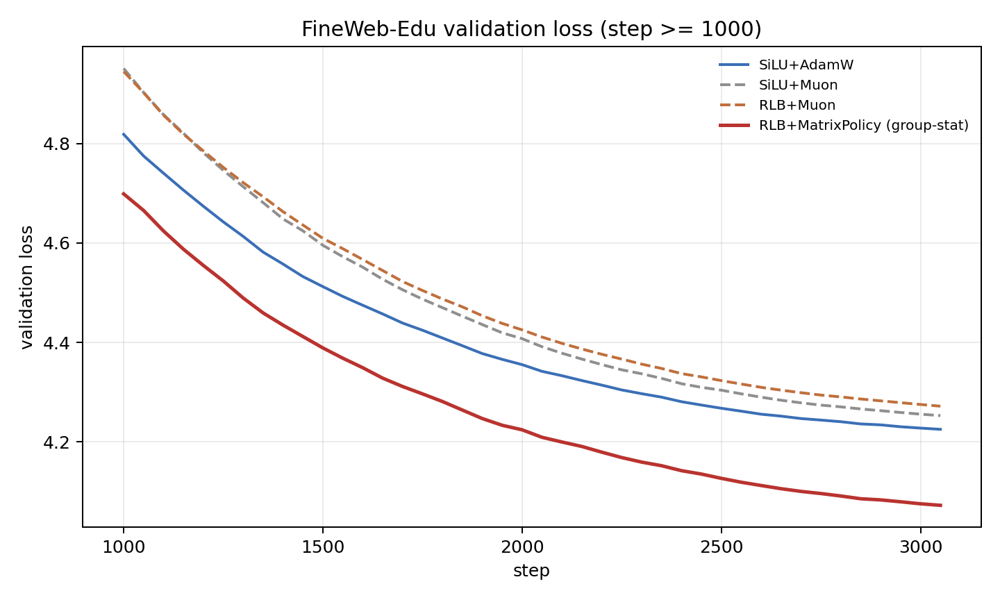
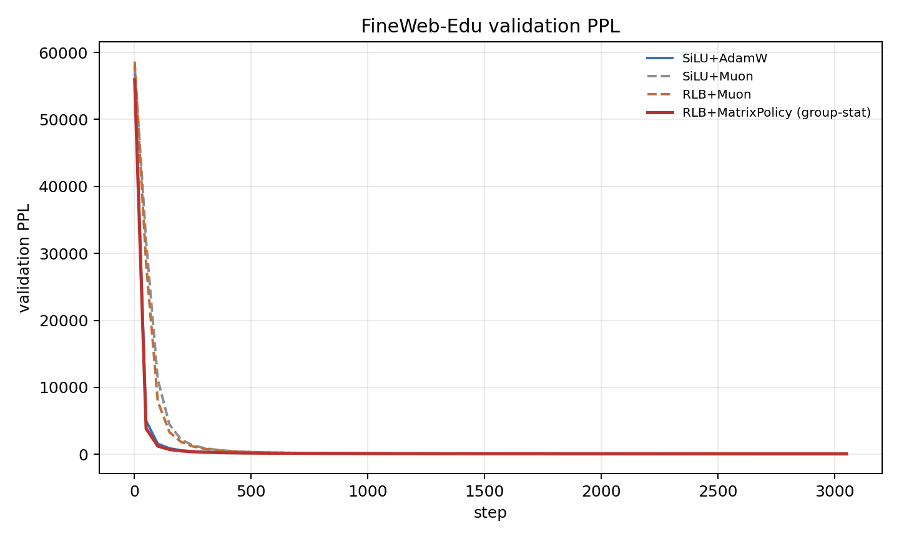
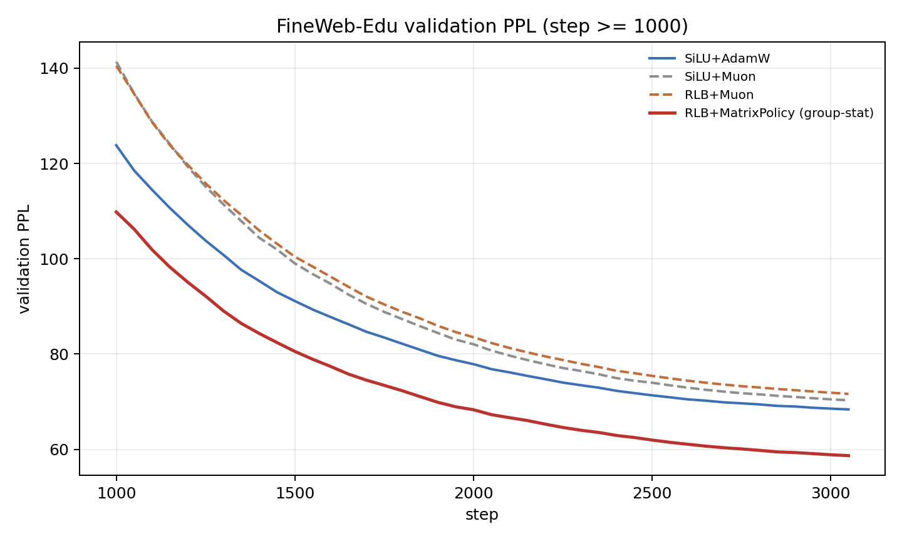
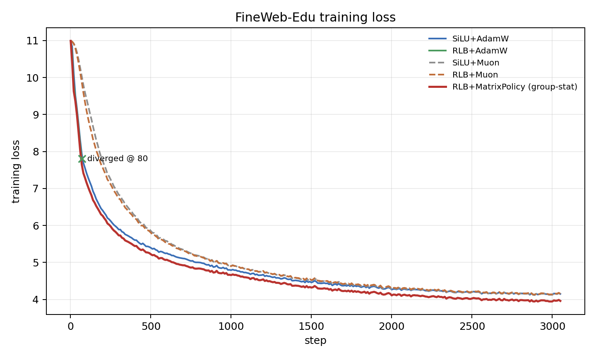

# Experiments

This directory contains launchers, summarizers, compact result artifacts, and raw JSONL traces for the current real-LM evidence.

The current public evidence is centered on the 3-seed FineWeb/FineWeb-Edu replication. Older one-seed plots and the WikiText anchor are retained as supporting artifacts, not as the main claim.

## Result Packages

| package | role |
| --- | --- |
| `ICLR_OPTIMIZER_EXPERIMENT_BLUEPRINT.md` | Full paper experiment program: broad optimizer baselines, two-corpus HPO, scaling, speed-to-target, mechanism tests, and launch discipline. |
| `results/real_lm_multiseed_2026_05_31/` | Primary current preliminary 3-seed tables, bootstrap gap CIs, curve CSVs, and multi-seed mean plots. |
| `runs/real_lm_multiseed_20260531/` | Compact raw JSONL traces for seed 2027 and seed 3407 runs. |
| `results/real_lm_screen_2026_05_30/` | Seed-1337 baseline summary, curves, and one-seed plot images. |
| `results/rlb_matrix_policy_muon_switch_2026_05_28/` | Older WikiText-103 same-LR anchor. |

Slurm `.out` files are local logs and are ignored. Compact JSONL traces are small enough to commit and are used by the multi-seed summarizer.

## Primary 3-Seed Summary

Regenerate the primary summary:

```bash
.venv-cu128/bin/python experiments/scripts/summarize_real_lm_multiseed.py \
  --run-root experiments/runs/real_lm_multiseed_20260531 \
  --baseline-summary-csv experiments/results/real_lm_screen_2026_05_30/summary.csv \
  --baseline-seed 1337
```

Outputs:

```text
results/real_lm_multiseed_2026_05_31/summary.md
results/real_lm_multiseed_2026_05_31/per_seed_summary.csv
results/real_lm_multiseed_2026_05_31/aggregate_summary.csv
results/real_lm_multiseed_2026_05_31/matrix_policy_gap_bootstrap_ci.csv
results/real_lm_multiseed_2026_05_31/eval_curves.csv
results/real_lm_multiseed_2026_05_31/train_curves.csv
results/real_lm_multiseed_2026_05_31/*_mean*.png
```

### FineWeb

| method | n | mean val loss | mean PPL | gap vs SiLU+AdamW | gap vs best control |
| --- | ---: | ---: | ---: | ---: | ---: |
| SiLU+AdamW | 3 | 4.528963 | 92.69 | 0.000000 | -0.006960 |
| RLB+AdamW | 3 | 4.522311 | 92.08 | 0.006653 | -0.000308 |
| SiLU+Muon | 3 | 4.566661 | 96.28 | -0.037698 | -0.044658 |
| RLB+Muon | 3 | 4.571341 | 96.70 | -0.042377 | -0.049337 |
| RLB+MatrixPolicy (group-stat) | 3 | 4.369701 | 79.04 | 0.159263 | 0.152302 |

### FineWeb-Edu

| method | n | div | mean val loss | mean PPL | gap vs SiLU+AdamW | gap vs best control |
| --- | ---: | ---: | ---: | ---: | ---: | ---: |
| SiLU+AdamW | 3 | 0 | 4.223572 | 68.28 | 0.000000 | -0.000748 |
| RLB+AdamW | 3 | 1 | 5.618928 | 1545.54 | -1.395356 | -1.396103 |
| SiLU+Muon | 3 | 0 | 4.258871 | 70.74 | -0.035300 | -0.036047 |
| RLB+Muon | 3 | 0 | 4.263744 | 71.08 | -0.040173 | -0.040920 |
| RLB+MatrixPolicy (group-stat) | 3 | 0 | 4.069422 | 58.52 | 0.154149 | 0.153402 |

Positive gaps mean lower validation loss than the comparison row.

Bootstrap CIs in `matrix_policy_gap_bootstrap_ci.csv` are paired over seeds. With only 3 seeds, treat them as a stability check rather than a definitive uncertainty estimate.

Generated multi-seed mean plots:

```text
fineweb_validation_loss_mean.png
fineweb_validation_loss_mean_zoom_step1000.png
fineweb_validation_ppl_mean.png
fineweb_validation_ppl_mean_zoom_step1000.png
fineweb_training_loss_mean.png
fineweb_edu_validation_loss_mean.png
fineweb_edu_validation_loss_mean_zoom_step1000.png
fineweb_edu_validation_ppl_mean.png
fineweb_edu_validation_ppl_mean_zoom_step1000.png
fineweb_edu_training_loss_mean.png
```


## Figures

The 3-seed tables are the primary result. These plots are kept in the README because curve shape matters for optimizer claims, especially early training and divergent controls.

### Multi-Seed Mean +/- Std Curves

Each line is the seed mean; shaded bands are +/- 1 std. PPL plots omit divergent/nonfinite seed-method rows.


### Seed-1337 Detailed Curves






















## One-Seed Curve Package

The May 30 package contains the seed-1337 curves and plot images:

```text
results/real_lm_screen_2026_05_30/summary.md
results/real_lm_screen_2026_05_30/summary.csv
results/real_lm_screen_2026_05_30/eval_curves.csv
results/real_lm_screen_2026_05_30/train_curves.csv
```

Regenerate it:

```bash
.venv-cu128/bin/python experiments/scripts/summarize_real_lm_screen_20260530.py
```

The plotted figures in this package are illustrative single-seed curves. The current aggregate claim should cite the multi-seed package above.

## WikiText-103 Anchor

WikiText-103 remains useful as an older same-LR LM anchor:

| method | final loss | final PPL |
| --- | ---: | ---: |
| RLB MatrixPolicy-Muon | 3.476232 | 32.34 |
| RLB Smooth-MatrixPolicy | 3.493210 | 32.89 |
| SiLU/SwiGLU+AdamW beta2=0.999 | 3.549346 | 34.79 |
| RLB+AdamW beta2=0.999 | 3.550018 | 34.81 |
| RLB+AdamW | 3.617501 | 37.24 |
| SiLU/SwiGLU+AdamW | 3.621982 | 37.41 |
| SiLU/SwiGLU+Muon | 3.644921 | 38.28 |
| RLB+Muon | 3.657877 | 38.78 |

It is not the main result because the current real-corpus gaps are larger and more directly relevant to pretraining.

## Launching More Runs

Main historical Slurm launcher:

```bash
sbatch experiments/scripts/run_real_lm_screen_20260530.sh
```

Current paper-program launchers:

```bash
sbatch experiments/scripts/run_iclr_optimizer_validation_20260602.sh
CONFIRM_ICLR_PHASE_A=1 HPO_FAMILIES="adamw muon lion soap_adamw" CONFIG_START=0 CONFIG_LIMIT=8 sbatch experiments/scripts/run_iclr_phase_a_hpo_20260602.sh
CONFIRM_ICLR_PHASE_A=1 HPO_FAMILIES="ademamix schedule_free_adamw adafactor_came rational_matrix_policy_onpolicy" CONFIG_START=0 CONFIG_LIMIT=6 sbatch experiments/scripts/run_iclr_phase_a_hpo_20260602.sh
CONFIRM_ICLR_PHASE_A=1 experiments/scripts/submit_iclr_phase_a_chunks_20260602.sh
```

The HPO launcher refuses to run unless `CONFIRM_ICLR_PHASE_A=1` is set. Each submitted HPO job uses 4 A6000 GPUs; keep at most two active jobs. It supports family-specific `*_LRS` and `*_WEIGHT_DECAYS` variables so Lion and AdEMAMix are not forced onto the AdamW grid. It also supports `CONFIG_START` and `CONFIG_LIMIT`; wide grids must be run as bounded chunks, not 7-day monolithic jobs. AdEMAMix HPO rows should use the default paper-style alpha and beta3 warmups; older partial rows without that fix are invalid.

The current launch sequence has passed tiny CUDA/DDP telemetry and broad-optimizer validation. The active work is Phase A HPO on FineWeb-Edu and FineWeb. Do not run MatrixPolicy component ablations before tuned configs exist from that HPO phase.

Chunking rule: submit chunks of roughly 6-8 configs per job for the adaptive lane and 8-10 configs per job for the core lane. Chain chunks with `afterok` dependencies. This keeps wall times bounded while preserving the 4-GPU-per-job and 8-active-GPU limits. The launcher stores token caches under `TOKEN_CACHE_DIR/<task>` so FineWeb and FineWeb-Edu never share tokenized data. This is operational discipline only; the paper TODO remains the academically strongest evidence plan, not a list cut down to today's queue.

Current launch order:

```text
1. tiny CUDA/DDP telemetry and broad-optimizer validation - done
2. broad optimizer-family HPO on FineWeb-Edu and FineWeb - in progress
3. Phase A summarization and tuned-config selection
4. final tuned benchmark
5. mechanism interventions and method-component ablations
```

Example dependent 3-seed pattern used for the completed batch:

```bash
REAL_LM_TASKS="fineweb_edu" SEEDS="2027" RUN_SUFFIX="20260531_seed2027_100m" \
  OUTPUT_ROOT="experiments/runs/real_lm_multiseed_20260531" \
  sbatch experiments/scripts/run_real_lm_screen_20260530.sh

REAL_LM_TASKS="fineweb" SEEDS="2027" RUN_SUFFIX="20260531_seed2027_100m" \
  OUTPUT_ROOT="experiments/runs/real_lm_multiseed_20260531" \
  sbatch experiments/scripts/run_real_lm_screen_20260530.sh
```

Use dependencies for later seeds so active usage never exceeds two 4-GPU jobs.

## Resource And Artifact Policy

Hard limits:

```text
max 4 A6000 GPUs per job
max 8 A6000 GPUs active total
repo size below 200G
```

Artifact policy:

```text
commit compact summaries and JSONL traces needed for table reproduction
do not commit Slurm .out logs
do not commit cache directories, checkpoints, or model weights
keep raw large datasets in cache paths ignored by git
```
