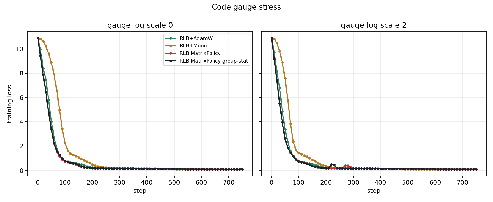
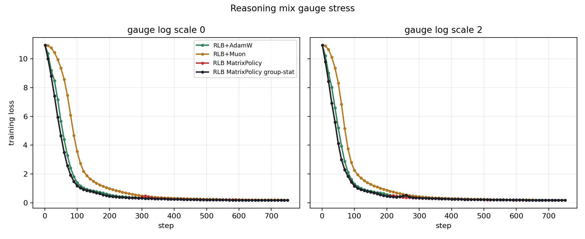

# RLB Gauge Stress Summary

Gauge stress applies an equivalent-function positive group rescaling at initialization.
Lower AUC mean loss is better. Negative gauge deltas mean the stressed parameterization trained faster on that metric, so this run should be read as gauge sensitivity rather than a pure degradation test.

## Curve Metrics

| task | gauge | method | val AUC mean 200 | val AUC mean 400 | train AUC mean 200 | first val <= 0.2 | final loss | final PPL |
| --- | --- | --- | --- | --- | --- | --- | --- | --- |
| Code | 0.0000 | RLB MatrixPolicy | 2.1541 | 1.1541 | 2.3568 | 200 | 0.1110 | 1.1174 |
| Code | 0.0000 | RLB MatrixPolicy group-stat | 2.1753 | 1.1648 | 2.3815 | 200 | 0.1109 | 1.1173 |
| Code | 0.0000 | RLB+AdamW | 2.4297 | 1.2956 | 2.6383 | 250 | 0.1047 | 1.1104 |
| Code | 0.0000 | RLB+Muon | 4.2148 | 2.2118 | 4.5040 | 300 | 0.1087 | 1.1148 |
| Code | 2.0000 | RLB MatrixPolicy group-stat | 1.9561 | 1.0654 | 2.1691 | 200 | 0.1167 | 1.1238 |
| Code | 2.0000 | RLB MatrixPolicy | 1.9676 | 1.0764 | 2.1734 | 200 | 0.1151 | 1.1220 |
| Code | 2.0000 | RLB+AdamW | 2.2702 | 1.2163 | 2.4591 | 225 | 0.1139 | 1.1206 |
| Code | 2.0000 | RLB+Muon | 3.4906 | 1.8390 | 3.7775 | 275 | 0.1049 | 1.1106 |
| Reasoning mix | 0.0000 | RLB MatrixPolicy | 2.7346 | 1.5352 | 2.9573 | 525 | 0.1726 | 1.1884 |
| Reasoning mix | 0.0000 | RLB MatrixPolicy group-stat | 2.7352 | 1.5225 | 2.9568 | 500 | 0.1640 | 1.1782 |
| Reasoning mix | 0.0000 | RLB+AdamW | 3.1179 | 1.7301 | 3.3429 | 550 | 0.1711 | 1.1866 |
| Reasoning mix | 0.0000 | RLB+Muon | 4.8260 | 2.6715 | 5.0980 | 650 | 0.1828 | 1.2006 |
| Reasoning mix | 2.0000 | RLB MatrixPolicy | 2.5668 | 1.4469 | 2.8048 | 525 | 0.1711 | 1.1866 |
| Reasoning mix | 2.0000 | RLB MatrixPolicy group-stat | 2.5754 | 1.4604 | 2.8139 | 550 | 0.1702 | 1.1856 |
| Reasoning mix | 2.0000 | RLB+AdamW | 2.9404 | 1.6455 | 3.1681 | 550 | 0.1724 | 1.1882 |
| Reasoning mix | 2.0000 | RLB+Muon | 4.1080 | 2.2832 | 4.3772 | 600 | 0.1729 | 1.1887 |

## Gauge Sensitivity

| task | method | delta val AUC 200 | delta val AUC 400 | delta train AUC 200 | delta final loss | delta first <= 0.2 |
| --- | --- | --- | --- | --- | --- | --- |
| Code | RLB+Muon | -0.7242 | -0.3728 | -0.7265 | -0.0038 | -25 |
| Code | RLB MatrixPolicy group-stat | -0.2192 | -0.0995 | -0.2124 | 0.0058 | 0 |
| Code | RLB MatrixPolicy | -0.1865 | -0.0777 | -0.1834 | 0.0041 | 0 |
| Code | RLB+AdamW | -0.1595 | -0.0793 | -0.1792 | 0.0092 | -25 |
| Reasoning mix | RLB+Muon | -0.7180 | -0.3883 | -0.7209 | -0.0099 | -50 |
| Reasoning mix | RLB+AdamW | -0.1775 | -0.0845 | -0.1748 | 0.0014 | 0 |
| Reasoning mix | RLB MatrixPolicy | -0.1677 | -0.0883 | -0.1525 | -0.0015 | 0 |
| Reasoning mix | RLB MatrixPolicy group-stat | -0.1598 | -0.0622 | -0.1429 | 0.0063 | 50 |

## Figures

Generated by `experiments/scripts/summarize_rlb_gauge_stress_20260529.py`.
Raw JSONL files stay under `experiments/runs/` and are not committed.
