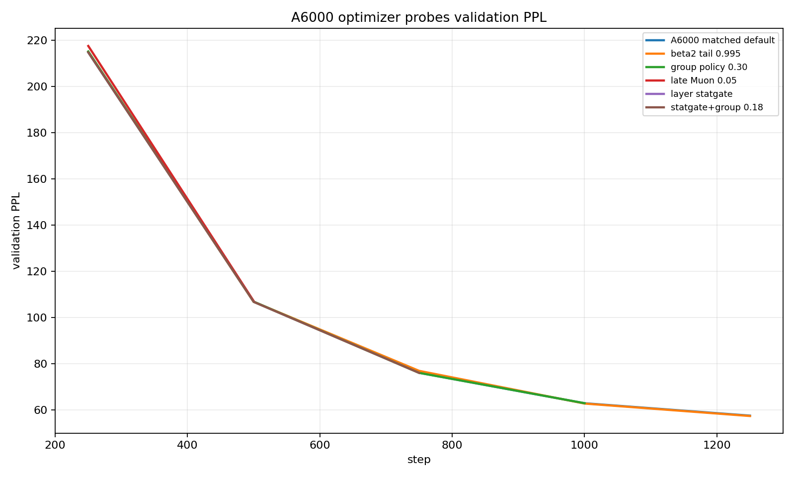
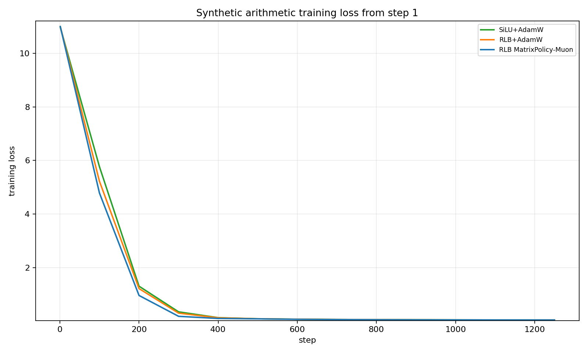

# RLB MatrixPolicy-Muon Same-LR Result

This artifact reports the current best same-global-LR optimizer story and the latest negative/transfer tests. It replaces older stacked result narratives.

## Current Best

```text
optimizer:   rational_matrix_policy_onpolicy
activation:  rlb_fused_fixed_strong_ffn
mechanism:   early RLB-matrix Muon switch, then MatrixPolicy AdamW
global LR:   lr=3e-4, min_lr=3e-5, warmup=200, cosine, unchanged
seed:        1337
steps:       3051
```

| row | final loss | final PPL |
| --- | ---: | ---: |
| RLB MatrixPolicy-Muon | 3.476232 | 32.34 |
| RLB Smooth-MatrixPolicy | 3.493210 | 32.89 |
| SiLU+AdamW beta2=0.999 | 3.549346 | 34.79 |
| RLB+AdamW beta2=0.999 | 3.550018 | 34.81 |
| RLB+AdamW | 3.617501 | 37.24 |
| SiLU+AdamW | 3.621982 | 37.41 |
| SiLU+Muon | 3.644921 | 38.28 |
| RLB+Muon | 3.657877 | 38.78 |

## Gap Readout

```text
vs SiLU+AdamW beta2=0.999: 0.073114 loss / 2.45 PPL
vs RLB+AdamW beta2=0.999:  0.073786 loss / 2.48 PPL
vs SiLU+AdamW:             0.145750 loss / 5.07 PPL
vs RLB+AdamW:              0.141269 loss / 4.91 PPL
vs SiLU+Muon:              0.168689 loss / 5.94 PPL
vs RLB+Muon:               0.181645 loss / 6.44 PPL
```

The result is a same-LR optimizer win, but not yet the requested `0.2-0.3` final loss gap versus tuned AdamW controls.

## What Changed In This Round

Muon controls were added and are not competitive:

```text
SiLU+Muon  3.644921 loss / 38.28 PPL
RLB+Muon   3.657877 loss / 38.78 PPL
```

A synthetic 100M-token arithmetic task was added. MatrixPolicy learned faster early, then the task saturated and final loss favored SiLU+AdamW:

| row | final loss | final PPL |
| --- | ---: | ---: |
| SiLU+AdamW | 0.048182 | 1.04936 |
| RLB+AdamW | 0.048326 | 1.04951 |
| RLB MatrixPolicy-Muon | 0.048382 | 1.04957 |

A6000 optimizer probes did not create a material widening:

| probe | last step | loss | readout |
| --- | ---: | ---: | --- |
| A6000 matched default | 1250 | 4.052293 | matched fallback screen |
| beta2 tail 0.995 | 1250 | 4.049556 | tiny +0.002738 vs matched default, not close to old best short curve |
| group policy 0.30 | 1000 | 4.141706 | neutral/worse vs matched default at 1000 |
| late Muon 0.05 | 500 | 4.673611 | worse than matched default at 500 |
| layer statgate | 250 | 5.369072 | tied with matched default |
| statgate+group 0.18 | 750 | 4.331103 | tiny +0.000628 vs matched default, noise-level |

## Plots

Validation starts at the first eval point. Training loss starts at step 1.







## Interpretation

The durable improvement comes from the RLB-specific matrix policy: role/depth update scaling, short early matrix-only Muon, exact gauge balance, and beta2=0.999. The extra policies tried here mostly add adaptive noise or reintroduce late Muon pressure. They do not exploit RLB better than the current policy.

The next real improvement probably needs a new signal, not another small timing tail: for example a principled per-layer rational-domain objective, a function-preserving preconditioner for `W_in/W_out`, or a way to update rational coefficients without destabilizing the matrix policy.

## Reproduce Current Best

```bash
env RATIONAL_OPT_TORCH_FALLBACK=1 PYTORCH_CUDA_ALLOC_CONF=expandable_segments:True NCCL_P2P_DISABLE=1 \
  RUN_NAME=rlb_matrix_policy_muon_switch \
  STEPS=3051 SEEDS=1337 \
  OPTIMIZERS=rational_matrix_policy_onpolicy \
  ACTIVATIONS=rlb_fused_fixed_strong_ffn \
  EVAL_INTERVAL=250 EVAL_BATCHES=20 LOG_INTERVAL=100 \
  EXTRA_ARGS="--batch-size 16 --grad-accum 2" \
  sbatch --gres=gpu:nvidia_rtx_a6000:4 training/run_wikitext103_optimizer_sweep.sbatch
```
