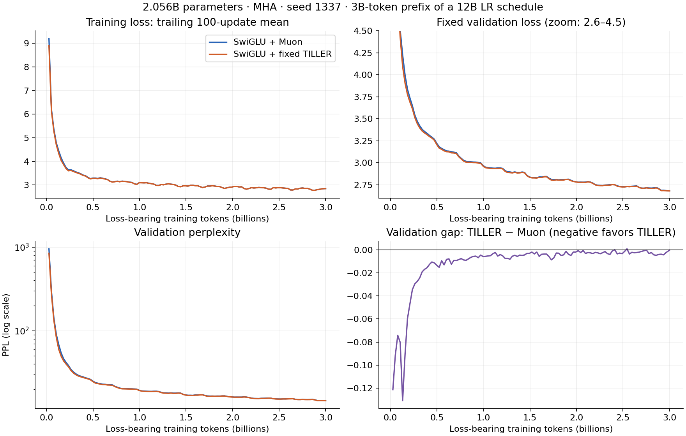

# Preliminary fixed-SwiGLU TILLER versus Muon results

Snapshot: September 23, 2026. Both runs completed **11,445 updates / 3,000,238,080
loss-bearing tokens**, with **2,056,136,704 parameters** and seed 1337. This is a
partial research release (one seed, ablation results pending), not an interrupted
training comparison. Both models use fixed SwiGLU and MHA; no GRAIN run is included.

Same model dimensions, initialization recipe, ordered data-cache prefix, actual
token batch, tokenizer, schedule and evaluation protocol. The retained cosine
schedule spans 45,776 updates, so the 3B-token endpoint is not fully annealed.
Training loss is measured on the current training batch; validation loss uses a
fixed 131,072-token holdout. PPL is exp(validation cross-entropy in nats). Training
and validation are deliberately labeled separately. Negative loss/PPL gaps favor
TILLER. Accuracy differences are percentage points; larger accuracy is better.

## Final language-model metrics

| Metric | Muon | Fixed-SwiGLU TILLER | TILLER − Muon |
|---|---:|---:|---:|
| Final training-batch loss | 2.84995508 | 2.84553170 | -0.00442338 |
| Validation loss | 2.68069997 | 2.68043283 | -0.00026714 |
| Validation perplexity | 14.59530601 | 14.59140758 | -0.00389842 |

The earlier LM-loss advantage has largely disappeared at this endpoint. The
benchmark pattern is mixed and cannot establish statistical significance or a
cause from one seed. Both raw and normalized accuracy are included, including
metrics that favor Muon; no selection of only favorable tasks.

## Final zero-shot benchmarks

| Task | Metric | Muon | TILLER | Difference |
|---|---|---:|---:|---:|
| arc_easy | acc | 58.9226% | 58.5859% | -0.3367 pp |
| arc_easy | acc_norm | 52.1044% | 52.6936% | +0.5892 pp |
| boolq | acc | 59.9083% | 61.2538% | +1.3456 pp |
| hellaswag | acc | 33.2802% | 33.6586% | +0.3784 pp |
| hellaswag | acc_norm | 39.9223% | 40.7090% | +0.7867 pp |
| lambada_openai | acc | 31.4768% | 32.7576% | +1.2808 pp |
| lambada_openai | perplexity | 49.0260 | 42.9146 | -6.1114 |
| piqa | acc | 67.5190% | 67.4102% | -0.1088 pp |
| piqa | acc_norm | 65.7780% | 66.2133% | +0.4353 pp |
| winogrande | acc | 51.3023% | 51.6969% | +0.3946 pp |

## Downloadable records and provenance

- [Loss/PPL every 100 steps plus final](loss-ppl-every-100-steps.csv): exact-step
  training losses, trailing 100-update means, validation losses and perplexities.
  Final validation comes from report.json's validation_loss_before: in the frozen
  engine this is evaluated after training and before optional checkpoint replay.
- [Every training update](training-every-step.csv): both losses, LR, tokens and
  measured step durations. No interpolation, smoothing substitution or missing updates.
- [Both benchmark milestones](benchmarks.csv): updates 3815 and 11445, approximately
  1B and 3B tokens, including all available accuracy variants and LAMBADA PPL.
- [Coordination records](coordination-every-step.csv): every proposal outcome,
  functional/surrogate measurement and coefficient statistics. The production
  release did not record individual failed acceptance guards; a rejection cannot
  be attributed to a specific guard from these records. The pending ablation does.
- `muon-benchmark-*.json` / `tiller-benchmark-*.json`: scored task definitions,
  sample counts, protocol, checkpoint/source/config/data/evaluation identities.
- [Provenance](provenance.json): original log hashes and completion scope.

Zero-shot evaluation uses a fixed harness revision and identical local task
assets. No chat templates or finetuning. The sealed final 12B LM test was not used.
LAMBADA's task PPL is distinct from the fixed validation-cache PPL above.
Raw documents, model checkpoints, credentials and scheduler/accounting records
are not included. No claim that this snapshot is a multi-seed benchmark study.

The source identity's historical `optimizer_version` field on the Muon run is a
campaign-wide MHA adapter label; that condition actually routes structural weights
to native `torch.optim.Muon`. The condition key and frozen source establish routing.

